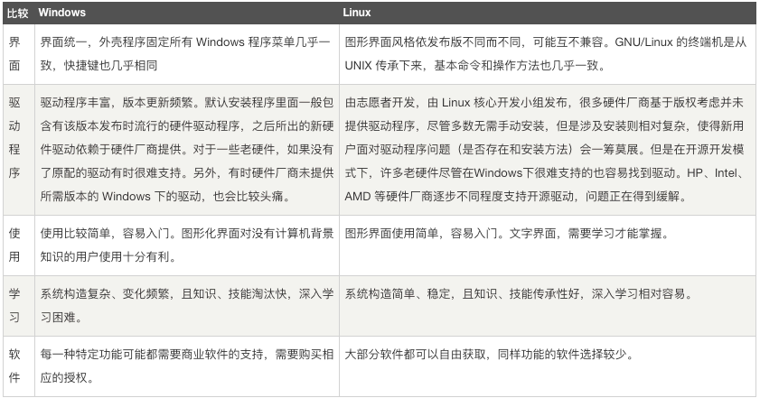
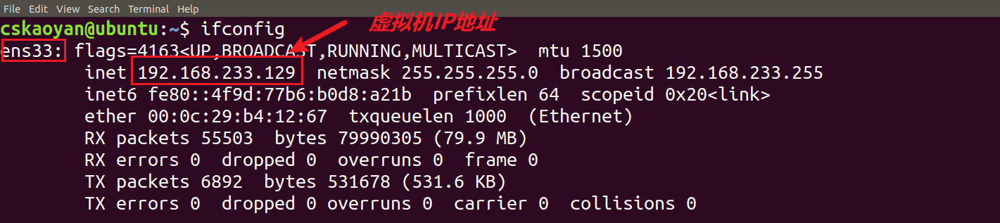
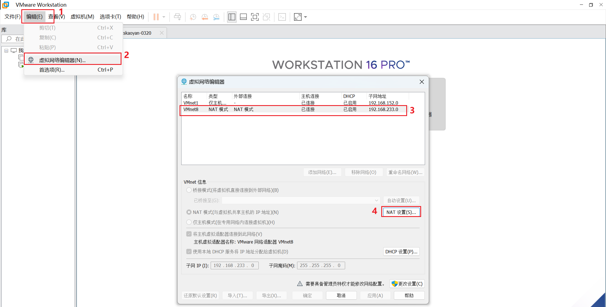
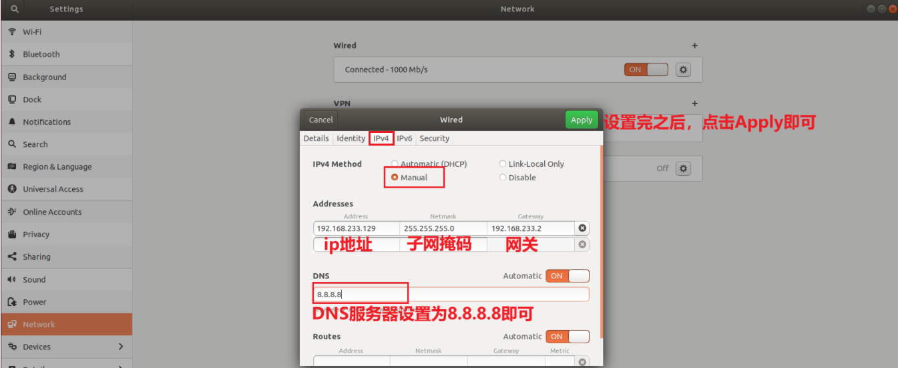
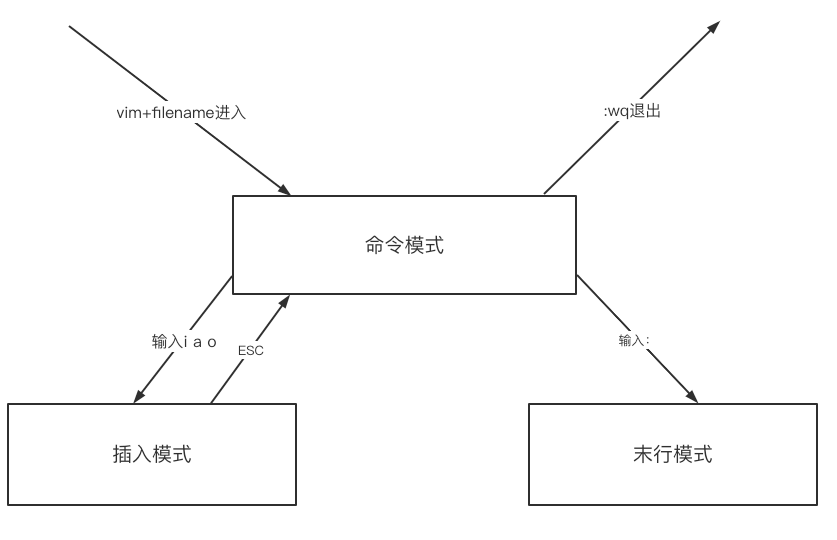

# Linux

## 1.  Linux介紹

####  1.1  Linux的前世今生

-  Linux操作系统，被称之为类Unix操作系统，因此，要了解Linux的诞生就得先了解Unix操作系统

> 1. 1965 年开始的 Multics ⼯程计划，该计划由⻉尔实验室、美国麻省理⼯学院和通⽤电⽓公司联合发起，⽬标是开发⼀种**交互式的、具有多道程序处理能⼒的分时操作系统**，以取代当时⼴泛使⽤的批处理操作系统。
> 2. 在此期间，贝尔实验室的肯•汤普森，在Multics操作系统上开发了一款名为太空遨游的游戏，回到贝尔实验室之后，他也想在自己的计算机上玩这款游戏，于是就自己开发出了一个**简化的分时操作系统**，这就是Unix操作系统的雏形。
> 3. 为了提高操作系统的可移植性，肯•汤普森和丹尼斯•⾥奇共同发明了C语言

> 操作系统发展历史
>
> 1. 批处理操作系统：特点是没有交互。单道处理系统和多道处理系统都是批处理系统
> 2. 分时操作系统：为了有交互。

加州大学伯克利分校 Unix 

- Linux 内核最初只是由芬兰⼈林纳斯·托瓦兹（Linus Torvalds）在赫尔⾟基⼤学上学时出于个⼈爱好⽽编写的

- Linux 是⼀套免费使⽤和⾃由传播的类 Unix 操作系统，是一个支持多⽤户、多任务、⽀持多线程和多 CPU 的操作系统

- Linux 继承了 Unix 以⽹络为核⼼的设计思想，Linux 的初衷就是要替代UNIX，并在功能和⽤户体验上进⾏优化，所以 Linux 模仿了 UNIX（但并没有抄袭UNIX 的源码），使得Linux在外观和交互上与UNIX⾮常类似。

- > 林纳斯开发的操作系统的内核


#### 1.2 Linux的发行版本


⽬前市⾯上较知名的发⾏版有：Ubuntu、RedHat、CentOS、Debian、Fedora、SuSE、OpenSUSE、Arch Linux、SolusOS 等。


> 为什么这么多发行版？因为林纳斯发明的只是内核。所以不同的发行版本的Shell层和应用层是有区别的，使用的命令不一样安装的软件不一样。

#### 1.3 Linux操作系統的組成

UNIX或者Linux系统⼤致可以分为以下⼏个部分

- 硬件交互的操作系统内核

- 中间层是shell层

- 最外层是应⽤层

  


内核层：内核层是 UNIX/Linux 系统的核⼼和基础，它直接附着在硬件平台之上，控制和管理系统内各种资源 （硬件资源和软件资源），有效地组织进程的运⾏，从⽽扩展硬件的功能，提⾼资源的利⽤效率，为⽤户提供⽅便、⾼效、安全、可靠的应⽤环境。

`Shell`层：`Shell` 层是与⽤户直接交互的界⾯。⽤户可以在提示符下输⼊命令⾏，由 **Shell 解释器**执⾏并输出相应结果或者有关信息，所以我们也把 `Shell` 称作命令解释器，利⽤系统提供的丰富命令可以快捷简便地完成许多工作。

#### 1.4 Linux的文件系统

##### 1.4.1 Linux操作系统中的文件类型

在linux中，<span style='color:red;background:yellow;font-size:文字大小;font-family:字体;'>**一切皆文件**</span>。⽂件分为下⾯的⼀些类型

- 普通文件
- 目录文件
  - 目录也是一种特殊的文件

- 链接文件
  - 类似win的快捷方式

- 设备文件
  - 主机是CPU和内存，其他都叫外设。把外设都当作文件。因为不管什么外设就两种操作：输入和输出。文件可以完成输入和输出。

- 管道文件
  - 管道是操作系统知识，两个进程之间是相互独立的，为了**实现共享信息**可以通过进程间通信的方式。一种方式就是通过“管道文件”。
  - **“管道文件”有两端，允许一端写，一端读。**


> 这些文件是散乱的吗？
>
> 当然不是，而是有一定组织结构

##### 1.4.2 Linux操作系统的组织结构

Linu文件系统目录结构和熟知的windows系统有较⼤区别，没有各种盘符的概念。根目录只有⼀个`/`，采用层级式的梳妆目录结构。


- `/`：根目录，所有的目录、文件、设备都在`/`之下，`/`就是Linux⽂件系统的组织者，也是最上级的领导者。
- `/bin`：bin 就是⼆进制（binary）英⽂缩写。在⼀般的系统当中，都可以在这个⽬录下找到linux常⽤的命令。系统所需要的那些命令位于此⽬录。
- `/boot`：(bootstrap) Linux的内核及引导系统程序所需要的⽂件⽬录。
- `/dev`：dev 是设备（device)的英⽂缩写。这个⽬录对所有的⽤户都⼗分重要。因为在这个⽬录中包含了所有linux系统中使⽤的外部设备。但是这⾥并不是放的外部设备的驱动程序。这⼀点和常⽤的windows,dos操作系统不⼀样。它实际上是⼀个访问这些外部设备的端⼝。可以非常方便地去访问这些外部设备，和访问⼀个文件，⼀个目录没有任何区别。
- `/home`：如果建立一个用户，用户名是"xx"，那么在`/home`目录下就有⼀个对应的`/home/xx`路径，用来存放用户的主目录。
- `/lib`：lib是库（library）英⽂缩写。这个目录是用来存放**系统动态连接共享库**的。⼏乎所有的应⽤程序都会⽤到这个⽬录下的共享库(因为应用都要经历链接和装载)。因此，千万不要轻易对这个⽬录进行什么操作，⼀旦发⽣问题，系统就不能工作了。
- `/proc`：存储的是当前内核运⾏状态的⼀系列特殊⽂件，⽤户可以通过这些文件查看有关系统硬件及当前正在运行进程的信息，甚至可以通过更改其中某些⽂件来改变内核的运⾏状态。此外还有`/srv /sys`三个目录，内核相关目录，不要动。
- `/root`：Linux超级权限用户root的家⽬录。
- `/sbin`：这个⽬录是⽤来存放**系统管理员的系统管理程序**。`superuser bin`。是只有超级管理员才可以运行的二进制目录。⼤多是涉及系统管理的命令的存放，是超级权限⽤户root的可执行命令存放地，普通⽤户⽆权限执⾏这个⽬录下的命令，sbin中包含的都是root权限才能执⾏的。
- `/usr`： **Unix software resource** 。这是linux系统中占⽤硬盘空间最⼤的⽬录。用户的很多应用程序和文件都存放在这个⽬录下。类似windows系统的program files
- `/usr/local`：这⾥主要存放那些⼿动安装的软件（比如Tomcat，jdk），即不是通过或apt-get安装的软件。它和`/usr`⽬录具有相类似的⽬录结构。
- `/usr/bin`：自己安装的普通应用程序也是有启停命令的，存放在该目录下。
- `/usr/share` ：系统共用的东西存放地，⽐如 `/usr/share/fonts` 是字体⽬录，`/usr/share/doc`和`/usr/share/man`帮助文件。
- `/etc`：管理所有的配置文件的目录，比如安装mysql的配置⽂件my.conf
- `/mnt`：**临时挂载目录**。可供系统管理员使用，手动挂载⼀些临时设备媒体设备的目录。比如安卓系统的SD卡插入手机时会自动挂载到该目录。（安卓操作系统的内核也是Linux）
- `/media`：是自动挂载的目录。当把U盘插⼊到系统中，会自动挂载到该目录下。比如插⼊⼀个U盘，会自动到`/media`目录中挂载。
- `/opt`：额外安装软件存放的目录。比如mysql的安装包就可以放在该⽬录。

#### 1.5 Linux vs Windows

⽬前国内 Linux 更多的是应⽤于服务器上，⽽桌⾯操作系统更多使⽤的是 Windows，主要区别如下



------

## 2. Linux安装

#### 2.1 云服务器

⾃⼰安装服务器还是麻烦了些，现在⼀般都推荐⼤家使用云服务器，比较方便。⽬前国内三家主流云服务器⼚商，阿⾥云、腾讯云、华为云

- [腾讯云校园优惠](https://cloud.tencent.com/act/campus?from=12631#step1)  [腾讯云新用户专享](https://cloud.tencent.com/act/new?cps_key=822991d9cc1eddb9c45d4c9d51e8cc65&fromSource=gwzcw.3775555.3775555.3775555&utm_id=gwzcw.3775555.3775555.3775555&utm_medium=cpc)
- [阿里云](https://www.aliyun.com/activity/daily/bestoffer)

在选择操作系统镜像的时候，最好选择Ubuntu 18.04这个版本

#### 2.2 虚拟机

##### 2.2.1 软硬件准备

- 软件： 推荐使⽤VMware，服务器上有相关安装包，安装
- 镜像:   推荐使⽤**ubuntu 18.04**（要注意版本）
- 因为是在宿主机上运⾏虚拟化软件安装ubuntu，所以对宿主机的配置有⼀定的要求。最起码I5CPU 双核，内存4G及以上。

##### 2.2.2 安装步骤

- 安装VMWare
- 打开VMWare，创建新的虚拟机
- 可以设置虚拟机的配置，内存，CPU，网络以及操作系统镜像等，其中我们将网络连接模式，我们使用NAT模式(默认就是这种模式)
- 启动虚拟机(启动安装过程可能需要等待)

##### 2.2.3 设置静态IP

> 说明，NAT模式默认情况下是DHCP模式，是自动获取IP的，导致每次虚拟机开启之后获取的IP可能会变化，假如项目中后续连接的是虚拟机上面的MySQL，那么MySQL的HOST地址可能会经常改变，这就需要我们经常去改项目中的MySQL的连接地址，比较麻烦。所以需要改为静态IP，也就是每次开机之后IP不会变，这样才能方便我们后面项目的开发。

- 首先查看虚拟机本地的IP地址，执行命令

  ```shell
  # 查看本地IP地址
  ifconfig
  
  # 如果提示没有找到这个命令，那么首先需要安装工具
  sudo apt install net-tools
  # apt是软件包管理工具，会从软件园下载软件
  # sudo super user do 短暂地提升到超级管理员用户，给权限
   
  ```

  

- 查看网关地址

  编辑 &rArr;   虚拟网络编辑器 &rArr; VMnet8 &rArr; NAT设置

  

  点击NAT设置，即可看到如下图所示

  

- 设置静态IP

  设置 &rArr; Network &rArr; 点击齿轮

  

  设置为下图所示

  

  重启虚拟机，查看IP地址是否变化，如果未变，那么设置成功。

------

## 3. Linux Shell命令

> 要知道有哪些命令可以完成什么功能。

#### 3.1 预备知识

我们知道Linux的⽬录结构为**树状结构**，最顶级的⽬录为根⽬录 /，我们需要先知道什么是绝对路径与相对路径。

绝对路径： 路径的写法，由根⽬录 / 写起，例如： /usr/share/doc 这个⽬录。

相对路径：路径的写法，不是由 / 写起，例如由 /usr/share/doc 要到 /usr/share/man 底下时，可以写成：cd ../man或cd man

#### 3.2 实用高频命令

- `pwd` ：显示当前目录路径
- `ls` ：list directory contents，显示当前⽂件夹下的⽬录或⽂件
  - `ls`只显示非隐藏目录
  - `ls -a`显示全部，隐藏目录开头是`.`
  - `ls -l` 显示详细信息，`-rw`开头是文件，`drw`开头是目录
  - `ls -al`显示全信息和全目录，简写`ll`（ubuntu支持简写）


```shell
常⽤选项：
 -a 显示所有的⽂件夹和⽂件，包括隐藏⽂件
 -l 以详细的形式显示
例如：
[root@www /]# ls -l
total 12
drwxr-xr-x 2 cskaoyan cskaoyan 4096 Aug 2 20:58 cskaoyan
-rw-r--r-- 1 cskaoyan cskaoyan 0    Aug 2 20:47 main.txt
-rw-r--r-- 1 cskaoyan cskaoyan 14   Aug 2 20:11 test.txt
```

- `cd` : change directory 进⼊⼀个路径或者⽬录，绝对路径或者相对路径都可以
  - `.`和`..`都代表目录


```shell
⽤法： cd [路径]，⽐如 cd ~(代表进⼊家⽬录)
cd . 进入当前⽬录
cd .. 进⼊上⼀级⽬录
cd /home 进⼊根目录下的home⽬录
~: 代表当前用户的家目录
```

> 快捷键
>
> 1. 前几个字符可以唯一确定目录名字时，`table`键可以自动补全。
> 2. `↑` `↓`键可以使用以前输入过的命令
> 3. `clear`清屏

#### 3.3  Linux⽂件与⽬录管理

##### 3.3.1 目录文件

- `mkdir`:  创建新目录

  ```shell
  mkdir 目录的相对路径或绝对路径
  ```

- `rmdir`:  删除**空目录**

  ```shell
  rmdir 目标目录的相对路径或绝对路径
  ```

- `rm`：移除文件或目录

  ```shell
  -f ：就是 force 的意思，忽略不存在的⽂件，不会出现警告信息；
  -i ：互动模式，在删除前会询问使⽤者是否动作
  -r ：recurion 递归删除啊！最常⽤在⽬录的删除了！这是⾮常危险的选项！！！
  ```

- `cp`： 复制文件或目录

  - `cp -r`用于复制一个目录，递归复制


  ```shell
   cp [-adfilprsu] 来源档(source) ⽬标档(destination)
   -a：相当于 -pdr 的意思，至于 pdr 请参考下列说明；(常⽤)
   -d：若来源档为连结档的属性(link file)，则复制连结档属性⽽⾮⽂件本身
   -p：连同⽂件的属性⼀起复制过去，⽽⾮使⽤默认属性(备份常⽤)
   -r：递归持续复制，用于⽬录的复制⾏为；(常⽤)
  ```

- `mv`：移动文件与目录，或修改文件与目录的名称

  ```shell
   mv [-fiu] source destination
   -f ：force 强制的意思，如果⽬标⽂件已经存在，不会询问⽽直接覆盖；
   -i ：若⽬标⽂件 (destination) 已经存在时，就会询问是否覆盖！
   -u ：若⽬标⽂件已经存在，且 source ⽐较新，才会覆盖 (update)
  ```

  我们可以使⽤ *`man [命令]`* 来查看各个命令的使⽤⽂档，如 ：man cp。

##### 3.3.2 普通文件

- 创建文件

  - `touch`命令，创建一个空文件


  ```shell
  touch: 目标文件的相对路径或绝对路径
  ```

- 查看文件内容

  1.  `cat`命令： 以**只读**的⽅式打开⼀个文件。可以加` -n` 表示带上行号(适合查看文件内容比较少的)

  2. `more`命令：和`cat`功能类似，不过是以分页的形式一页一页显示数据

     ```shell
     cat [选项]  目标文件
     选项:
         +n: 从笫n⾏开始显示
         -c: 从顶部清屏，然后显示
     分页查看命令:
     空格: 向后翻一页
        b: 键就会往回（back）⼀⻚显示
     ```

  3. `less`： 也用来分页显示数据，但是功能比`more`强⼤。并不会⼀次性将全部⽂件读取才显示，而是根据显示的需要加载对应的数据。

     ```shell
     less [选项] 目标文件
     选项:
         -f ：强迫打开特殊⽂件，例如外围设备代号、⽬录和⼆进制⽂件
         -m ：显示类似more命令的百分⽐
         -N ：显示每⾏的⾏号
     分页查看命令:
         f 向后翻⼀⻚
         d 向后翻半⻚
         h 显示帮助界⾯
         q 退出less 命令
         u 向前滚动半⻚
         y 向前滚动⼀⾏
     ```
     
  4. `head`：查看⼀个⽂件，取开头的⼀部分内容

     ```shell
     head -n 目标文件，表示查看目标文件的前n行内容，比如 head -5 a.txt
     ```

  5. ⭐ `tail`：查看⼀个文件的尾部内容（**查看日志**） 🏷️滚动输出指的是实时查看最新内容。

     ```shell
     tail -n 目标文件，查看⽂件的最后n行内容，比如 tail -5 a.txt
     tail -f filename，尾部持续不断地输出内容。Control + c退出
     例如：tail -5f filename
     ```

- 重定向和追加

  1. `echo`：输出内容到控制台。类似JAVA中的`sout`

     ```shell
     echo $PATH 输出Linux的环境变量到控制台
     ```

  2. `>` 命令：输出重定向（会将原来的内容覆盖）类似OutputStream，从头开始写

     ```shell
     echo hello > a.txt 将字符串hello, 写入a.txt文件
     ls -l > a.txt 将目录信息，写入a.txt文件
     cat a.txt > b.txt(⽂件可以存在，可以不存在) 将a.txt文件内容写入b.txt文件中
     ```

  3. `>>` 命令：追加（不会覆盖原⽂件的内容，追加到底部）

     ```shell
     echo hello >> a.txt 将字符串hello, 追加 写入到a.txt文件
     ls -l >> a.txt  将目录信息，追加 写入a.txt文件
     cat a.txt >> b.txt(⽂件可以存在，可以不存在) 将a.txt文件内容写入b.txt文件中
     ```

- 压缩与解压缩

 `tar`是用来建立，还原备份文件的工具程序，它可以加入，解开备份文件内的文件。使用`.gz`格式的压缩包。

```shell
tar
-c：产⽣.tar⽂件
-v：显示详细信息
-z：打包同时压缩
-f：指定压缩后的⽂件名
-x：解压.tar⽂件
压缩: tar -zcvf combine.tar.gz 1.txt
解压: tar -zxvf combine.tar.gz -C java/
-C 表示解压到指定目录
```

 如果需要解压和压缩为` .zip `格式的⽂件，那么需要安装`zip` 和 `unzip`命令

##### 3.2.3 文本编辑

Ubuntu默认没有安装vim，需要先安装vim⼯具。

```shell
sudo apt install vim
```

> 只有安装虚拟机时添加的用户才可以用sudo命令

vim有三种模式：命令模式（Command mode）、插入模式（Insert mode）、末行模式（Last Line mode）。

- 命令模式

  ```shell
  通过指令 vim filename 进⼊命令模式。除此之外，还有⼀些其他的参数，比如：
  -R: 把指定的⽂件以只读的⽅式放⼊vim编辑器中
  +: 打开⽂件，并把光标置于最后⼀⾏的⾸部
  +n: 打开⽂件，并把光标置于第n⾏的⾸部
  
  命令模式快捷键：
  
  删除：
        x: 删除光标所在位置的字符
        dd: 删除光标所在⾏
        ndd: 删除当前⾏后n⾏⽂本（包括此⾏）
        dG: 删除光标所在⾏⼀直到⽂件末尾的所有内容
        D: 删除光标位置到⾏尾的所有内容
  删除的内容此时并没有被真正删除，⽽是在剪切版中，按下 p 键，可以将删除的内容粘贴回来。
  
  光标移动:
        w: 光标移动⾄下⼀个单词⾸
        e: 光标移动⾄下⼀个单词尾
        b: 光标移动⾄上⼀个单词⾸
        gg: 光标移动到⽂件开头
        G: 光标移动⾄⽂件末尾
        nG: 光标移动到第n⾏，n为数字
        0或^:光标移动⾄当前⾏的⾏⾸
        $: 光标移动⾄当前⾏的⾏尾
  ```
  
- 插入模式

  ```shell
  在命令模式下，通过按下i、I、a、A、o、O这6个字⺟进⼊插⼊模式，不同的字⺟代表不同的进⼊⽅式。
  i: 在当前光标位置前⾯插⼊随后输⼊的⽂本，光标后的⽂本相应向右移动
  I: 在光标所在⾏的⾏首插⼊随后输⼊的⽂本
  o: 在光标所在⾏下⾯插⼊新的⼀⾏，然后光标停在空⾏⾸，等待输⼊⽂本
  O: 在光标所在⾏上⾯插⼊新的⼀⾏，然后光标停在空⾏⾸，等待输⼊⽂本
  a: 在当前光标位置后⾯插⼊随后输⼊的⽂本，光标后的⽂本相应向右移动
  A: 在光标所在⾏的⾏尾插⼊随后输⼊的⽂本
  ```

  按下ESC键离开插⼊模式，进⼊命令模式

- 末行模式

  ```shell
  在命令模式下，按下: 键进⼊末⾏模式。
  在该模式下，可以使⽤⼀系列的指令，完成保存、离开vim编辑器等功能。
  
  :wq 保存并退出vim编辑器
  :wq! 保存并强制退出vim编辑器
  :q 不保存退出
  :q! 不保存强制退出
  :w 保存不退出
  :w! 强制保存不退出
  :w filename 另存到filename⽂件
  ZZ 直接退出
  ```

三种模式之间的关系



#### 3.4 用户管理

Linux系统是⼀个多⽤户、多任务的操作系统。多用户是指在linux操作系统中可以创建多个用户，而这些用户⼜可以**同时执行**各自不同的任务，而互不影响。

在Linux系统中，会存在着以下几个概念:

- 用户名：每个用户在操作系统中，都具有唯一用户名
- 用户所属的组：多个用户可以属于同一个用户组。
- 用户的家目录：在`/home`目录下，与该用户的用户名一致的目录。

##### 3.4.1 添加用户

- `sudo useradd [选项] ⽤户名`

```shell
sudo useradd test
注意这种⽅式创建出来的没有家⽬录，我们创建的时候需要带参数
sudo useradd -m test: -m 表示在 /home 目录下创建⼀个家⽬录
sudo useradd -m -s /bin/bash test: 表示指定shell版本是我们熟悉的bash
```

- 设置用户密码

  ```shell
  sudo passwd [⽤户名]
  ```

- 切换用户

  ```shell
  su [⽤户名]
  ```

  > `cd ~` 进入当前用户的/home目录

##### 3.4.2 删除用户

`sudo userdel [⽤户名]`

`-r`：不仅会删除该用户，还会删除该用户对应的家目录`\home`

#### 3.5 用户组管理

- 添加组

  `groupadd [groupname]`

```shell
创建⽤户的时候加⼊组： useradd -m -s /bin/bash -g [groupname] [username]
```

- 查看用户及组信息

  id 用户名

- 修改用户所属组

  `usermod -g [groupname] [username]`

#### 3.6 文件权限管理 🏷️

> 文件权限的本质：限制**用户**对文件所能做的合法**操作**。
>
> + 操作有哪些？
>
>   + 读`r`
>   + 写`w`
>   + 执行`x`
>
> + 对一个文件而言，用户分三类
>
>   + 文件拥有者（创建文件的人，天生拥有对文件的一切权限）
>   + 和文件拥有者同组的用户
>   + 其他用户
>
>   
>   
>   rwx可以用三位二进制数表示是否开启该权限，比如111表示可以读，可以写，可以执行；000表示都不可以。

##### 3.6.1 权限及命令

```shell
ls -l
total 40
#⽂件信息 ⽂件数 ⽤户      组名   ⼤⼩  ⽉份 ⽇期 时间 ⽂件名
drwxr-xr-x 2   cskaoyan cskaoyan 4096  Aug  2  23:52 cskaoyan
prw-r--r-- 1   cskaoyan cskaoyan 0     Aug  2  23:43 fifo_file
-rw-r--r-- 1   cskaoyan cskaoyan 26825 Aug  3  00:25 main.txt
-rw-r--r-- 1   cskaoyan cskaoyan 33    Aug  3  00:37 test.txt
drwxr-xr-x 3   cskaoyan cskaoyan 4096  Aug  3  01:27 xxx
```

前10位字符的说明：

- 第1位：`-`表示是⼀个普通的⽂件；`d`表示是⼀个⽬录；
- `r` `w` `x` ：分别代表`Read`、`Write`、`Execute`即读、写、执行权限，这个顺序不会变，如果没有权限的话就⽤ `-` 代替
- 第2-4位：表示⽂件所有者的对于文件所具有的权限
- 第5-7位：表示和文件所有者同组的其他用户对文件所具有的权限
- 第8-10位：⽂件其他组⽤户拥有的权限

 🏷️我们可以使用`chmod`命令，手动修改文件权限

- 第一种方式

  ```shell
  chmod u=rwx,g=rw,o=r filename
  u:文件所有者 g:和所有者同组用户 o:其他用户,a代表全部，没有就用空格替代
  ```

- 第二中方式

  ```
  r=4,w=2,x=1 rwx = 4 + 2 + 1 = 7
  chmod 751 等价于 u=rwx,g=rx,o=x
  ```

##### 3.6.2 案例 🏷️

> SSH协议，云服务器（虚拟机）和物理主机之间通信的协议。为了使用物理主机输入shell命令让云服务器（虚拟机）执行。
>
> 要做的准备：
>
> 1. 云服务器端，有SSHserver
> 2. 物理主机有SSH协议客户端

- 新建⼀个police组和⼀个gang组
- police组新增⼀个成员叫刘⼩磊，另⼀个成员⼩警，gang组新增⼀个成员叫张⼤松，另⼀个成员强哥
-  将刘⼩磊和张⼤松的分组对调
-  刘⼩磊创建⼀个⽂件，写下：葵涌码头，⻰⿎滩收货。该⽂件权限⾃⼰可以读写，同组其他⼈员没有权限读写，其他组可以查看
-  张⼤松创建⼀个⽂件，写下：有内鬼，终止交易。该文件权限自己可以读写，同组其他⼈员没有权限读写，其他组可以读写
-  将刘⼩磊的账号销毁

> 相互卧底的本质，修改用户所属组

```shell
#第⼀步
sudo groupadd police
sudo groupadd gang
#第⼆步
sudo useradd -m -s /bin/bash -g police liuxiaolei
sudo useradd -m -s /bin/bash -g police xiaojing
sudo useradd -m -s /bin/bash -g gang zhangdasong
sudo useradd -m -s /bin/bash -g gang qiangge
#给定密码
sudo passwd liuxiaolei
sudo passwd xiaojing
sudo passwd zhangdasong
sudo passwd qiangge
#第三步 卧底
sudo usermod -g police zhangdasong
sudo usermod -g gang liuxiaolei
#第四步 卧底传递情报
su liuxiaolei
sudo echo "葵涌码头，⻰⿎滩收货" > liuxiaolei.txt
chmod 704 liuxiaolei.txt
su zhangdasong
sudo echo "有内⻤，终⽌交易" > zhangdasong.txt
```

#### 3.7 进程管理

##### 3.7.1 查看进程

Linux系统中查看进程使⽤情况的命令是`ps`命令，但是ps命令一般都不会单独使用

```shell
常⻅选项：
-e：显示所有进程
-f：全格式
a：显示终端上的所有进程
u：以⽤户的格式来显示进程信息
x：显示后台运⾏的进程
```

⼀般常⽤格式为`ps -ef`或者`ps -aux`两种。显示的信息⼤体⼀致，略有区别。


> CPU密集型运算：表示CPU用的越多。

```shell
UID：⽤户ID
PID：进程ID
PPID：⽗进程ID
C：CPU⽤于计算执⾏优先级的因⼦。数值越⼤，表明进程是CPU密集型运算，执⾏优先级会降低；数值越⼩，表明进程是I/O密集型运算，执⾏优先级会提⾼
STIME：进程启动的时间
TTY：完整的终端名称，没有终端显示?
TIME：CPU时间
CMD：完整的启动进程所⽤的命令和参数
```


```shell
USER：⽤户名称
PID：程号
%CPU：进程占⽤CPU的百分⽐
%MEM：进程占⽤物理内存的百分⽐
VSZ：进程占⽤的虚拟内存⼤⼩（单位：KB）
RSS：进程占⽤的物理内存⼤⼩（单位：KB）
TT：终端名称（缩写），若为？，则代表此进程与终端⽆关，因为它们是由系统启动的
STAT：进程状态，其中S-睡眠，s-表示该进程是会话的先导进程，N-表示进程拥有⽐普通优先级更低的优先级，R-正在运⾏，D-短期等待，Z-僵死进程，T-被跟踪或者被停⽌等
STARTED：进程的启动时间
TIME：CPU时间，即进程使⽤CPU的总时间
COMMAND：启动进程所⽤的命令和参数，如果过⻓会被截断显示
```

`ps -ef` 与` ps -aux`的区别：

- 如果想查看进程的⽗进程ID和完整的CMD命令，可以使⽤ef
- 如果想查看进程的CPU占⽤率和内存占⽤率，可以使⽤aux

如果还想进一步**筛选**想要查询的目标进程信息，可以使用**管道命令**

> 管道命令负责接收ps -ef输出的结果，当作grep sshd的输入。
>
> 管道命令`|`接收上一个命令的输出作为下一个命令的输入。

```shell
#搜索匹配进程
ps -ef | grep [搜索内容]
```

`grep`本质是字符串匹配。

##### 3.7.2 终止进程

`kill [选项] 进程号`

```shell
选项：
-9：操作系统从内核级别强制杀死⼀个进程
-15：可以理解为操作系统发送⼀个通知告诉应⽤主动关闭
```

##### 3.7.3 服务管理

服务本质上来说也是⼀个进程，只不过是在后台运行。监听着某⼀端⼝，等待该端⼝的请求到来，比如ssh服务监听着22端⼝，mysql服务监听着3306端口；

`systemctl start/stop/restart/status/reload 服务名称`

```shell
#⽐如关闭ssh服务
systemctl stop sshd
```

#### 3.8 网络管理

##### 3.8.1  查看网络设置

```shell
ifconfig
```

##### 3.8.2 查看网络端口占用

- `netstat`

```shell
 -a:显示全部
 -n:以数字的形式显示
 -p:显示该连接被哪个应⽤程序占⽤PID
eg:
netstat -anp | grep 3306
```

- `lsof -i: 端⼝号`

##### 3.8.3 测试网络是否正常

```shell
ping [⽬的ip或者域名]
```

------

## 4. Linux 远程软件的安装

#### 4.1 远程连接软件

安装软件，使得我们可以通过ssh协议远程连接Linux服务器。

 🏷️**什么是ssh协议？**

`SSH` 为` Secure Shell `的缩写，由 IETF 的网路工作小组(Network Working Group)所制定；SSH是建立在应用层和传输层基础之上的安全协议。SSH 是目前较可靠，专为远程登录会话和其他网络提供安全性的协议。

如何使用ssh协议远程连接服务器？

- 首先需要在目标服务器上安装ssh服务（Ubuntu 16默认自带了这个服务）
- `ps`命令用于查看进程

```shell
#查看ssh服务是否启动
ps aux|grep sshd
#如果出现sshd进程则表示已经启动，如果没有出现那么执⾏下⾯的命令
#更新apt源
sudo apt update
#安装ssh
sudo apt install openssh-server
#安装完之后再次查看sshd是否已经启动，如果没有启动的话执⾏以下命令启动
sudo service ssh restart

# 注意，如果是刚装的新的虚拟机执行sudo apt update命令报错，执行如下命令之后再执行update命令即可
sudo apt-get install --reinstall libappstream4
```

- 在⽬标服务器上安装ssh服务之后需要在本机也安装ssh客户端的软件，可以安装的ssh协议客户端软件有很多，例如xshell、SecrueCRT等等

  


#### 4.2 远程文件传输

需要使用FTP软件实现，本地主机和远程服务器主机的文件传输。

FTP（File Transfer Protocol，⽂件传输协议） 是 TCP/IP 协议组中的协议之⼀。FTP协议包括两个组成部分，其⼀为FTP服务器，其⼆为FTP客户端。其中FTP服务器⽤来存储⽂件，⽤户可以使⽤FTP客户端，通过FTP协议访问位于FTP服务器上的资源

如何使⽤？安装 winscp ， filezila 或者是 transmit 软件即可。

------

## 5. Java开发环境的搭建

#### 5.1 JDK环境搭建

- 从oracle官⽹下载linux的jdk8，之后⽤winscp⼯具等将jdk8上传到linux机器上
- 解压tar.gz到某个目录下

```shell
sudo mkdir /usr/local/java
cd /usr/local/java
sudo tar -zxvf jdk-8u231-linux-x64.tar.gz
sudo mv jdk1.8.0_231/ jdk
```

- 配置JDK的环境变量

  1. 进入配置文件 `sudo vim /etc/profile`

  2. 编辑文件，在文件末尾添加环境变量

     ```shell
     export JAVA_HOME=/usr/local/java/jdk/jdk1.8.0_231
     export JRE_HOME=/usr/local/java/jdk/jdk1.8.0_231/jre
     export CLASSPATH=.:$JAVA_HOME/lib:$JRE_HOME/lib:$CLASSPATH
     export PATH=$JAVA_HOME/bin:$JRE_HOME/bin:$PATH
     ```

  3. 退出文件编译之后，执行如下命令，让配置文件生效

     ```shell
     source /etc/profile
     ```

  4. 执⾏命令 `java -version` 查看JDK环境变量是否已经搭建好

#### 5.2 Tomcat的安装

```shell
#先把tomcat压缩包丢进服务器⾥⾯去
mkdir /usr/local/tomcat
sudo tar -zxvf apache-tomcat-8.5.50.tar.gz
chmod -R 777 *
cd bin
#启动tomcat
./startup.sh
```

#### 5.3 Mysql环境搭建

- 使用apt工具安装mysql

  ```shell
  sudo apt update
  sudo apt install mysql-server
  #如果是ubuntu 16.04 那么此时会要求你输⼊密码，如果是18.04，那么就直接完成安装了
  ```

- Ubuntu18.04 安装完之后修改mysql密码，我们先使用mysql的一个默认用户名和密码登录，需要先找到这个用户名和密码

```shell
sudo cat /etc/mysql/debian.cnf
```


- 以上一步中得到的用户名和密码登录mysql，修改root用户的密码为我们想要的密码

```shell
#登陆mysql
mysql -u debian-sys-maint -p
#修改⽤户名密码
use mysql;#连接到mysql数据库
update mysql.user set authentication_string=password('123456') where user='root' and Host ='localhost' #修改密码123456是密码
update user set plugin="mysql_native_password" 
flush privileges
quit/exit
```


- 重启mysql服务

```shell
#重启mysql
systemctl restart mysql
```

如果我们需要，远程用navicat基于mysql协议连接，虚拟机中的mysql怎么办呢？

方式一：基于MySQL自身协议

要做两项准备：

- 修改被连接的mysql服务的配置，进入`/etc/mysql/mysql.conf.d`目录，用vim打开配置文件


- 在mysql数据库中，增加远程连接的root用户，并赋予其权限

```shell
mysql -uroot -p
use mysql;
# 给任意主机的root用户给予权限
GRANT ALL PRIVILEGES ON *.* TO 'root'@'%' IDENTIFIED BY '123456' WITH GRANT OPTION;
flush privileges;
exit;
```

重启MySQL服务

```shell
#重启mysql
systemctl restart mysql
```

然后就可以通过navicat，基于mysql协议远程连接mysql服务了


方式二：（更安全）基于SSH协议

我们还可以基于ssh协议，远程连接Mysql，此时


