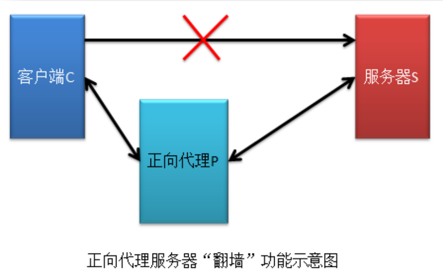
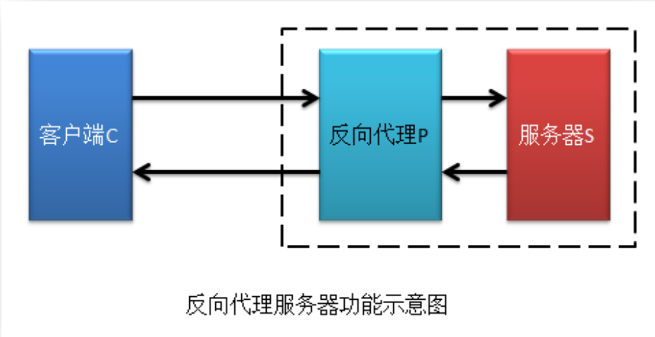
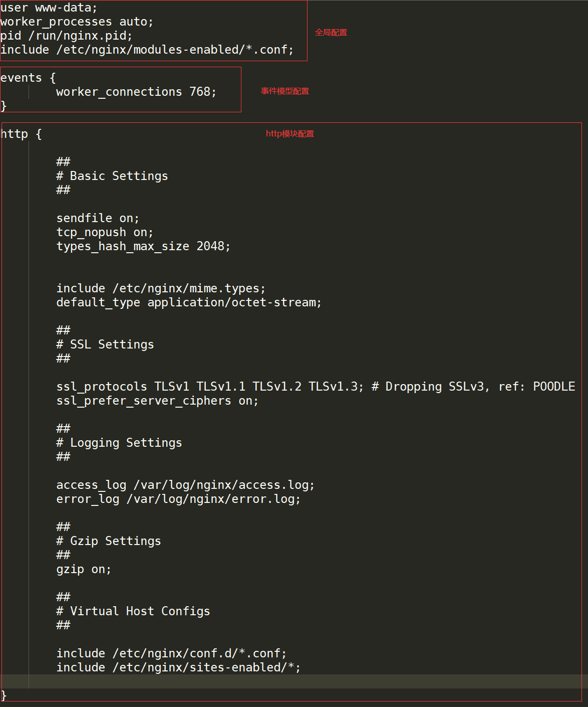
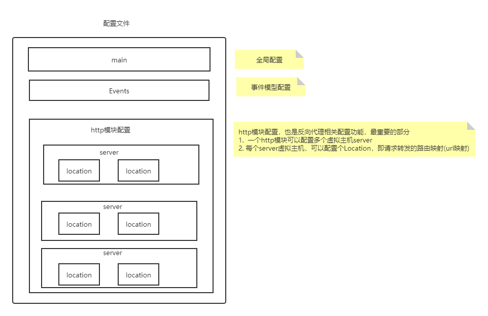

###### 一个全新的服务器

# 1 Nginx简介

## 1.1 什么是Nginx

Nginx (engine x) 是一个高性能的[HTTP](https://baike.baidu.com/item/HTTP)和[反向代理](https://baike.baidu.com/item/反向代理/7793488)web服务器，同时也提供了IMAP/POP3/SMTP[服务](https://baike.baidu.com/item/服务/100571)。（支持邮件协议）Nginx是由伊戈尔·赛索耶夫为[俄罗斯](https://baike.baidu.com/item/俄罗斯/125568)访问量第二的Rambler.ru站点（俄文：Рамблер）开发的，第一个公开版本0.1.0发布于2004年10月4日。

```bash
docker run --name mysql --restart=always -v /home/ljaer/mysql:/var/lib/mysql -p 3306:3306 -e MYSQL_ROOT_PASSWORD=root123456 -e TZ=Asia/Shanghai -d mysql:5.7
```

```bash
docker run --env MODE=standalone --name nacos --restart=always -d -p 8848:8848 -e JVM_XMS=128m -e JVM_XMX=128m -e JVM_XMN=64m nacos/nacos-server:1.4.1
```

> 对比Tomcat和Nginx
>
> 共同特征都是基于HTTP协议的web服务器：
>
> 1. Tomcat可以接收HTTP请求，返回HTTP响应。
> 2. 同样的，Nginx可以接收HTTP请求，返回HTTP响应。
>
> 区别在于：
>
> 1. Tomcat开发的语言是JAVA语言，支持Servlet规范，也就是支持java web应用的部署
> 2. Nginx开发语言是C语言，不支持Servlet规范，也就是不支持任何语言的web应用的部署
>
> 那么为什么使用Nginx？
>
> 希望多个Tomcat服务器能够组成一个系统——**Tomcat服务器集群**。在集群中的每一个Tomcat都是等价的。对于一个Http请求，Tomcat之间可以等价替换。
>
> 前端将请求发给Nginx然后转发给Tomcat集群。

Nginx是一款轻量级的[Web](https://baike.baidu.com/item/Web/150564) 服务器/[反向代理](https://baike.baidu.com/item/反向代理/7793488)服务器及[电子邮件](https://baike.baidu.com/item/电子邮件/111106)（IMAP/POP3）代理服务器，在BSD-like 协议（一种开源协议）下发行。其特点是占有内存少，[并发](https://baike.baidu.com/item/并发/11024806)能力强，事实上nginx的并发能力在同类型的网页服务器中表现较好，中国大陆使用nginx网站用户有：百度、[京东](https://baike.baidu.com/item/京东/210931)、[新浪](https://baike.baidu.com/item/新浪/125692)、[网易](https://baike.baidu.com/item/网易/185754)、[腾讯](https://baike.baidu.com/item/腾讯/112204)、[淘宝](https://baike.baidu.com/item/淘宝/145661)等。

## 1.2 Nginx的核心功能

 🏷️Nginx最核心的两个功能：

1. 高性能的静态web服务器

2. 反向代理

静态资源请求不包含复杂的业务逻辑，是图片/html/csss/js脚本等文本文件。可以将静态资源从Tomcat挪到Nginx，从而提高访问静态资源的速度。

*正向代理vs反向代理*





正向代理：代理发起请求的一方；

反向代理：代理接收处理请求的一方。

如上图，上边是正向代理，下边是反向代理
正向代理：代理服务器是代表用户客户端去访问后端服务器，代理的对象是前面的用户
反向代理：代理服务器是代表后端服务器供客户端去访问，对于前面的用户来说是无感知的，代理的对象是后面的后台服务器 

## 1.3 Nginx的优势

1. 高并发、高性能（多进程，多线程模型，master进程下有多个woker进程）

2. 扩展性好（模块化设计）

3. **异步非阻塞的事件驱动模型**
   1. IO性能非常好

   2. 事件驱动模型尚未学过

4. 高可靠性（1. 有多个woker进程，2. 即使修改了配置文件，不需要重启。热部署、7*24）

# 2 Ngnix的使用

## 2.1 Nginx的安装

Ubuntu安装[Nginx](https://nginx.org) 非常方便，可以直接使用apt源来安装

```bash
sudo add-apt-repository ppa:nginx/stable 
sudo apt-get update
sudo apt-get install nginx
```

执行以上三条指令即可完成安装

执行命令查看是否安装成功

```bash
nginx -v
```


**安装之后Nginx的目录组成**

1. 配置路径 `/etc/nginx `
2. 命令路径`/usr/sbin/`
3. 日志路径`/var/log/nginx`

在  `/etc/nginx `目录下可以看到nginx的配置文件`nginx.conf`


如上图所示，主配置文件是`nginx.conf` ，而Nginx的指令放在`/usr/sbin/nginx`，日志文件放在`/var/log/nginx`中


## 2.2 Nginx常用命令

找到Nginx执行命令，以Ubuntu18.04为例

安装完成之后会启动。

```bash
cd /usr/sbin
#启动命令
./nginx
#关闭命令
./nginx -s stop
#重启命令
./nginx -s reload
```

## 2.3 Nginx配置文件🏷️ 

> 学习Nginx重点在于学会配置。先学配置文件的结构。

- 核心配置文件就是`nginx.conf`，打开这个核心配置文件
- 配置文件中有很多`#` 开头的表示注释内容，我们去掉所有以 `# `开头的段落，精简之后的内容如下：



**根据上述文件，我们可以很明显的将 `nginx.conf `配置文件分为三部分：**



**重点关注HTTP协议配置**

#### 2.3.1 全局配置

从配置文件开始到 events 块之间的内容，主要会设置一些影响 nginx 服务器整体运行的配置指令，主要包括配置运行 Nginx 服务器的用户（组）、允许生成的 worker process 数，进程 PID 存放路径、日志存放路径和类型以及配置文件的引入等。

比如上面第一行配置的：

```bash
user www-data;	#运行worker子进程的用户
worker_processes auto; #子进程的个数
pid /run/nginx.pid; #运行master的pid文件存放的路径
include /etc/nginx/modules-enabled/*.conf; #将其他配置文件包含进来
```

这是 Nginx 服务器并发处理服务的关键配置，worker_processes 值越大，可以支持的并发处理量也越多，但是会受到硬件、软件等设备的制约

#### 2.3.2 events配置

比如上面的配置：

```xml
events {
	worker_connections 768;
}
```

events 块涉及的指令主要影响 Nginx 服务器与用户的网络连接，常用的设置包括是否开启对多 work process 下的网络连接进行序列化，是否允许同时接收多个网络连接，选取哪种事件驱动模型来处理连接请求，每个 word process 可以同时支持的最大连接数等。上述例子就表示每个 work process 支持的最大连接数为 768， 这部分的配置对 Nginx 的性能影响较大，在实际中应该灵活配置。

#### 2.3.3 http配置

> HTTP配置模块里面又有多个虚拟server，每一个不同的虚拟server可以代理不同的集群。

这算是 Nginx 服务器配置中最频繁的部分，代理、缓存和日志定义等绝大多数功能和第三方模块的配置都在这里。需要注意的是：http 块也可以包括 **http** **全局块**、**server** **块**。

<a color=red>1. http全局块</a>

http 全局块配置的指令包括文件引入、MIME-TYPE 定义、日志自定义、连接超时时间、单链接请求数上限等。

<a color=red>2. server块</a>

- 这块和虚拟主机有密切关系，虚拟主机从用户角度看，和一台独立的硬件主机是完全一样的，该技术的产生是为了节省互联网服务器硬件成本。
- 每个 http 块可以包括多个 server 块，而每个 server 块就相当于一个虚拟主机。
- 而每个 server 块也分为全局 server 块，以及可以同时包含多个 location 块。

>  ⭐ `sendfile on`代表的是零拷贝
>
> 首先复习一下应用程序读取磁盘文件的过程
>
> 
>
> 从磁盘中读了之后，要发出去
>
> 
>
> 在整个过程中有多次复制数据，为了优化整个IO效率，出现了零拷贝，从内核态到用户态的数据过程被省略掉，直接从内核缓冲区复制到Socket缓冲区
>
> 

>  ⭐`Tcp NoPush on`：当响应只有1个字节而封装的响应头有40字节时，直接发送会使有效载荷率降低，所以增加一个缓冲区。但是这会造成一些数据的延时。所以具体是否开启要看业务场景。相反的设置`TCP NODelay`
>

**配置详解**

```bash
########### 每个指令必须有分号结束。#################
#user administrator administrators;  #配置用户或者组，默认为nobody nobody。
#worker_processes 2;  #允许生成的进程数，默认为1
#pid /nginx/pid/nginx.pid;   #指定nginx进程运行文件存放地址
error_log log/error.log debug;  #制定日志路径，级别。这个设置可以放入全局块，http块，server块，级别以此为：debug|info|notice|warn|error|crit|alert|emerg
events {
    accept_mutex on;   #设置网路连接序列化，防止惊群现象发生，默认为on
    multi_accept on;  #设置一个进程是否同时接受多个网络连接，默认为off
    #use epoll;      #事件驱动模型，select|poll|kqueue|epoll|resig|/dev/poll|eventport
    worker_connections  1024;    #最大连接数，默认为512
}
http {
    include       mime.types;   #文件扩展名与文件类型映射表
    default_type  application/octet-stream; #默认文件类型，默认为text/plain
    #access_log off; #取/消服务日志    
    log_format myFormat '$remote_addr–$remote_user [$time_local] $request $status $body_bytes_sent $http_referer $http_user_agent $http_x_forwarded_for'; #自定义格式
    access_log log/access.log myFormat;  #combined为日志格式的默认值
    sendfile on;   #允许sendfile方式传输文件，默认为off，可以在http块，server块，location块。零拷贝
    sendfile_max_chunk 100k;  #每个进程每次调用传输数量不能大于设定的值，默认为0，即不设上限。
    keepalive_timeout 65;  #连接超时时间，默认为75s，可以在http，server，location块。

    upstream mysvr {   
      server 127.0.0.1:7878;
      server 192.168.10.121:3333 backup;  #热备
    }
    error_page 404 https://www.baidu.com; #错误页
    server {
        keepalive_requests 120; #单连接请求上限次数。
        listen       4545;   #监听端口
        server_name  127.0.0.1;   #监听地址       
        location  ~*^.+$ {       #请求的url过滤，正则匹配，~为区分大小写，~*为不区分大小写。
           #root path;  #根目录
           #index vv.txt;  #设置默认页
           proxy_pass  http://mysvr;  #请求转向mysvr 定义的服务器列表
           deny 127.0.0.1;  #拒绝的ip
           allow 172.18.5.54; #允许的ip           
        } 
    }
}
```

## 2.4 Nginx核心功能

### 反向代理

**反向代理配置**

```bash
http{
	...
	...
  #这部分是nginx作为反向代理服务器的配置
  server{
  		#nginx监听的端口
      listen  80;
      #虚拟服务器的识别标记，一般配置为本机ip
      server_name 192.168.45.151;
			#代理设置地址 路由转发规则 location后面跟的是请求匹配路径
      location / {
          proxy_pass http://192.168.45.151:8080;
      }
  }
}
```

让配置文件生效

```bash
sudo ./nginx -s reload
```

**集群及负载均衡配置**

> 负载均衡策略是指Nginx的选择策略

**负载均衡策略** 

1. 轮询（默认）
2.  weight
3. ip_hash
4. least_conn 最少连接方式
5.  fair(第三方) 响应时间 总是转发给平均响应时间最短的
6. url_hash (第三方) 即使是同一台主机发的请求那么也可能由不同tomcat处理，有更好的散列效果

```bash
# weight weight 代表权重,默认为 1,权重越高被分配的客户端越多
...
# cskaoyan是集群的名字，理论上可以是任意字符串，只需要保证和转发时集群名字一致即可
	upstream cskaoyan{
		server 192.168.45.151:8080 weight=2;
		server 192.168.45.151:8081 weight=1;
	}
...
```

```bash
# ip_hash 每个请求按访问 ip 的 hash 结果分配，这样每个访客固定访问一个后端服务器，可以解决 session 的问题。例如：
...
	upstream cskaoyan{
		ip_hash;
		server 192.168.45.151:8080;
		server 192.168.45.151:8081;
	}
...
```

注意，这里为了不让，浏览器自动发起的，获取应用图标的请求，干扰我们的测试结果，我们给server添加如下的location映射

```bash
    location /favicon.ico {
    }
```
