# Docker


## 1. 背景介绍

### 1.1 容器技术的起源

假如我们正在开发一个名叫“谁是小黑子”的应用，程序员自己**从头到尾搭建了一套环境**开始写代码，写完代码后程序员要把代码交给测试同学测试，这时测试同学开始**从头到尾搭建这套环境**，测试同学测完后终于可以上线了，这时运维同学又要重新**从头到尾搭建这套环境**，费了九牛二虎之力搭建好环境开始上线，糟糕，上线系统就崩溃了。

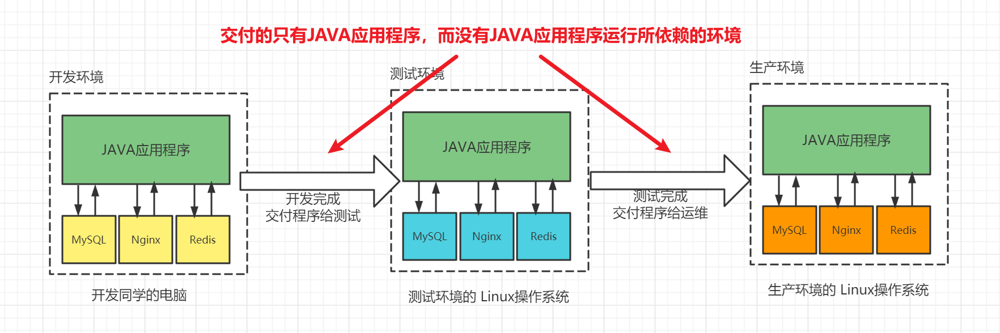

不难看出，不管是开发，还是测试，还是运维，想要运行我们的应用程序，都需要从头开始搭建环境，如果环境没有搭建好，那么我们的应用程序就运行不起来。这种做法，不仅仅会大大增加各个岗位的工作量，还可能引发一些不必要的.....


从以上整个过程可以看到，在从开发到上线的过程中，反复搭建了三套环境，这个过程十分浪费时间与效率，而聪明的程序员们是永远不会满足现状的。所以，容器技术应运而生。

### 1.2 虚拟机技术

针对以上的情况，聪明的同学可以想到，其实可以使用VMware虚拟机，先搭建好一套虚拟机环境，然后克隆出来分别交给开发、测试和运维，这样就可以解决反复搭建环境的痛点了。

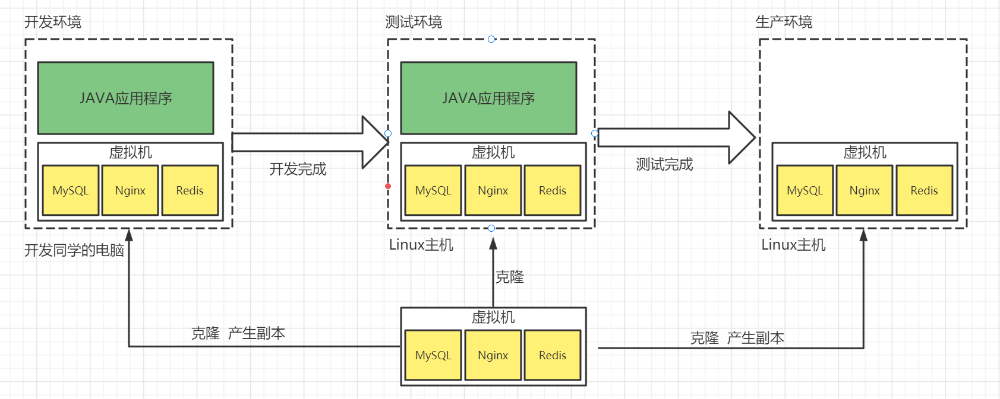

通过上图可以知道，这确实是一个不错的办法，不过也不是一个完美的解决办法。

因为我们的本意是在开发环境、测试环境和生产环境，部署并运行我们JAVA应用程序所依赖的其他应用，如上图中的MySQL、Nginx和Redis，但是现在我们在这三个环境中都运行了一个虚拟机，在这个虚拟机中运行了我们所需要的应用。

而虚拟机本身又运行了一个操作系统，操作系统是很**笨重**的，需要消耗更多的资源。

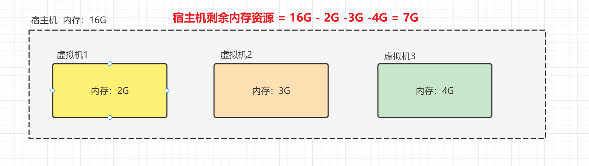

在上面的案例中，以开发环境为例

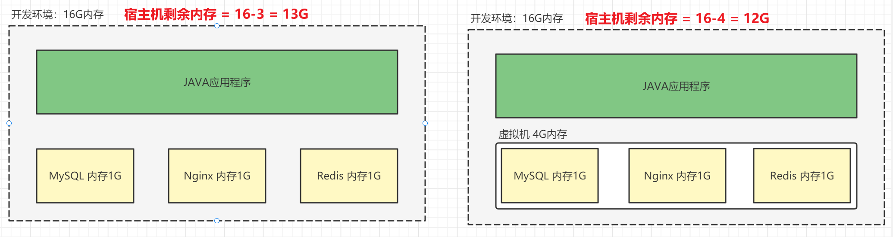

由上图不难看出，因为虚拟机的存在，消耗了更多的内存资源，其实不仅仅是内存资源，还有CPU和磁盘等资源。

> 在这里有同学可能会有疑问：那我在右边的图中对虚拟机分配3G内存不就行了吗？其实不行，因为在这个虚拟机操作系统中，不光光要运行MySQL、Nginx、Redis等应用程序（也可以简单理解为进程），还需要运行一些额外的系统进程，比如说会话管理器、登录服务、任务管理器
>
> 以下以windows操作系统为例，举例说明一些额外的系统进程，Linux等操作系统也是类似的。
>
> 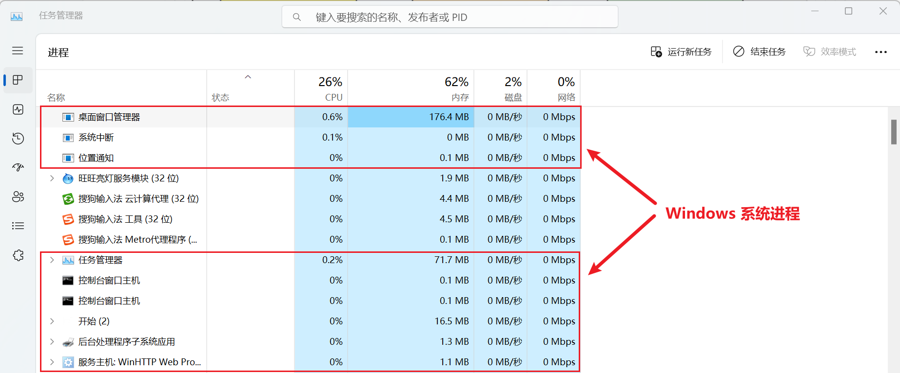

那么有没有一种技术，既能获得虚拟机的好处（只需要部署一次，部署快速简单），又能克服虚拟机的缺点（操作系统笨重，需要消耗更多的资源）呢？

答案是肯定的，这就是<span style='color:red;background:yellow;font-size:文字大小;font-family:字体;'>**容器技术**</span>。

### 1.3 容器

容器，英文是container，其实container还有集装箱的意思。

集装箱的特点：

- 集装箱之间互相<span style='color:red;background:yellow;font-size:文字大小;font-family:字体;'>**隔离**</span>
- 长期反复使用
- 快速装载与卸载
- 规格标准，在任何码头上都可以摆放


其实容器和集装箱的概念特别类似，集装箱是为了货物之间的隔离，<span style='color:red;background:yellow;font-size:文字大小;font-family:字体;'>**容器也是为了应用程序之间的隔离**</span>。其实虚拟机本质上也是一个隔离技术，隔离出宿主机的各个**操作资源**。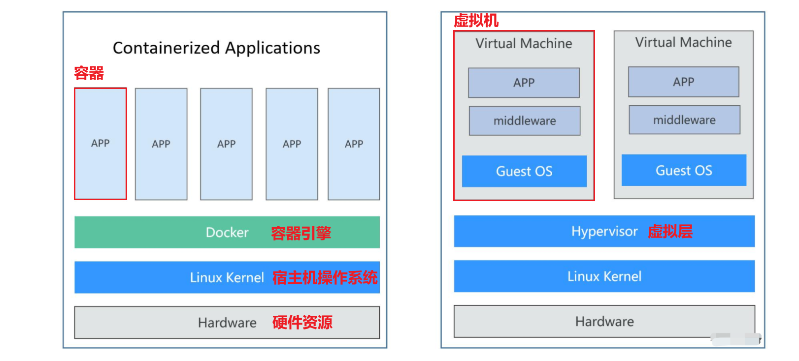

<span style='color:red;background:yellow;font-size:文字大小;font-family:字体;'>**不过与虚拟机技术不同的是，虚拟机是在操作系统层面实现的隔离，而容器技术只隔离应用程序的运行时环境，但容器之间可以共享同一个操作系统。**</span> 通过上图不难看出，容器更加轻量而且占用的资源更少，与宿主机的交互更快更直接，所以容器内的应用启动更加迅速，容器相比较与虚拟机是一种更加高效的技术。

**而正是因为有了容器引擎的存在：**

- 容器与容器之间可以**互相隔离**
- 容器内应用程序的运行也可以通过**容器引擎**调度宿主机的系统资源

而Docker只是容器引擎的一种实现，除了Docker之外，容器引擎还有很多，比如podman（开源），pouch(阿里)。

 🏷️**一个容器的本质就是一个独立的运行环境。**

## 2. Docker介绍

Docker是一个开源的应用容器引擎，基于Go语言并且遵从Apache2.0协议开源。

Docker将程序以及程序所有的依赖都打包在一起，运行在一个Docker容器中，这样你的程序可以在任何环境都会有**一致的表现**，这里程序运行的依赖也就是容器就好比集装箱，容器所处的操作系统环境就好比货船或港口，**程序的表现只和集装箱有关系(容器)，和集装箱放在哪个货船或者哪个港口(操作系统)没有关系**。

因此我们可以认为Docker可以帮助我们**屏蔽环境差异**，也就是说，只要你的应用程序和它运行所依赖的环境打包到了同一个Docker容器中，那么这个Docker容器不管运行在哪里，都会有完全一致的表现。

Docker的口号：“build once, run everywhere”。一次构建，处处运行。

## 3. 核心概念

容器中运行的是镜像，镜像中包含的是应用程序的只读文件。

- 镜像（Image）

  Docker镜像就类似于操作系统的镜像（比如之前安装虚拟机使用到的Ubuntu18），是一个**只读**的模版。一个镜像中包含了一个或多个特定的应用程序以及运行他们所依赖的应用程序。

- 容器（Container)

  - “用来运行镜像的特殊进程”
  
    把镜像下载到本地，容器就是从镜像创建的应用运行实例。它可以启动、开始、停止、删除，而这些容器都是彼此相互隔离、互不可见的。

- 仓库（Repository）

  仓库是集中存放镜像文件的场所。推荐使用的是[官方仓库地址](https://hub.docker.com/)，[网易云仓库](https://c.163yun.com/hub#/home)。当然，企业也可以搭建自己的仓库。

  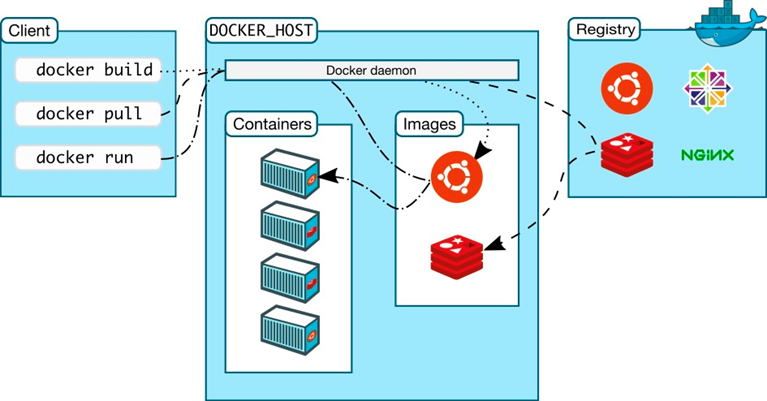


## 4. 安装	

### 准备工作

```bash
# 需要先执行更新命令
sudo apt-get update

# 如果是新安装的虚拟机，执行失败，那么执行以下命令
sudo apt-get install --reinstall libappstream4
```

如果虚拟机上已经存在docker，那么需要先卸载可能存在的旧版本

```bash
# 查找docker相关的软件
dpkg -l |grep docker
```

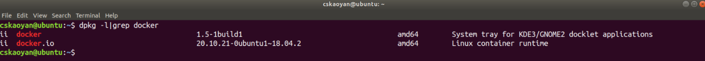

如上图所示，查到一个docker，还有一个docker.io，需要删除掉

```bash
# --purge: 删除软件以及相关的配置文件
sudo apt-get remove --purge docker docker.io
```

### 安装docker

安装docker的方式有很多种，这里推荐采用shell脚本的方式进行安装

```bash
# 下载curl工具
sudo apt install curl

# 安装方式1
# 安装docker
curl -fsSL https://get.docker.com | bash -s docker --mirror Aliyun

# 安装方式2
# 下载安装脚本
curl -fsSL https://get.docker.com -o get-docker.sh
# 执行安装脚本
sudo sh ./get-docker.sh
```

查看docker版本

```bash
docker version
```

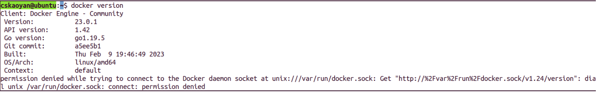

出现上图，表示docker安装成功。

### docker配置

#### 权限配置

注意上面查看docker版本的执行命令结果的图中，出现了一个`permission denied ...` 的报错，此时是因为当前用户对docker命令没有执行权限造成的，那么可以在`docker version` 这个命令的前面添加`sudo`解决这个问题，不过每次执行都添加`sudo`比较麻烦，而且后续使用docker下载镜像，运行容器，还需要大量的执行`docker ...` 命令，可以在这里执行以下命令**将当前用户添加到docker组**，来获取权限

```bash
# 添加docker用户组
sudo groupadd docker

# 将当前登录用户添加到docker用户组中
sudo gpasswd -a $USER docker

#更新用户组
newgrp docker

# 测试docker命令是否可以在当前用户下正常使用
docker version
```

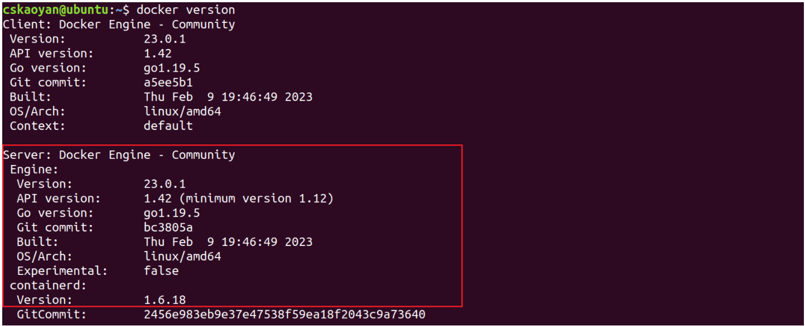

如上图所示，docker权限配置好了之后，会显示出更多更完整的信息

> 如果出现以下提示，那么需要`/var/run/docker.sock`权限

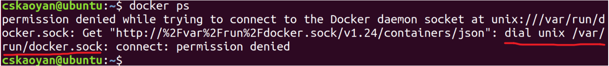

```shell
# 添加权限
sudo chmod a+rw /var/run/docker.sock
```

设置开机自启

```bash
systemctl enable docker
```

#### 镜像仓库加速

由于国内用户下载Docker镜像文件的速度太慢（因为Docker官方镜像仓库的服务器地址在国外），所以我们需要配置Docker镜像加速地址，提高镜像文件下载速度，就像MAVEN镜像仓库一样。

这里推荐使用阿里云镜像仓库加速配置。【[官方配置地址](https://cr.console.aliyun.com/cn-hangzhou/instances/mirrors)】

```bash
# 修改docker配置文件
sudo vim /etc/docker/daemon.json
```

在文件中，输入上面官方配置地址中的以下内容（不同用户的加速地址不一致）

https://8yhc9ic5.mirror.aliyuncs.com

```bash
{
	"registry-mirrors": ["https://8yhc9ic5.mirror.aliyuncs.com"]
}
```

```shell
# 加载新的配置文件
sudo systemctl daemon-reload

# 重启docker
sudo systemctl restart docker
```

验证docker镜像加速配置是否成功

```shell
# 查看docker详细信息
docker info
```

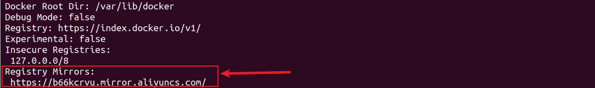

> 补充说明：docker镜像加速地址有很多，也可以配置别的镜像加速地址
>
> - Docker官方：https://registry.docker-cn.com
>
> - 网易：http://hub-mirror.c.163.com
> - 中科大：https://docker.mirrors.ustc.edu.cn
> - 腾讯云：https://mirror.ccs.tencentyun.com
>
> 如果速度不如预期，也可以在`daemon.json`中配置其他的镜像加速地址

## 5. 使用

### 镜像相关的命令

想要启动一个容器，首先需要找到它的镜像。镜像相关的命令如下：

- 列出本机的所有镜像：

  ```bash
  docker images
  #REPOSITORY 		TAG 			ID 					CREATED 		SIZE
  #nginx 				1.21.6 			0e901e68141f 		6 weeks ago 	142MB
  ```

  这个命令会展示镜像的信息：包括镜像的仓库源(REPOSITORY)、标签(`TAG`也就是版本)、镜像ID(IMAGE ID)、 创建时间和大小。

- 从仓库当中拉取镜像到本地：

  ```bash
  docker pull nginx:1.21.6
  #1.21.6: Pulling from library/nginx
  #42c077c10790: Pull complete
  #62c70f376f6a: Pull complete
  #915cc9bd79c2: Pull complete
  #75a963e94de0: Pull complete
  #7b1fab684d70: Pull complete
  #db24d06d5af4: Pull complete
  #Digest: sha256:2bcabc23b45489fb0885d69a06ba1d648aeda973fae7bb981bafbb884165e514
  #Status: Downloaded newer image for nginx:1.21.6
  #docker.io/library/nginx:1.21.6
  ```

  拉取镜像的来源地是仓库——一般使用的是公共仓库，比如默认的`hub.docker.com`，团队自己也可以建立私有仓库。

- 删除本地镜像：

  ```bash
  docker rmi nginx:1.21.6
  ```

### 容器相关的命令

#### 创建并启动容器

通过`docker run`命令可以从镜像当中启动容器。

前台启动：特征是会一直占用窗口。

```bash
docker run nginx:1.21.6
```

默认情况，执行`docker run`的效果会寻找镜像，如果相应的镜像不存在，那么会自动从公开仓库当中拉取；然后启动运行容器；随后附加的命令，在本例中附加命令为空。对应nginx容器，就会进入容器内部nginx的交互终端，可以使用ctrl+c从容器当中退出，但是同时也会停止容器。

如果给容器指定附加指令，对于nginx容器而言，会直接执行该指令，随后容器就停止了。

```bash
docker run nginx:1.21.6 echo hello
hello
```

使用`--help`选项可以获取命令的简明帮助：

```bash
docker run --help
# -i, 以交互模式运行容器，通常与 -t 同时使用
# -t, 为容器重新分配一个伪输入终端，通常与 -i 同时使用
# -d, 后台运行容器，并返回容器ID
# --name="nginx-cskaoyan": 为容器指定一个名称
# -e username="cskaoyan": 设置环境变量参数
```

```bash
# -p: 指定端口映射，格式为：主机(宿主)端口:容器端口
# -v: 文件挂载，映射文件
```

⭐ 假如需要进入容器内部，通过shell命令和容器交互`/bin/bash`指定交互的脚本格式

```bash
docker run -it nginx /bin/bash
```

上述命令执行之后，用户就可以进入容器内部，像使用一个普通的shell操作容器内部文件系统。使用ctrl+d可以退出容器并停止容器。

使用`-d`选项可以以守护进程的形式运行容器：

```bash
docker run -d nginx
```

#### 查看容器

我们还可以查看容器

```bash
docker ps  # 列出运行当中的容器
docker ps -a  # 列出所有的容器

docker rm 容器名|ID  # 删除停止状态的容器
```

```bash
# 容器id			  镜像      启动命令                 创建时间          状态       端口映射
#CONTAINER ID      IMAGE     COMMAND                 CREATED         STATUS    PORTS
#d05375d418cf	   nginx     "/docker-entrypoint.."  9 seconds ago   Exited    0.0.0.0:80->80
```

#### 进入运行中的容器

假若一个容器已经存在并且正在运行，使用`docker exec`进入容器

```bash
docker exec -it 容器名 /bin/bash
```

#### 查看容器日志

```bash
# 容器日志查看
docker logs [-f] 容器ID|容器名
```

#### 容器的启停命令

当然也可以停止、启动、重启或者是删除容器

```bash
# 停止容器
docker stop 容器ID|容器名

# 启动容器
docker start 容器ID|容器名

# 重启容器
docker restart 容器ID|容器名
```

#### 容器的删除命令

```bash
# 删除容器
docker rm 容器ID|容器名
```

### 端口映射 🏷️

> 使用端口映射的原因：**容器具有隔离性**。想要访问容器的80端口需要在容器内部才可以访问，为了在外部也可以访问，需要做端口映射，这样就可以通过访问宿主机端口来访问容器端口。

容器天生具有隔离的特性，所以不同的容器拥有**独立的网络系统**。这样的话，两个不同的容器在容器内部完全可以使用相同的端口，并且可以使用宿主机当中已经使用的端口——**这些相同的端口号实际上是毫无关联的，彼此之间也无法进行网络通信。**如果希望通过容器来对外提供服务，就需要为容器的端口和宿主机的端口建立映射。

为了从外部访问docker应用程序的端口，使用`docker run`的`-p`选项可以实现端口映射：

```bash
# 将宿主机的8080端口映射到容器的80
# -p: 指定端口映射，格式为：主机(宿主)端口:容器端口
docker run -d --name=xxx -p 8080:80 nginx
```

> 镜像名字后面不加tag，默认使用最新的镜像。

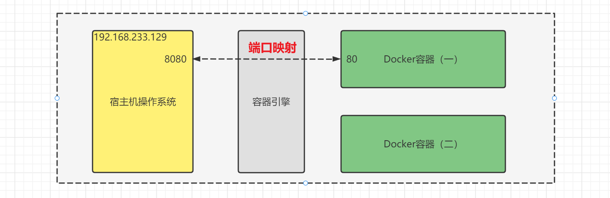

### 文件映射  🏷️ 

容器天生具有隔离的特性，所以不同的容器拥有**独立的文件系统**。在容器内部做任何的修改，都不会影响到宿主机或者其他容器。如果容器一旦被删除，那么容器中的一切数据就都不存在了，所以如果想要让容器在被删除之后，仍然可以访问到容器中的数据（比如对于数据库类型中的数据），就需要将容器内部的某个目录映射到宿主机文件系统当中，从而让数据保存到宿主机，这样一来，即使容器被删除了，我们也可以在宿主机中访问到之前容器中的数据

使用`docker run` 的`-v`可以实现数据持久化：

```bash
docker run --name=xxx -d -p 0.0.0.0:8081:80 -v /tmp/test:/usr/share/nginx/html nginx
```

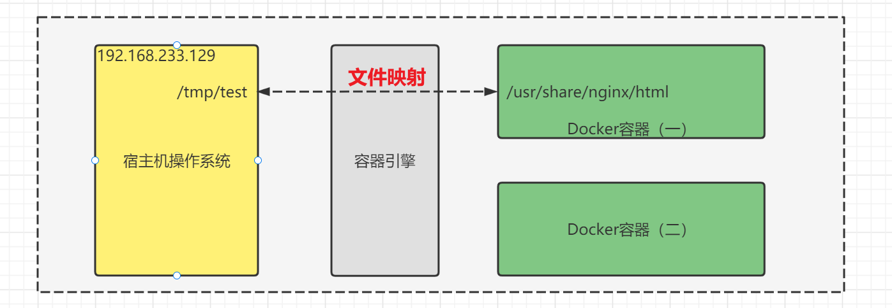

容器中访问的`/usr/share/nginx/html`和宿主系统的`/tmp/test`的内容是一致，并且任何形式的修改都会在宿主系统和容器当中共享。

```bash
# 在容器内部执行
echo "<html>hello world</html>" > /usr/share/nginx/html/index.html
# 相当于在宿主系统当中执行
sudo echo "<html>hello world</html>" > /tmp/test/index.html
```
