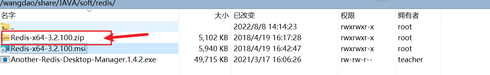
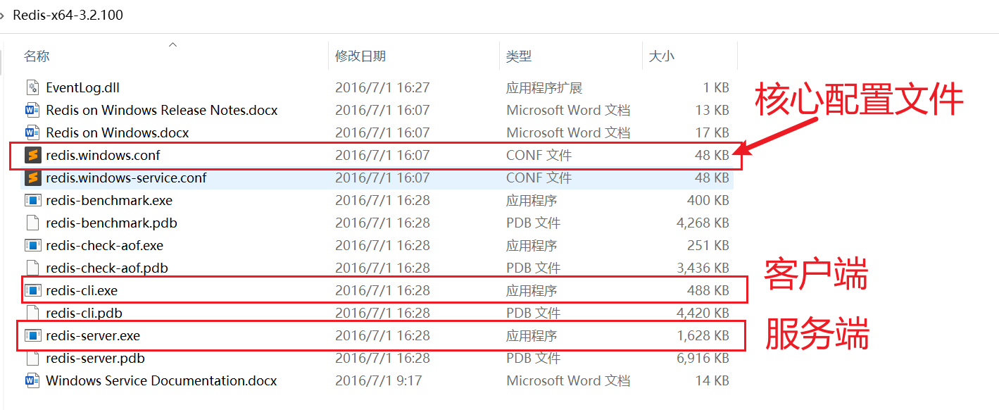
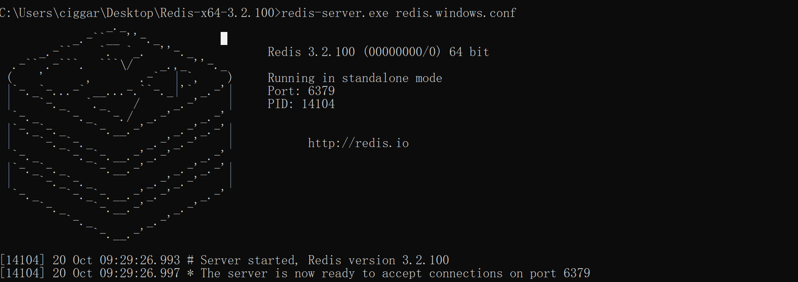
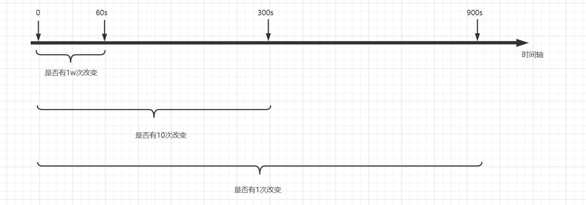
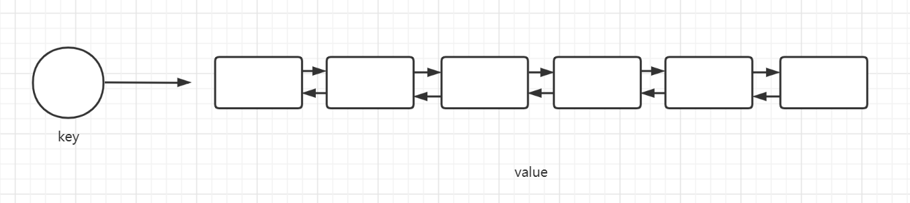
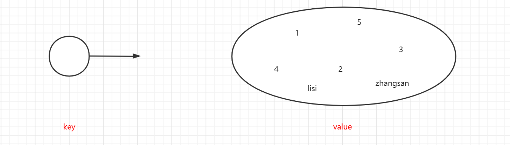
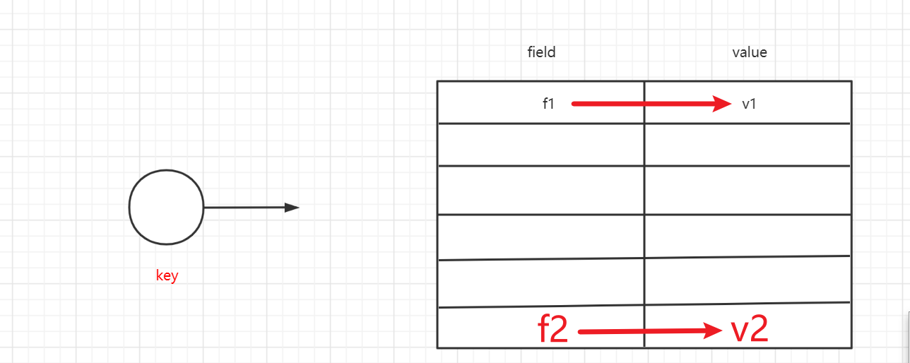
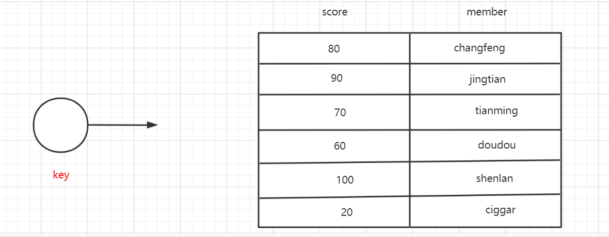
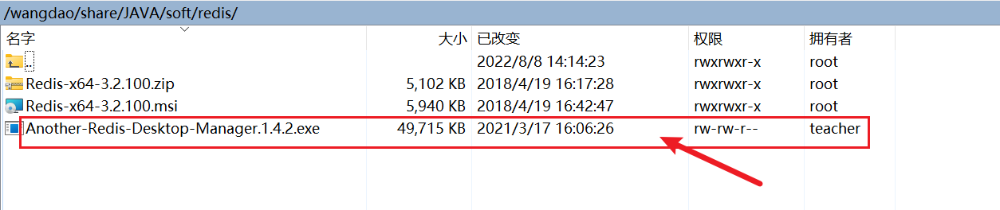
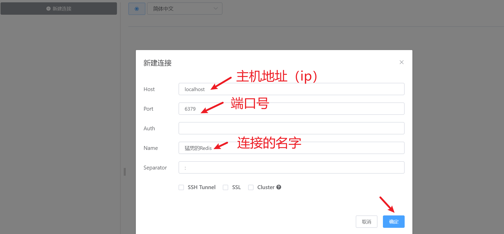

# Redis

## 1. 引入

迄今为止，互联网的发展已经经历了两个阶段web1.0和web2.0

- web 1.0时代，网站是静态的(通常是一些简单的文字和图片)，也就是网站创建什么内容，用户就获取什么内容，这是一个单方面的信息传递，没有任何互动，比如以前的中国三大门户网站：搜狐、新浪、网易，就是Web1.0的典型代表。
- Web2.0 强调**内容的互动**，用户不再只是内容接收方，而可以成为内容的提供方，平台的共建者，于是我们就进入了数据爆炸的时代

传统的关系型数据库在应付web2.0网站，特别是超大规模和高并发的web2.0纯动态网站已经显得力不从心，暴露了难以克服的问题：

- High performance 对数据库**高并发写**的需求。web2.0网站要根据用户个性化信息来实时生成动态页面和提供动态信息，因此数据库并发负载非常高，往往要达到每秒上万次读写请求，关系型数据库应付上万次的SQL查询还勉强顶得住，但是应付上万次的SQL写数据请求，硬盘IO就已经无法承受了
- Huge Storage 对海量数据的**高效存储和访问**的需求。对于大型的SNS网站（社交网络），每天用户产生海量的用户动态信息，以国外的Friend feed为例子，一个月就达到了2.5亿条用户动态，对于关系型数据库来说，在一张2.5亿条记录的表里进行SQL查询，效率是极其低下乃至不可忍受的，再如大型web网站用户登录系统，比如腾讯、盛大、动辄数亿计的账号、关系数据库也很难以应付。

同时，对于web2.0网站来说，关系数据库的很多主要特性却往往无用武之地。比如：

- 很多web实时系统并不要求严格的数据库事务，对**读一致性**的要求很低，有些场合对**写一致性**要求也不高，因此数据库事务管理成了数据库高负载下一个沉重的负担。
- 对关系数据库来说，插入一条数据之后立刻查询，是肯定可以读出来这条数据的，但是对于很多web应用来说，并不要求这么高的实时性。
- 任何大量数据的web系统，都非常忌讳多个大表的关联查询，以及复杂的数据分析类型的复杂SQL报表查询，从需求以及产品设计角度，我们也会尽量避免这种情况的产生，往往更多的只是**单表的主键查询**，以及单表条件分页查询，SQL功能被极大地弱化了

因此关系数据库在这些越来越多的应用场景下显得不那么合适了，为了解决这一问题，NoSQL数据库应运而生。而Redis就是一个典型的NoSQL数据库。和传统的关系数据库相比，Redis是一个**纯内存数据库**，存储**非结构化**的key-value键值对。

 🏷️Redis的两个特征：

1. 是一个纯内存数据库，操作快
2. 存储键值对

## 2. 介绍

Redis是一个NoSQL数据库。

NoSQL: not only SQL。表示非关系型数据库（不支持SQL标准语法）。

> Redis 是一个使用C语言编写的、免费的、开源的、支持网络、可基于内存、亦可持久化的日志型，key-value 非关系型数据库，并且提供多种语言的 API
>
> - C语言编写的
> - 开源的（https://github.com/redis）
> - 可基于内存：是把数据存在到内存上的
> - 可持久化：可以把内存里面的数据持久化到磁盘(为了实现数据恢复)
> - key-value：数据在内存中是以键值对的方式来存储的
> - 支持网络：客户端是通过网络连接服务端的（Redis是C/S架构：redis-server和redis-cli客户端）
>
> - 支持多种语言：可以在各种语言的代码中操作Redis

## 3. 安装

Redis官方其实是不支持windows操作系统的。但是windows的工作团队给redis提供了适配，让Redis能够支持windows。

### 3.1 下载



### 3.2 解压



### 3.3 启动

#### 3.3.1 启动服务端

> 1. 打开Redis的解压目录
>
> 2. 在此处打开cmd命令行
>
> 3. 执行命令
>
>    ```shell
>    redis-server.exe redis.windows.conf
>    ```



#### 3.3.2 启动客户端

> 1. 进入解压路径
>
> 2. 输入cmd
>
> 3. 执行命令
>
>    ```shell
>    redis-cli.exe [-h  localhost] [-p 6379]
>    ```
>    
>    默认访问本机的6379端口

## 4. Redis核心配置

### 4.1 常规配置

```ini
# 表示redis服务端是不是以守护进程（后台进程）的方式运行
# on windows, daemonize is not supported
daemonize no

# 客户端和服务端之间建立连接，假如超过多长时间没有进行通信那么就断开连接
# 0表示不关闭连接
timeout 0

# 端口号（一般不用去改）
port 6379

# 绑定的主机地址
bind 127.0.0.1
# 所有人都可以连接
# bind 0.0.0.0

# 日志级别
loglevel notice

# 数据库的数量设置
databases 16

# 密码设置
requirepass cskaoyan
```

### 4.2 持久化配置

#### RDB

RDB是指Redis通过**内存快照**的形式来持久化内存中的数据到磁盘中。

RDB是Redis默认的持久化策略，没有提供开关关闭。

> 快照：其实就是一种内存技术，就可以像对内存进行拍照一样，保存内存当时的状态。
>
> - 快照的速度很快
> - 快照保存的一种数据的状态，占用的磁盘空间比较小
> - 快照会保存完整的数据

```ini
# 内存快照保存文件的位置
# 默认是./ 当前目录，安装Redis的目录
dir D:\tmp

# 内存快照保存文件的名字
dbfilename dump.rdb

# 快照触发的策略 ⚡ 
save <seconds> <changes>
# 在多少秒之后，检查有多少次改变，如果达到设置的条件，那么就触发持久化
# 键值对发生变化指的是，新增，删除和修改
# 相当于启动了一个定时任务，每个固定时间扫描一次改变次数
save 900 1
save 300 10
save 60 10000
```



> 总结：
>
> 1. RDB每次保存的是触发RDB时刻的完整的数据
> 2. RDB可能丢失数据，可能会丢失上一次持久化之后所有写入的数据（比如最小间隔是60秒，在0~60秒间Redis突然挂掉，就会有数据丢失）
> 3. RDB保存数据的速度很快，还原数据也很快，比AOF快

#### AOF

Append only file。AOF这种持久化的机制是通过**追加(写操作命令)日志文件**的方式来保存数据的。

> AOF会把用户输入的每一个写入命令保存到文件中，后续恢复数据的时候可以通过执行这个文件中的所有的命令来恢复数据。

```ini
# 总开关
# AOF默认是关闭的
appendonly no

# 保存文件的路径
# 配置和RDB是同一个配置
dir D:\tmp

# 保存文件的名字
appendfilename "appendonly.aof"

# 保存的策略

# 每收到一条写入的命令，就把命令保存到文件中
# fsync()方法会让操作系统将数据立刻写入磁盘，而不走缓存
# appendfsync always

# 每秒保存一次（推荐使用的）
appendfsync everysec

# 依赖于操作系统的策略
# appendfsync no
```

AOF文件会一直膨胀吗？

当AOF文件大小增长到一定程度时，会触发**server的精简机制**，只保存对同一个key的最后一条命令。

> AOF持久化机制的总结：
>
> 1. AOF**可以做到**不丢失数据（`appendfsync always`），通过设置`appendfsync always`，但是这样就和关系型数据库一样，每次都会操作都会有IO。
> 2. AOF保存数据生成的文件会越来越大，占用磁盘空间比较大
> 3. AOF还原数据要通过执行文件中的所有的命令来还原数据，还原数据比较慢

> AOF和RDB是可以同时运行的。
>
> 当两种机制都开启的时候，恢复数据的时候，优先从AOF生成的文件来恢复数据。因为AOF数据保存的完整度更高。

##  5. 数据结构

### 常用命令

```ini
# 切换数据（index从0开始，0~15）
select index

# 认证密码
auth password

# 搜索key (pattern 是一个正则表达式)
keys pattern
# 常用的是：keys * （查看所有的key），注意keys * 不可以在生产环境使用，涉及到线程模型

# 清空数据库（删库）
# 清空所有的数据库（16个）
flushall

# 清空当前的数据库
flushdb
```

>  🏷️`keys * `不可以在生产环境使用：
>
> Redis中**执行命令**的线程有且只有一个，并不是Redis是单线程的，而是执行命令是单线程的。需要被执行的命令存在一个队列，执行`keys *` 时，在单线程里需要获取很多数据，执行时间很长，在这段时间里，再向Redis发送命令，会进入排队，不会被执行。另外，同时因为是单线程，所以一个命令天生就是一个原子操作。

不同数据类型的命令不同。通过输入命令就可以决定是什么数据类型。

### `string`

> 和JAVA中的String有区别，相当于JAVA中的String 类型与数值类型的总和。

string数据结构是Redis中最基本的数据结构，包含 （String + 数字类型）


```ini
# 设置一个键值对（如果key存在，会覆盖）
set key value

# 获取一个键值对的值
get key

# 批量的设置键值对 multi-set的缩写mset
mset key1 value1 key2 value2 ...

# 批量的获取键值对
mget key1 key2 key3 ...

# 给指定的key的value +1 value必须得是一个数值
incr key

# 给指定的key增加指定的步长
incrby key increment

# 给指定的key的value -1
decr key

# 给指定的key减去指定的步长
decrby key decrement

# 设置一个key-value，并且指定过期时间，过期之后拿不到对应的值
setex key seconds value

# set not exists，设置一个键值对，不会覆盖原来的值
# 当key不存在的时候，再去设值，不会覆盖原来的值
# 返回0代表修改失败；1代表添加成功
setnx key value
```

> 使用场景：
>
> 1. 利用incr命令可以统计网站的**访问量**
>
> 2. 利用incr和decr统计游戏的**在线人数**
>
> 3. setex可以用于**秒杀**
>
> 4. setnx可以实现简单的**分布式锁**

> 如何基于Redis模拟最简单的锁？
>
> + 如何模拟加锁释放锁的状态？
>   + 可以用有无键值对模拟加锁释放锁的状态
> + setnx：只能添加一个新的键值对
>   + 如果redis已经有了该键值对（添加失败 → 加锁失败）
>   + 如果redis中没有该键值对（添加成功 → 加锁成功）

### `list`

`list`的本质是一个**双向链表**。`list`的一个值是一个双向链表，其中每个元素的类型是`string`。Redis支持用户从`list`的两端推入或者是弹出元素。

 🏷️特点：

- 可重复
- 有序



🏷️ 因为有序所以要注意书写顺序和存取顺序的关系。

```ini
# 从队列的左端推入元素（当list不存在的时候，会自动创建一个新的list，然后来推入）
lpush key value1 value2 ...

# 从队列的左端弹出一个元素
# 执行之后该元素会被删除
lpop key

# 从队列的右端推入元素
rpush key value1 value2 ...

# 从队列的右端弹出一个元素
rpop key

# 查看链表的元素数量
llen key

# 查看某一个范围内的元素(start、stop指元素的下标，最左边的元素下标为0)（0，-1）表示所有元素
# 这里的l代表list
lrange key start stop

# 求指定下标的元素值
lindex key index

# 插入一个元素(在指定的元素pivot 前面或者是后面插入一个指定的元素 value )
# 如果指定的元素pivot有重复，那么就会在第一个值前面或者是后面插入
linsert key before|after pivot value

# 正常的从左端推入，当list存在的时候才会生效
lpushx key value

# 修改指定位置元素的值
lset key index value

# 删除前几个指定的元素
lrem key count value
```

> 应用场景：
>
> - 消息队列
> - 最新动态（消息）排行榜（eg：B站的动态）

### `set`

无序的集合。

 🏷️ 特点：

1. 无序
2. 不可重复

> 无序集合这种数据结构，最大的特点是可以利用Redis给我们提供的命令**求多个无序集合的交集、并集、差集**。



```ini
# 往无序集合中添加元素
sadd key member1 member2 ...

# 查看无序集合中元素的个数
scard key

# 查看无序集合中所有的元素
smembers

# 判断某个元素在不在指定的集合中
sismember key member

# 随机弹出一个元素(取出并删除)
spop key [count]

# 随机从集合中取出一个元素的值（取出不删除）
srandmember key [count]

# 求交集
sinter key1 key2 ...

# 求出交集并保存
sinterstore destination key1 key2 ...

# 求并集
sunion key1 key2 ...

# 求出并集并保存
sunionstore destination key1 key2 ...

# 求差集
# 求的是key1有而key2无的
sdiff key1 key2 ...

# 求出差集并保存
sdiffstore destination key1 key2 ...

# 移动元素
smove source destination  member

# 删除元素
srem key member1 member2 ...
```

> 应用场景：
>
> 1. 求共同好友
>
> 2. 好友推荐

### `hash`

`hash`叫做二维表，类似于`Map`。

`hash`这种数据结构可以看作是一个`map`，可以存储多个键值对。这里键值对称为`field-value`。



```ini
# 设置一个键值对
hset key field value

# 获取指定二维表中field的值
hget key field

# 设置多个键值对
hmset key field1 value1 field2 value2 ...

# 获取多个键值对的值
hmget key field1 field2 ...

# 判断二维表中有没有指定的field
hexists key field

# 获取二维表中所有的键值对
hgetall key

# 获取二维表中所有的键
hkeys key

# 获取二维表中所有的值
hvals key

# 求出二维表中 键值对的个数
hlen key

# 给键值对的值 增加指定的长度
hincrby key field increment

# 设置值，不覆盖( 当二维表不存在时候，也会设置值)
hsetnx key field value
```

> 应用场景：
>
> 要根据业务特征决定
>
> 业务中，一个用户只有一个购物车，一个购物车中可以包含多个不同的数据
>
> 并且可以**快速找到**修改的数据而不需要遍历！
>
> - 存储商城中的购物车

### `sortedset`(`zset`)

有序的集合。每个元素都绑定score，理解为元素的权重。有序的大小由score的大小决定。



> 有序集合的最大特点是：可以任意的取出有序集合中指定排名区间内的成员、以及指定分数区间内的成员。

```ini
# 往有序集合中添加成员一级他的分数（注意：分数在前，名字在后）
zadd key score1 member1 score2 member2 ...

# 计算集合中元素的总个数
zcard key

# 求指定分数区间内成员的个数（分时是闭区间）
zcount key min max

# 求出指定成员的分数
zscore key member

# 给指定的成员增加分数
zincrby key score member

# 求出指定排名区间内的成员(排名从0开始，默认按照分数的升序排列)
zrange key start stop [withscores]

# 求出指定排名区间内的成员(排名从0开始，默认按照分数降序排列)
zrevrange key start stop [withscores]

# 求指定分数区间内的成员-按照分数的升序排列
zrangebyscore key min max [withscores]

# 求指定分数区间内的成员-按照分数的降序排列
zrevrangebyscore key max min [withscores]

# 升序求出指定成员的排名
zrank key member

# 降序求出指定成员的排名
zrevrank key member

# 删除指定的成员
zrem key member1 member2 ...

# 删除指定排名区间内的所有成员
zremrangebyrank key start stop [withscores]

# 删除指定分数区间内的所有成员
zremrangebyscore key min max [withscores]
```

> 应用场景：
>
> 有序集合可以实现排行榜，比如积分排行榜，将积分当作权重。
>
> 1. 游戏中积分"排行榜"

## 6. 内存淘汰策略

Redis是一个基于内存来存储的数据库，而内存资源是十分宝贵且有限的。那么当**内存满了之后**，Redis又需要存储新的数据的时候，该怎么办呢？

这个时候，Redis会触发**内存淘汰策略**，来淘汰老的数据，保证写入的成功。Redis提供了8种淘汰策略。

> 参数说明：
>
> `volatile`：**设置过期时间**的数据集
>
> `allkeys`：所有数据集
>
> `LRU(Least Recently Used)`：最近最少使用
>
> `LFU(Least Frequently Used)`：访问频度最低
>
> `TTL（Time To Live）`：最近过期时间

- volatile-lru（least recently used）

  从已经设置了过期时间的数据集中，选择**最近最少使用**的数据进行淘汰。

- volatile-lfu

  从已经设置了过期时间的数据集中，选择一段时间内使用最少的key进行淘汰

- volatile-random

  从已经设置了过期时间的数据集中，**随机**选择数据进行淘汰

- volatile-ttl

  从已经设置了过期时间的数据集中，选择**最近将要过期**的数据进行淘汰

- allkeys-lru

  从所有的数据集中，选择最近最少使用的数据进行淘汰。

- allkeys-random

  从所有的数据集中，随机选择数据进行淘汰

- allkeys-lfu

  从所有的数据集中，选择一段时间内使用最少的key进行淘汰

- no-evication

  禁止淘汰数据，如果有新的数据需要写入，那么就**直接报错**
  
  > ### eviction /ɪˈvɪkʃən/   |TEM8
  >
  > - [N-VAR ](javascript:;)**Eviction** is the act or process of officially forcing someone to leave a house or piece of land. 驱逐

> 在以后的工作中，选择哪一种更加合理呢？
>
> - 从效率的角度出发：allkeys-random
> - 从合理性的角度从出发：volatile-lru
>
> 那么优先保证淘汰的效率还是保证淘汰数据的合理性呢？
>
> - 一般是保证效率，因为使用redis就是为了快

NoSQL数据库是SQL的一种补充，不用担心数据从Redis删除掉，因为还存储在SQL中。

 🏷️什么样的数据适合存储在Redis上面呢？

- 用户不敏感的
- 访问量比较大的（速度要求比较高的）

## 7. 客户端

Redis和MySQL一样，也是一个C/S架构的应用。

Redis也和MySQL是类似的，存在各种各样的客户端。

### 7.1 命令行客户端

redis-client

### 7.2 图形化界面客户端

AnnotherRedisDeskTopManager。





### 7.3 Java客户端

官方推荐的Java客户端是：

- Redisson
- Jedis

#### 7.3.1 Jedis

> Jedis全称叫做Java for Redis，使用非常简单，因为Jedis的每一个方法都和Redis的相关的命令名字是一致的。

如何使用呢？

- 导包

  ```xml
  <dependency>
      <groupId>redis.clients</groupId>
      <artifactId>jedis</artifactId>
      <version>2.9.0</version>
  </dependency>
  ```

- 配置

  Jedis不需要任何配置

- 使用

  - 创建Jedis对象，指定IP地址和端口号
  
  - 一切方法都是Jedis对象来调用
  
- Jedis方法名和Redis命令名一致

  ```java
   // 1. 创建一个Jedis对象
          Jedis jedis = new Jedis("localhost",6379);
  
          // 认证密码
          // jedis.auth("cskaoyan");
  
          // 2. 使用Jedis
  //        String value = jedis.get("shuaige");
  //        System.out.println("value:" + value);
  
  //        jedis.hset()
  //        jedis.rpush
  //        jedis.sismember()
  //        jedis.zrank()
  //        jedis.zrevrank()
  ```


Jedis虽然简单，但是功能有限。

#### 7.3.2 Redisson🏷️ 

和Jedis不同，Redisson不仅仅实现了我们前面所学习过得所有的Redis命令对应的功能，它自己对Redis的功能做了很多的封装，提供了很多**更为好用，更为强大**的功能，比如**基于Redis实现的分布式锁**。

使用Redisson我们首先需要引入依赖，然后我们就可以开始使用Redisson了。

+ 导包

```xml
<dependencies>
    <dependency>
        <groupId>org.redisson</groupId>
        <artifactId>redisson</artifactId>
        <version>3.11.1</version>
    </dependency>
</dependencies>
```

首先，使用Redisson访问Redis之前，我们得首先构造出一个RedssonClient对象

> 需要告诉`RedissonClient`是什么模式的Redis？
>
> 单机模式，还是哨兵模式。

```java
// 1. new 出一个config对象，Config是org.redisson包下的
Config config = new Config();
// 2. 配置Config对象
SingleServerConfig serverConfig = config.useSingleServer()
        // 这里设置访问Redis的地址
        .setAddress("redis://localhost:6379");

// 设置序列化方式，使用jackson实现序列化和反序列化
config.setCodec(new JsonJacksonCodec());

// 3. 创建redis客户端 该对象在创建的时候，就会像redis-server发起连接请求
RedissonClient redissonClient = Redisson.create(config);
```

需要注意的是，RedissonClient对象在创建的时候就会向Redis Server发起连接请求了，所以如果和Redis Server建立连接失败，那么RedissonClient对象也会创建失败！

创建好RedissonClient对象之后，我们就可以基于ReidssonClient对象实现对Redis中5种基本数据类型的访问了。

+ 在访问一个类型的值之前，总是要先获取`RBucket<>`对象，有一个泛型表示访问的类型对应的JAVA类型
+ `RBucket`对象：是一个代理对象，它就代理了Redis当中key值为name的键值对
+ 写value时，RBucket对象会自动把value从Java进程发送给Redis-Server

+ 写value时，因为JAVA中有引用数据类型，而Redis-Server没有引用数据类型，所以RBucket会做类型转换，做一个序列化，取出的时候会反序列化。
+ 当设置`config.setCondec()`为`JsonJacksonCondec`时，可以将对象转换为Json字符串

```java
/*
   该方法主要演示对于Redis，string类型数据的访问
*/ 
private static void string(RedissonClient redissonClient) {
/* 
     1. number表示String类型的值对应的Redis中的key
     2. 通过redissonClient获取存放key对应值的Bucket桶
     3. 桶中放的就是key对应的Redis中的string类型的值
     4. 对于桶的基本操作就是get/set，获取桶中的值/设置桶中的值
     5. 对桶中值的操作都相当于是对Redis中key对应的string类型的值的操作

     */
    RBucket<Integer> bucket = redissonClient.getBucket("number");
    bucket.set(0);

    // 获取对应的String数据类型的值
   	Integer result = bucket.get();
    System.out.println(result);

    // 获取obj对应的存放String类型值的Bucket桶(这里其实对象被转化成了json字符串)
    RBucket<Person> personBucket = redissonClient.getBucket("obj");
    Person person = new Person();
    person.setName("长风");
    // 向桶中放入对象
    personBucket.set(person);

    // 从桶中获取对象
    Person newPerson = personBucket.get();
    System.out.println(newPerson.getName());

}
```

> `bucket.tryset()`等同于Redis中的`setnx`：不存在key时再设置返回1代表成功，存在时设置失败返回0。不会覆盖原来的值。这种逻辑可以用来实现分布式锁。

访问List类型的值

```java
private static void list(RedissonClient redissonClient) {

    /*
        1. 调用redissonClient的getList方法，根据指定的key获取List类型的值
        2. 对于我们而言List类型的值就相当于内存中的一个List，所以之前怎么访问List，现在完全一样
        3. List中可以放基本数据类型及其包装类的值，也可以放对象
        4. 如果要修改Redis中List数据类型中的元素的值，还得把修改后的元素重新调用add方法
           添加到List才行
    */
    List<Person> list = redissonClient.getList("listKey");

    // ...

}
```

访问Set类型的值

```java
private static void set(RedissonClient redissonClient) {
/*
    1. 调用redissonClient的getList方法，根据指定的key获取Set类型的值
    2. 对于我们而言List类型的值就相当于内存中的一个Set，所以之前怎么访问Set，现在完全一样
    3. Set中可以放基本数据类型及其包装类的值，也可以放对象
    4. 因为Set无序，所以仍然和之前一样，可以用迭代器或者stream流来访问
*/
	Set<String> set = redissonClient.getSet("setKey");
	set.add("setValue");

	Iterator<String> iterator = set.iterator();
	while (iterator.hasNext()) {
   	String next = iterator.next();
   	System.out.println(next);
	}
}
```

访问SortedSet类型的值

```java
 private static void sortedSet(RedissonClient redissonClient) {
    /*
       1. 调用RedissonClient的getScoredSortedSet获取指定key对应的一个SortedSet
       2. Redisson用RScoredSortedSet对象表示一个SortedSet，该类所持有的泛型表示SortSet中元素对
          应的Java类型

       3. RScoredSortedSet中的每一个元素都绑定分数，所以添加的时候既要添加元素还要添加元素的score
       4. 可以获取元素的分数，排名...
       5. RScoredSortedSet中也可以放Java对象

    */
    RScoredSortedSet<String> sortedSet
            = redissonClient.getScoredSortedSet("sortedKey");

    sortedSet.add(1.0, "zs");
    sortedSet.add(2.0, "lisi");

    Double score = sortedSet.getScore("zs");
    System.out.println(score);
    Integer rank = sortedSet.rank("zs");
    System.out.println(rank);
}
```

访问hash数据类型的值

```java
private static void map(RedissonClient redissonClient) {

    /*
        1. 在redis中获取名为mapKey的名称的hash数据结构的值
        2. 获取到的是一个Map，就可以把它当做内存中的一个Map，所以之前怎么用Map现在还是一样
        3. Map中的key为String类型，Value可以是基本数据类型及其包装类的值，也可以是对象
        4. 如果要修改Redis中hash数据类型中的元素的值，还得把修改后的元素重新调用Map的put方法
           添加到Map中才行
    */ 
  
    Map<String, String> map = redissonClient.getMap("mapKey");

    //         "field"      "value"
    // 添加
    map.put("mapField", "mapValue");
    // 修改
    map.put("mapField", "v1");

   //获取
    String mapField = map.get("mapField");
    System.out.println(mapField);
   //删除
    map.remove("mapField");
}
```

