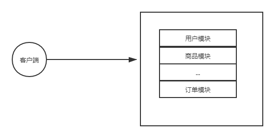
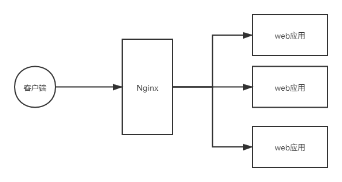
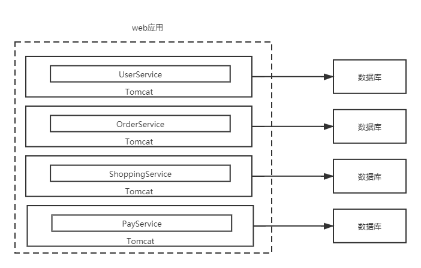
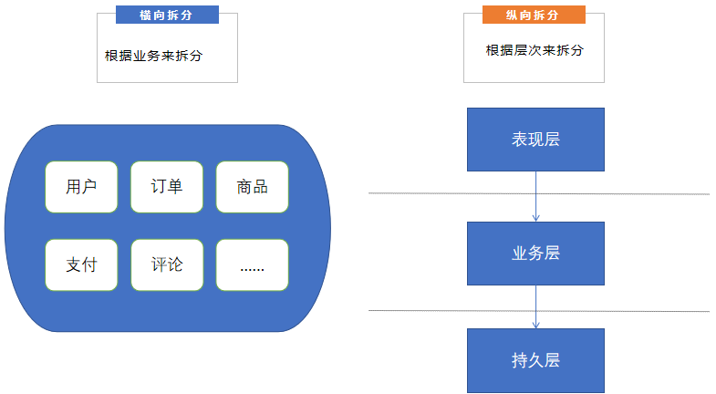
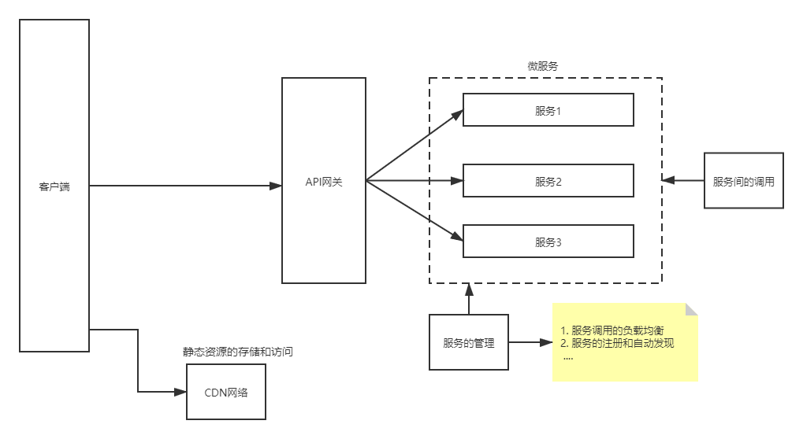
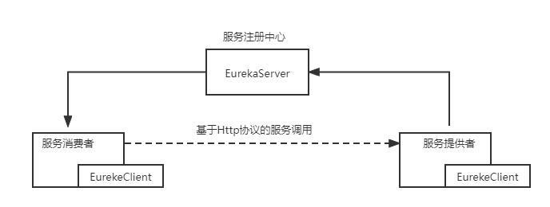
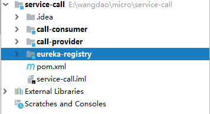
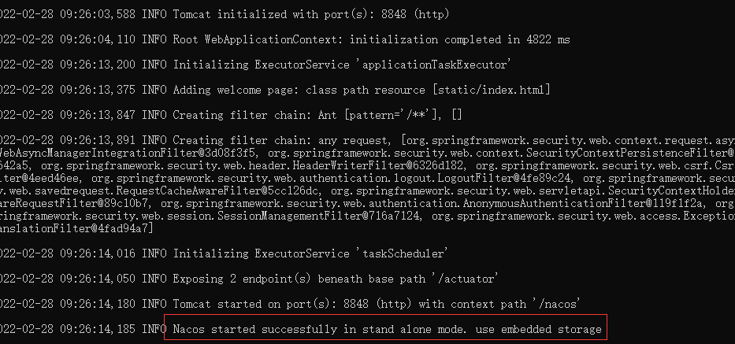

理论：回答为什么学习微服务

实现：写代码去

#  从单体应用到微服务

## 单体架构

到目前为止，我们所实现的web应用都有一个共同的特点，**所有的代码最终打包成一个文件(jar包)，整个系统的所有功能单元整体部署到同一个进程**，这种软件架构的风格，即所谓的"单体架构"。



#### 单体架构的扩容

一个单体应用在运行时，会部署在一台云服务器上，但是随着用户体量的增长，一台云服务器上运行的一个单体应用，已经无法承载日益增长的请求量，怎么办呢？我们可以对单体应用实现扩容，也就是使用单体应用集群



通过使用单体应用的集群，可以一定程度上，很好地应对日益增长的用户请求，但是这样就完美了吗？当然不是

#### 单体架构的优势和弊端

在单体应用的早期，应用程序相对较小，单体架构的好处：

- 应用的开发很简单
- 易于对应用程序进行大规模的更改
- 测试相对直观简单
- 部署简单明了
- 横向扩容不费吹灰之力

但是，随着时间的推移，单体应用中包含的功能越来越多，应用的"体积"越来越大，单体应用的弊端就会逐渐体现出来。

- 代码过度复杂且严重耦合，导致难以维护

> 1. 由于系统本身过于庞大和复杂，以至于任何一个开发者都很难理解它的全部，因此，修复软件中的问题和正确实现新功能就变得困难且耗时
> 2. 更糟糕的是，这种极度的复杂性，可能会形成一个恶性循环: 由于代码难以理解，因此开发者在更改时更容易出错，每一次更改都会让代码库变得更复杂，更难懂

- 从代码提交到实际部署的周期很长

> 从代码完成到运行在生产环境，是一个漫长且费力的过程。
> 1. 众多开发人员都向同一个代码库提交代码，常常使得代码库的构建结构处于无法交付的状态。当采用了分支来解决这个问题，又必须忍受漫长且痛苦的合并过程
> 2. 因为代码库中的代码十分复杂，以至于任何一个更改可能引起的影响是未知的，为了避免牵一发而动全身的后果，即使是一个微小的更改，也必须执行全部的测试

- 扩展性受限

> 1. 如果单体应用中的某一个功能点存在性能问题，那么就需要多部署几个单体应用的实例，再加上负载均衡的设备(比如nginx)，才能保证整个应用的性能能够支撑用户的使用
> 2. 在某些情况下，应用的不同模块对资源的需求是相互冲突的，比如某些模块需要高效的IO，某些模块需要高性能的CPU, 而这些模块都在一个单体应用之内，因此其所部署的服务器必须满足所有的需求  

- 开发慢，启动慢，严重影响开发效率
- 交付可靠的单体应用困难

> 1. 单体应用体积庞大，难以进行全面和彻底的测试，而缺乏可靠的测试意味着代码中的错误会进入生产环境
> 2. 缺乏故障隔离，因为所有的模块都在同一个进程中运行，每隔一段时间，在一个模块中的代码错误，将会导致整个应用程序的崩溃

## 微服务架构

> 什么是微服务？
>
> 什么是微服务架构？

我们看到，随着单体应用的发展，最终会变得难以维护，难以实现及时可靠的交付，且开发效率低。那么怎么解决这个问题呢？解决之道就在于微服务架构。

要理解微服务架构，我们得首先理解微服务，那什么是微服务呢？

简单理解一个**微服务**的本质就是一个麻雀虽小但五脏俱全的应用程序，它按照**单一职责原则**实现了**特定的一组功能**。

- 因为每个微服务的本质都可以是一个应用程序，这就要求，微服务可以**独立部署，独立运行，独立对外提供服务**(运行在一个独立的进程中)
- 每个微服务，根据单一职责原则，实现一组相关功能

在此基础上，什么是**微服务架构**呢？简单理解，就是**把应用程序功能分解为一组服务**的架构风格。实际上，微服务架构是模块化开发的一种形式。

模块化是开发大型，复杂应用程序的基础。当一个单体应用程序的规模太大的时候，是很难作为一个整体开发，也很难让一个人完全理解的。为了让不同的人开发和理解(不同的部分)，大型应用需要拆分模块。

- 在单体架构中，模块通常由一组编程语言所提供的的结构(例如Java中的包，或者jar文件)来定义，但是通过这种方式得到的模块，不同模块的代码还是可以相互引用，**导致模块中对象依赖关系的混乱**
- 而微服务架构，使用微服务作为模块化的单元，要访问服务，只能通过服务对外提供的API，于是**服务的API为它自身构筑了一个不可逾越的边界**，你无法越过API去访问服务内部的类。（功能边界决定数据边界，也就是不同的服务访问不同的数据库）



#### 微服务的优势和弊端

使用微服务架构，可以解决庞大的单体应用的痛点，带来很多好处：

- 每个服务都相对较小，容易维护
- 使得大型的应用程序实现快速的持续交付和持续部署

> 1. 每一个服务相对较小，编写全面的测试代码和执行自动化测试都变得相对容易
> 2. 每个服务都独立于其他服务部署，如果负责服务的开发人员，需要部署对该服务的更改，不需要与其他开发人员协商，因此将更改频繁部署到生产中要容易的多

- 应用扩展灵活

> 1. 应用被拆分为不同的微服务，而微服务可以独立部署，因此，扩容就不在针对整个应用了，哪里出现性能瓶颈，对哪个服务扩容即可
> 2. 即使不同的的服务需要资源存在冲突，也没有关系，把它们分别部署到具有拥有各自所需要资源的机器上即可

- 更好的容错

> 相比于单体架构中，一个故障拖垮整个系统的情况，一个服务的故障，并不会影响想到其他服务的正常运行。

当然，使用微服务也会带来一些弊端，微服务是一个分布式系统，有分布式系统的通病：

- 分布式系统可能复杂难以管理
- 分布式部署追踪问题难（但是目前有成熟的日志聚合技术）
- 分布式事务比较难处理（目前有成熟的事务治理技术）
- 服务数量增加，管理复杂性增加（服务一访问数据库一，服务二访问数据库二，两个是不同的数据库连接；将不同的服务对数据库的访问成为一个事务，需要分布式事务）

#### 微服务的拆分

因为应用很少一开始就是微服务架构，刚开始是单体架构，将单体架构拆分成微服务架构。



实际开发时，通常使用横向拆分

服务拆分的注意事项：

+ 每个服务的功能有边界，因此每个服务访问的数据也是有边界的，所以每个服务都有自己的数据库
+ 每个服务的数据库只限于自己直接访问，其他服务不能直接访问
+  服务调用：🏷️如果一个服务需要其他服务的数据，则可以通过调用其他服务对外暴露的接口，访问到其他服务的数据

为了实现服务调用，两个服务是两个不同的进程，两者之间要建立连接。服务调用，**调用的是方法**，但是连接传输的是二进制字节数据，所以需要定义协议对数据进行编码和解析。还需要实现**服务治理**功能，比如服务的注册和自动发现，服务调用的负载均衡。

服务调用，服务治理这种通用功能，可以使用已经存在框架，从而让我们只专注于业务代码。已经存在的框架有SpringCloud和Dubbo。

# 微服务的实现



一个微服务架构的项目，大致结构如上图所示，因为每个服务独立运行，独立部署，所以想要将微服务架构在项目中落地，还需要解决一些其他问题，**服务之间的调用**，**服务的治理**，比如服务的注册与自动发现，服务调用的负载均衡等等。

而这些问题，都由相应的服务框架，已经帮助我们实现了，所以我们在实现微服务架构的项目，都需要基于某个微服务的框架，目前比较流行的有大概有两种SpringCloud和Dubbo，我们的学习主要基于S框架SpringCloud。

两个框架的使用方向有所区别，Dubbo效率更高，大厂使用。中小公司使用SpringCloud居多。

SpringCloud 基于SpringBoot提供了一套微服务架构实现的解决方案，包括服务的注册与自动发现，面向接口的服务调用，服务调用的**负载均衡，服务网关，服务熔断**等等组件，它利用SpringBoot开发的便利性，巧妙的简化了分布式系统的**基础设施搭建**，使开发者可以基于SpringBoot的开发风格做到快速启动和部署。

>  🏷️API网关
>
> 微服务项目必须具有。核心功能是对外接收请求，对内进行路由。是后端开发的一部分。
>
> 🏷️ CDN网络
>
> **内容分发网络**，ContentDeliveryNetwork。用来提供静态资源。由多个CDN服务器构成一个CDN网络。
>
> 不想要静态资源浪费带宽，希望快速访问静态资源。大型云服务提供商才有能力提供CDN网络服务，因为不同的CDN服务器在地理位置上不同，CDN服务器里早就准备好了静态资源。当从CDN网络请求静态资源时，CDN网络会从离用户最近的CDN服务器返回静态资源，使用户更快速的拿到静态资源。

> Maven父子工程
> 如果子工程中不需要父工程中的一些依赖呢？但是继承下来，工程打包为jar时也会将不需要的依赖打包进来。
>
> 所以父工程里的依赖应该是子工程要有的。在父工程里定义`<dependencyMangement>`，**只声明未引入**，当各个子工程需要使用时，还是需要声明依赖，但是子工程可以不用写版本，而是父工程声明的依赖版本。这样就可以避免依赖版本的冲突。
>
> 注意：一个子工程只能有一个父工程
>
> SpringBoot工程天生有一个父工程，而我们使用springCloud时要使用到spring-cloud,spring-cloud-alibaba,spring-boot这三个东西，所以一般不创建SpringBoot工程而是创建普通Maven工程。
>
> 如何整合父子工程，在操作系统中直接将子工程的文件夹放在父工程的pom.xml所在文件夹下。

## 服务调用的场景

填写并核对订单信息

订单服务在下单时要调用用户服务来获取用户的地址信息。

## 服务间的调用

实际上，在基于SpringCloud实现的微服务架构中，一个微服务实例(进程)的本质，**就是一个部署在Tomcat中的，满足单一职责原则的应用程序。**也就是天生支持HTTP协议，也就说服务间调用的协议可以使用HTTP协议。

但此时就有一个问题了，如果一个服务想要使用另一个服务的功能，即一个服务想要调用另一个服务，那么服务之间的调用如何实现呢？调用另一个服务的controller方法。那么**如何通过JAVA代码发送HTTP请求？**这就是学习的重点

> 发送HTTP请求的方式：
>
> + 通过浏览器发送
>
> + 通过Postman发送
> + 通过JAVA代码发送

### 服务调用的理论

两个服务是两个不同的进程，进程间通信使用网络的方式。

实际上，服务间的调用，基于我们以前学习过的知识，就可以轻松解决：

- 基于SpringCloud实现的微服务，其本质是Tomcat中的一个应用，它们都支持基于Http协议的通信，因此我们可以通过Http协议实现服务进程(实例)间的通信
- 于是服务间的通信过程就变成了，调用者发送Http请求，被调用这返回Http响应，一次请求响应过程，就等价于一次服务调用过程
- 在一次服务调用过程中，我们称调用者为**服务消费者**(使用或者消费另一个服务的功能)，我们称被调用者为**服务提供者**(提供被消费的功能)

因此，服务提供者只要对外暴露了接口，那么服务消费者就能通过调用服务提供者对外提供的接口，从而实现对服务提供者的调用，使用服务提供者的功能。

> 如何理解“对外暴露的接口”？
>
> Controller层的方法。通过HTTP协议调用方法，需要接收HTTP请求，只有Controller层的方法可以处理HTTP请求。

### 实现服务调用的准备`RestTemplate`

> 实现服务调用的步骤
>
> 1. 构造HTTP请求
> 2. 发送HTTP请求（实现服务调用）
>
> 通过服务调用的理论分析，我们知道服务调用其实就是发送Http请求，接收Http响应的过程，在实现服务调用之前，我们还存在一个问题，就是 ⭐**如何通过代码发送Http请求**——使用`RestTemplate`。

`RestTemplate`是一个专门用来发送Http请求的工具，通过封装JDK中的`HttpURLConnection`类库，提供简单易用的模板方法API，它所提供的模板方法几乎覆盖了常用的所有Http请求类型的场景。

我们通常使用其无参构造方法，来获取一个`RestTemplate`对象

```java
RestTemplate()
Create a new instance of the RestTemplate using default settings.
```

同时，我们可以通过一个`RestTemplate`对象，发起`POST`,`GET`,`DELETE`,`PUT`,`PATCH` 等不同种类的Http请求，我们以最常用的`GET`和`POST`两种方式为例来学习`RestTemplate`的用法。

```java
// RestTemplate的API
/*
	当我们只想要获取一个GET请求的结果的时候，可以调用其getForObject方法，其中
	String url: 发起请求的url
	Class<T> responseType: 响应体返回值类型
	第三个参数: 表示GET请求携带的参数
*/
public <T> T getForObject(String url, Class<T> responseType, Map<String,?> uriVariables)
// Map的key是用来指明哪个占位符 
public <T> T getForObject(String url,Class<T> responseType, Object... uriVariables)

/* 
    如果我们不仅想要获取GET请求的响应体数据，还想获取响应头，以及响应码等信息，那么可以使用getForEntity方法，其中
	String url: GET请求的url
	Class<T> responseType： 响应体返回值类型
	第三个参数: 表示GET请求携带的参数
*/
  // 这里的泛型类型指的是响应体中的数据类型 
public <T> ResponseEntity<T> getForEntity(String url, Class<T> responseType, Object... uriVariables)
public <T> ResponseEntity<T> getForEntity(String url, Class<T> responseType, Map<String,?> uriVariables)
    
/*
	当我们只想要获取一个POST请求的结果的时候，可以调用其postForObject方法，其中
	String url: 发起请求的url
	request：表示post请求的请求体数据，也可以不传这个参数
	Class<T> responseType: 响应体返回值类型
	第三个参数: 表示GET请求携带的参数
*/
public <T> T postForObject(String url, @Nullable Object request, Class<T> responseType, Map<String,?> uriVariables)
public <T> T postForObject(URI url, @Nullable Object request, Class<T> responseType)
    
/* 
    如果我们不仅想要获取GET请求的响应体数据，还想获取响应头，以及响应码等信息，那么可以使用getForEntity方法，其中
	String url: POST请求的url
	Object request： 表示post请求的请求体数据，也可以不传这个参数
	Class<T> responseType： 响应体返回值类型
	第三个参数: 表示GET请求携带的参数
*/
public <T> ResponseEntity<T> postForEntity(String url, @Nullable Object request, Class<T> responseType, Object... uriVariables)
public <T> ResponseEntity<T> postForEntity(String url, @Nullable Object request, Class<T> responseType, Map<String,?> uriVariables)
```

我们以发送GET请求为例来说明：

```java
// 准备好请求的url，携带名为name的请求参数，占位符的名称为name 
String url = "http://localhost:8002/say/hello?name={name}";
// map中参数值的key一定要和url中参数的占位符同名
HashMap<String, Object> param = new HashMap<>();
param.put("name", name);
//map参数方式
String rest = restTemplate.getForObject(url, String.class, param);
```

```java
/*
  准备好请求的url，携带名为name的请求参数，占位符的名称就不重要了，因为通过可变参数可以通过参数位置确 定请求参数对应参数值
*/
String url = "http://localhost:8002/say/hello?name={1}";
// 用可变参数的方式来传递请求参数, 这里只有一个参数值name
String rest = restTemplate.getForObject(url,String.class, name);
```

```java
// 获取更完整的响应信息
ResponseEntity<String> forEntity = restTemplate.getForEntity(url, String.class);
// 获取http响应的响应码
HttpStatus statusCode = forEntity.getStatusCode();
System.out.println(statusCode);
// 返回响应体数据
return forEntity.getBody();
```

### 服务调用的实现

#### 被调用接口

那么接下来，我们来实现一个服务消费者调用服务提供者的例子，假设服务提供者对外暴露的接口为

| 入参   | 类型 |
| ------ | ---- |
| userId | Long |

请求路径：/user/address/{userId}

请求类型: GET

请求示例：

http://localhost:9001/user/address/{userId}

| 出参    | 类型   |
| ------- | ------ |
| address | String |

#### 父工程依赖

因为代码包含多个maven工程，因此我们使用父子工程来实现，创建父工程，父工程中并不包含代码，主要用来管理子Maven工程


```xml
<properties>
    <spring-boot.version>2.2.2.RELEASE</spring-boot.version>
    <spring-cloud.version>Hoxton.SR1</spring-cloud.version>
    <spring-cloud-alibaba.version>2.2.0.RELEASE</spring-cloud-alibaba.version>
    <mysql.version>8.0.20</mysql.version>
    <mybatis.version>2.1.1</mybatis.version>
    <lombok.verion>1.18.8</lombok.verion>
</properties>
<dependencyManagement>
    <dependencies>
        <!-- spring-boot -->
        <dependency>
            <groupId>org.springframework.boot</groupId>
            <artifactId>spring-boot-dependencies</artifactId>
            <version>${spring-boot.version}</version>
            <type>pom</type>
            <scope>import</scope>
        </dependency>

        <!--spring cloud alibaba-->
        <dependency>
            <groupId>com.alibaba.cloud</groupId>
            <artifactId>spring-cloud-alibaba-dependencies</artifactId>
            <version>${spring-cloud-alibaba.version}</version>
            <type>pom</type>
            <scope>import</scope>
        </dependency>

        <!--spring cloud-->
        <dependency>
            <groupId>org.springframework.cloud</groupId>
            <artifactId>spring-cloud-dependencies</artifactId>
            <version>${spring-cloud.version}</version>
            <type>pom</type>
            <scope>import</scope>
        </dependency>

        <!-- mysql驱动 -->
        <dependency>
            <groupId>mysql</groupId>
            <artifactId>mysql-connector-java</artifactId>
            <version>${mysql.version}</version>
        </dependency>
        <!--mybatis-->
        <dependency>
            <groupId>org.mybatis.spring.boot</groupId>
            <artifactId>mybatis-spring-boot-starter</artifactId>
            <version>${mybatis.version}</version>
        </dependency>

        <dependency>
            <groupId>org.projectlombok</groupId>
            <artifactId>lombok</artifactId>
            <version>${lombok.verion}</version>
        </dependency>
    </dependencies>
</dependencyManagement>
```

#### 服务提供者实现

依赖如下

```xml
<dependencies>
    <dependency>
        <groupId>org.springframework.boot</groupId>
        <artifactId>spring-boot-starter-web</artifactId>
    </dependency>

    <dependency>
        <groupId>mysql</groupId>
        <artifactId>mysql-connector-java</artifactId>
    </dependency>
    <!--mybatis-->
    <dependency>
        <groupId>org.mybatis.spring.boot</groupId>
        <artifactId>mybatis-spring-boot-starter</artifactId>
    </dependency>

    <dependency>
        <groupId>org.projectlombok</groupId>
        <artifactId>lombok</artifactId>
    </dependency>
</dependencies>
```

配置如下

```yml
server:
  port: 9001
spring:
  datasource:
    url: jdbc:mysql://localhost:3306/demo_user?useSSL=false&serverTimezone=Asia/Shanghai
    username: root
    password: xxxxxx
    driver-class-name: com.mysql.jdbc.Driver
```

代码如下(SpringBoot工程的启动类就不展示了)

```java
@RestController
@RequestMapping("/user")
public class UserController {

    @Autowired
    private UserService userService;
    
    /**
     * @param id 用户id
     * @return 用户
     */
    @GetMapping("/address/{id}")
    public String queryById(@PathVariable("id") Long id) {
        // 根据id查询用户的地址信息
        return userService.queryById(id);
    }
}
```

```java
@Service
public class UserService {

    @Autowired
    private UserMapper userMapper;

    public String queryById(Long id) {
        User user = userMapper.findById(id);
        return user.getAddress();
    }
}
```

#### 服务消费者实现

依赖如下

```xml
<dependencies>
    <dependency>
        <groupId>org.springframework.boot</groupId>
        <artifactId>spring-boot-starter-web</artifactId>
    </dependency>

    <dependency>
        <groupId>mysql</groupId>
        <artifactId>mysql-connector-java</artifactId>
    </dependency>
    <!--mybatis-->
    <dependency>
        <groupId>org.mybatis.spring.boot</groupId>
        <artifactId>mybatis-spring-boot-starter</artifactId>
    </dependency>

    <dependency>
        <groupId>org.projectlombok</groupId>
        <artifactId>lombok</artifactId>
    </dependency>
</dependencies>
```

配置如下

```yaml
server:
  port: 9002
spring:
  datasource:
    url: jdbc:mysql://localhost:3306/demo_order?useSSL=false&serverTimezone=Asia/Shanghai
    username: root
    password: xxxxxx
    driver-class-name: com.mysql.jdbc.Driver
```

代码如下

先准备好一个用于发起`Http`请求的`RestTemplate`对象

```java
@Configuration
public class ClientConfig {

    @Bean
    @LoadBalanced
    public RestTemplate template() {
        return new RestTemplate();
    }
}
```

```java
@RestController
@RequestMapping("order")
public class OrderController {

   @Autowired
   private OrderService orderService;

    @GetMapping("{orderId}")
    public Order queryOrderByUserId(@PathVariable("orderId") Long orderId) {
        // 根据id查询订单并返回
        return orderService.queryOrderById(orderId);
    }
}
```

```java
@Service
public class OrderService {

    @Autowired
    private OrderMapper orderMapper;


    @Autowired
    private RestTemplate restTemplate;

    public Order queryOrderById(Long orderId) {
        // 1.查询订单
        Order order = orderMapper.findById(orderId);
        // 2.利用RestTemplate发起http请求，查询用户
        // 2.1.url地址
        String url = "http://localhost:9001/user/address/{userId}";
        // 2.2.发送http请求，实现远程调用
        String userAddress = restTemplate.getForObject(url, String.class,order.getUserId());
        // 3.封装user到Order
        order.setUserAdress(userAddress);
        // 4.返回
        return order;
    }
}
```

> 🏷️ 新的问题
>
> 多个订单服务进程，代表多个订单服务实例，可以组成订单服务集群。但是url里将端口号写定了，只能发给一个服务器。

如果一个服务消费者实例可以**自动发现服务提供者**就可以解决了。这就需要使用新的组件，服务注册中心。

服务实例，在**启动的时候**会向服务注册中心注册，注册服务实例所属的服务名称，ip地址，端口号。

服务注册中心和服务的交互过程：

1. 服务实例在启动的时候，向服务注册中心注册，上传信息
2. 服务注册中心实时获取服务实例的状态
   1. 防止服务消费者实例无法访问成功
3. 服务实例从注册中心下载服务实例地址列表
4. 注册中心还需要给服务实例同步最新的服务实例列表信息

> 一个进程如何感知另一个进程的状态？
>
> 通过心跳协议

## 服务的注册与发现

服务间调用的问题，但是仅仅实现到这种程度，还远远不够

### 问题的引出

首先回顾一下，对于服务消费者而言，它如何知道服务提供者的信息，从而调用远程服务的功能呢? 再来看看代码

```java
String url = "http://localhost:9001/user/address/{userId}";
// 实现远程调用
String userAddress = restTemplate.getForObject(url, String.class, order.getUserId());
```

但是，将服务消费者要调用的服务提供者地址写死，这样好吗？我们来设想如场景


- 假设对于用户服务的请求量很大，一个用户服务实例(进程)处理不了这么多的请求了，此时我们就可以启动多个用户服务实例(进程)，此时，这多个用户服务实例就组成了**用户服务的集群**
- 但是我们如果写死了调用的服务提供者的地址，即使有用户服务的集群，有意义吗？没有，因为写死了服务调用的地址，所以我们永远只能调用到集群中的一个服务实例！

 此时矛盾就出现了，服务调用时必须知道服务提供者的地址，但是在代码里把改地址写死，就永远只能调用确定的那一个服务实例，但是如果不在代码里写服务调用的地址，我们又从哪里得到服务提供者实例的地址呢？

### 服务注册中心

那么，如果在定义服务消费者的时候，不指明服务消费者调用的服务提供者地址，那么服务消费者怎么知道去哪里调用服务提供者呢？此时，我们就需要引入一个新的角色——服务注册中心，由服务注册中心来统一管理服务的状态和信息，那么这个问题就可以解决了。

.png)

对于每一个服务

- 在服务启动时，会将自己的信息，注册到服务注册中心，其中就包括ip地址，端口号等信息。即实现服务的注册
- 在服务运行过程中，会实时向服务注册中心"报告"自己的状态，因此服务注册中心就可以实时感知到服务的运行状态

- 同时，在服务启动时，也会去注册中心拉取，其他服务信息，即将服务注册表信息下载到本地，这样一来一个服务就可以知道，其他服务调用地址等信息
- 在服务运行的过程中，服务会从注册中心实时拉取最新的服务注册表信息，从而实现服务的实时发现

那么服务注册中心需要我们自己去实现吗？不是，已经有很多的注册中心实现供我们使用了，比如SpringCloud Netflix中的**Eureka**，比如SpringCloud Alibaba中的**Nacos**等等。

> 微服务的鼻祖就是Netflix

### Eureka 注册中心

Eureka是另一个典型的C/S架构产品。



Eureka是SpringCloud Netflix中包含的注册中心的组件，它扮演注册中心的角色，实现服务的注册与自动发现。

Eureka采用了C/S的架构设计，其中

- EurekaServer作为服务器端，它具体就实现了服务注册中心的功能
- EurekaClient作为客户端，服务提供者可通过它实现和EurekaServer的通信完成服务的注册，服务消费者可通过它与EurekaServer通信完成服务的自动发现

接下来，我们就基于Eureka服务注册中心，实现服务的注册与自动发现。

#### 配置并启动EurekaServer

> 注意：不是直接创建一个SpringBoot工程，而是创建一个普通的Maven工程之后再写`@SpringBootApplication`注解配置启动类

在父工程中，添加SpringCloud依赖

```xml
<!--springCloud的依赖-->
<dependency>
   <groupId>org.springframework.cloud</groupId>
   <artifactId>spring-cloud-dependencies</artifactId>
   <version>Hoxton.SR1</version>
   <type>pom</type>
   <scope>import</scope>
</dependency>
```

新建一个子Maven工程，这个工程仅仅只是为了启动一个`EurekaServer`进程



在子工程中添加依赖

```xml
<dependency>
    <groupId>org.springframework.cloud</groupId>
    <artifactId>spring-cloud-starter-netflix-eureka-server</artifactId>
</dependency>
```

在子工程中需要添加如下配置：

```yaml
server:
  port: 7001
# Eureka配置
eureka:
  instance:
    # Eureka服务端的实例名字
    hostname: localhost
  client:
    # 表示是否向 Eureka 注册中心注册自己(这个模块本身是服务器,所以不需要)
    register-with-eureka: false
    # fetch-registry如果为false,则表示自己为注册中心,客户端的为 ture
    fetch-registry: false
    service-url:
      defaultZone: http://localhost:7001/eureka/
```

> 注册中心既不调用别的服务，也不被别的服务调用。所以配置中注册设为false，取得注册也设为false。
>
> EurekaServer有自身的欢迎界面，浏览器访问service-url。

启动类上添加注解`@EnableEurekaServer`

```java
@SpringBootApplication
@EnableEurekaServer
public class EurekaServer {

    public static void main(String[] args) {
        SpringApplication.run(EurekaServer.class, args);
    }
}
```

#### 服务提供者整合Eureka

 🍃在服务提供者的Maven工程中，添加如下依赖

```xml
<dependency>
    <groupId>org.springframework.boot</groupId>
    <artifactId>spring-boot-starter-web</artifactId>
</dependency>

<!--Eureka依赖-->
<dependency>
    <groupId>org.springframework.cloud</groupId>
    <artifactId>spring-cloud-starter-netflix-eureka-client</artifactId>
</dependency>
```

 🍃添加如下配置

```yaml
spring:
  application:
    name: registry-provider
server:
  port: 7101
  
#告诉client到哪里访问server
eureka:
  client:
    service-url:
      defaultZone: http://localhost:7001/eureka/
      # 可以去注册的信息
  instance:
    instance-id: provider-7101 
    hostname: localhost
```

 🍃主启动类添加注解`@EnableEurekaClient`

```java
@SpringBootApplication
@EnableEurekaClient
public class RegistryProviderApplication {
    public static void main(String[] args) {
        SpringApplication.run(RegistryProviderApplication.class, args);
    }
}
```

#### 服务消费者整合 Eureka

服务消费者不再直接访问服务提供者，而是先访问注册中心。基于服务的自动发现，发现服务的地址。

添加如下依赖

```xml
<dependency>
    <groupId>org.springframework.boot</groupId>
    <artifactId>spring-boot-starter-web</artifactId>
</dependency>

<!--Eureka依赖-->
<dependency>
    <groupId>org.springframework.cloud</groupId>
    <artifactId>spring-cloud-starter-netflix-eureka-client</artifactId>
</dependency>
```

添加如下配置

```yaml
spring:
  application:
    name: registry-consumer
server:
  port: 7102

# Eureka配置
eureka:
  client:
    service-url:
      defaultZone: http://localhost:7001/eureka/
  instance:
    instance-id: consumer-7102 #修改Eureka上的默认描述信息
    hostname: localhost
```

主启动类，添加注解

```java
@SpringBootApplication
@EnableEurekaClient
public class RegistryConsumerApplication {

    public static void main(String[] args) {
        SpringApplication.run(RegistryConsumerApplication.class, args);
    }
}
```

在服务消费者中添加测试代码

```java
// 注入服务发现的客户端对象，通过该对象访问从注册中心下载的服务信息 
@Autowired
 DiscoveryClient discoveryClient;   

@GetMapping("/eureka")
    public String consumeByEureka(String name) {
        // 获取名为registry-provider的服务实例
        List<ServiceInstance> instances = discoveryClient.getInstances("registry-provider");
        // uri的格式为http://服务实例ip:服务实例启动端口
        URI uri = instances.get(0).getUri();
	    // 向注册表中的服务发起请求
        ResponseEntity<String> response = template.getForEntity(uri.toString() + "/registry/hello?name={1}", String.class, name);
        String result = response.getBody();
        return result;
    }
```

#### Eureka的自我保护机制

> 自我保护机制不是所有注册中心都有。

自我保护机制触发的场景如下:

- 默认情况下，当eureka server在一定时间内没有收到实例的心跳，便会把该实例从注册表中删除（**默认是90秒**）
- 但是，如果短时间内丢失大量的实例心跳，这意味着短时间内大量的服务连接丢失了，此时就会触发Eureka的自我保护机制
- 触发自我保护机制的结果就是，Eureka认为虽然收不到实例的心跳，但它认为实例还是健康的，eureka会保护这些实例，**不会把它们从注册表中删掉**。

那么Eureka的自我保护机制的意义在哪里呢？

- 该保护机制的目的是**避免网络连接故障**，在发生网络故障时，微服务和注册中心之间无法正常通信，但服务本身是健康的
- 此时，为了避免注册中心同时删除大量本来是正常运行(健康的)的服务实例，于是就会自动触发自我保护机制
- 该自我保护机制开启之后，Eureka会保护注册表中的信息，不再注销任何微服务，当网络故障恢复后，**Eureka会自动退出保护模式**，从而使集群更加健壮。

自我保护机制会有误判的风险。因为在开启自我保护机制的阶段，如果真有服务提供者实例无法正常运行，注册信息不及时删除，会带来问题。

但是我们在开发测试阶段，需要频繁地重启发布，如果触发了保护机制，则旧的服务实例没有被删除，这时服务消费者按照注册表中的服务提供者信息，发出服务调用请求，会因为该实例关闭而失败，这就导致请求错误，影响开发测试。

所以，在开发测试阶段，我们可以**把自我保护模式关闭**，只需在eureka server配置文件中加上如下配置即可

```yaml
eureka:
  server:
    enable-self-preservation: false
```


### Nacos  注册中心

Nacos(Dynamic Naming and Configuration Service)是服务中心的另外一种实现。从注册中心的功能实现角度，与Eureka等价，只是实现方式有所差异。与Eureka不同的是，Nacos注册中心类似于Tomcat，是独立启动的服务器。因此在我们的代码中，无需在专门创建一个工程用于启动注册中心。

#### 启动nacos服务器

首先，下载好Nacos安装包(.zip压缩包)，解压后，如下图


进入bin目录，打开命令行，输入如下命令

```bash
windows: startup.cmd -m standalone
linux: startup.sh -m standalone
```

> 欢迎页面：
>
> localhost:8848/nacos
>
> 用户名和密码都是nacos

启动之后看到如下界面，这里上面的部分没截全



#### 使用Nacos服务注册中心

下面我们使用Nacos作为服务注册中心，实现服务的注册与自动发现。


首先，在父工程中，导入如下依赖

```xml
<dependencyManagement>
    <dependencies>
        <!--SpringCloudAlibaba-->
        <dependency>
            <groupId>com.alibaba.cloud</groupId>
            <artifactId>spring-cloud-alibaba-dependencies</artifactId>
            <version>2.1.0.RELEASE</version>
            <type>pom</type>
            <scope>import</scope>
        </dependency>
        <!--springCloud的依赖-->
        <dependency>
            <groupId>org.springframework.cloud</groupId>
            <artifactId>spring-cloud-dependencies</artifactId>
            <version>Hoxton.SR1</version>
            <type>pom</type>
            <scope>import</scope>
        </dependency>
        <!--SpringBoot-->
        <dependency>
            <groupId>org.springframework.boot</groupId>
            <artifactId>spring-boot-dependencies</artifactId>
            <version>2.2.2.RELEASE</version>
            <type>pom</type>
            <scope>import</scope>
        </dependency>
    </dependencies>
</dependencyManagement>
```

在nacos-provider-8002服务提供者工程中，添加如下依赖

```xml
<dependencies>
    <!--SpringCloud ailibaba nacos -->
    <dependency>
        <groupId>com.alibaba.cloud</groupId>
        <artifactId>spring-cloud-starter-alibaba-nacos-discovery</artifactId>
    </dependency>

    <dependency>
        <groupId>org.springframework.boot</groupId>
        <artifactId>spring-boot-starter-web</artifactId>
    </dependency>
</dependencies>
```

在nacos-provider-8002模块中，添加如下配置

```yaml
server:
  port: 8002
spring:
  application:
    name: nacos-provider
  cloud:
    nacos:
      discovery:
       # nacos服务器地址
        server-addr: localhost:8848 
```

nacos-provider-8002模块代码中，代码如下

```java
@RestController
@RequestMapping("/nacos")
public class RegistryProviderController {

    @GetMapping("/registry/hello")
    public String hello(String name) {
        return "hello, " + name;
    }
}
```

在启动类上加注解`@EnableDiscoveryClient`

```java
@SpringBootApplication
@EnableDiscoveryClient
public class NacosProvider8002Application {
    public static void main(String[] args) {
        SpringApplication.run(NacosProvider8002Application.class, args);
    }
}

```

接着是nacos-consumer-8001模块，依赖，配置同nacos-provider-8002，就是server.port端口改为8001,**这里不再赘述**。代码如下

```java
@Configuration
public class ClientConfig {

    @Bean
    public RestTemplate template() {
        return new RestTemplate();
    }
}
```

```java
@RestController
@RequestMapping("/call")
public class RegistryConsumerController {

    @Autowired
    DiscoveryClient discoveryClient;

    @Autowired
    RestTemplate template;

    @GetMapping("/nacos")
    public String consumeNacos(String name) {
        // 服务发现，获取nacos-provider-8002服务的服务注册信息(即服务注册表)
        List<ServiceInstance> instances = discoveryClient.getInstances("nacos-provider-8002");
        URI uri = instances.get(0).getUri();
		String url = uri + "/registry/hello?name={1}";
        ResponseEntity<String> response = template.getForEntity(url, String.class, name);
        String result = response.getBody();
        return result;
    }
}
```
