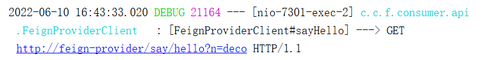
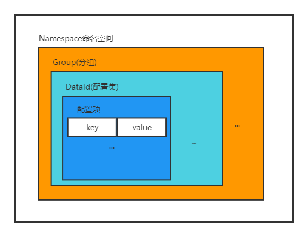
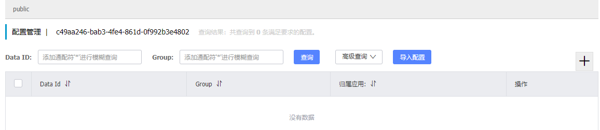
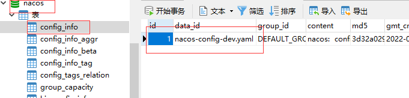

# SpringCloud-2

## 服务调用的负载均衡

### 问题引出

学习完了注册中心相关知识，在微服务架构中，我们已经可以实现服务的注册与自动发现了。但是再来看看我们的代码

```java
// 服务发现
List<ServiceInstance> instances = discoveryClient.getInstances("服务名");
// 选择一个服务提供者
URI uri = instances.get(0).getUri();
// 向选择的服务提供者发起请求
ResponseEntity<String> response = template.getForEntity(uri.toString() + "/nacos/registry/hello?name={1}", String.class, name);
```

服务是可以有集群的，在发现了一个服务所有的实例之后，在一次服务调用过程中，我们还需要选择其中一个服务实例，发起调用请求，所以发起调用之前还存在着一个选择过程，这就涉及到了选择的策略问题，该按照何种策略选择出集群中的一个实例呢？在SpringCloud中有一个由Ribbon帮我们完成这一**选择**过程。

Ribbon的功能两个字可以概括：选择。实现服务调用的负载均衡效果。

### Ribbon负载均衡

Ribbon是一个客户端负载均衡器，能够给HTTP客户端带来灵活的控制。其实现的核心功能，就是一组选择策略，帮助我们在一个服务集群中，选择一个服务实例，并向该实例发起调用请求。它所支持的负载均衡策略如下:

> 🏷️ 服务器实例的断路：
>
> [CircuitBreaker (martinfowler.com)](https://martinfowler.com/bliki/CircuitBreaker.html)
>
> 1. 所谓的服务实例的断路，是**指Ribbon在选择服务实例的时候不再考虑选择这个服务实例**
> 2. 服务实例断路效果是有一个时间窗口的，过了这个时间窗口（默认是60秒），Ribbon又会重新考虑选择该服务实例
>
>  🏷️区域权重策略
>
> Zone：区域，这是一个亚马逊云提出的概念，类比于国内的机房，不同区域的服务器。
>
> 分两步选择：
>
> 1. 选择合适的机房
>    1. 怎么选择机房？
>    2. Ribbon会统计一个机房当中总体的服务实例数量，未被断路的服务实例数量，所有服务实例并发连接数的总和。从而利用平均负载判断忙碌程度（平均负载 = 并发连接数总和/未断路的服务数量）。
> 2. 在合适机房中的多个实例里选择合适的服务实例
>    1. 使用轮询策略
>
> 如果使用Nacos的话，因为没有Zone的概念，相当于只有一个Zone，所以效果就退化成了轮询策略。

| 策略               | 实现类                      | 描述                                                         |
| ------------------ | --------------------------- | ------------------------------------------------------------ |
| 随机策略           | `RandomRule`                | 随机选择server                                               |
| 轮询策略           | `RoundRobinRule`            | 轮询选择                                                     |
| 重试策略           | `RetryRule`                 | 对选定的负载均衡策略(轮询)之上的重试机制，在一个**配置时间段内**当选择服务不成功，则一直尝试使用该策略选择一个可用的服务 |
| 最低并发策略       | `BestAvailableRule`         | 逐个考察服务，如果**服务断路器**打开，则忽略，再选择其中并发连接最低的服务 |
| 可用过滤策略       | `AvailabilityFilteringRule` | 过滤条件：①被断路：过滤掉因一直失败并被标记为circuit tripped的服务；②太忙的：过滤掉那些高并发连接的服务（active connections超过配置的阈值) |
| 响应时间加权重策略 | `WeightedResponseTimeRule`  | 总是选择最快的实例。根据server的响应时间分配权重，响应时间越长，权重越低，被选择到的概率也就越低。响应时间越短，权重越高，被选中的概率越高，这个策略很贴切，**综合**了各种因素，比如：网络，磁盘，io等，都直接影响响应时间 |
| 区域权重策略       | `ZoneAvoidanceRule`         | 默认使用的负载均衡策略。综合判断服务**所在区域的性能**和服务的轮询选择server并且判断一个AWS Zone的运行性能是否可用，剔除不可用的Zone中的所有server |

#### `RestTemplate`整合Ribbon

我们希望，在使用`RestTemplate`发起请求的时候，能“自动选择”其所请求的服务实例，因此我们需要将`RestTemplate`与Ribbon进行整合。

首先，理论上需要在服务消费者工程中，添加依赖

```xml
<dependency>
  <groupId>org.springframework.cloud</groupId>
  <artifactId>spring-cloud-starter-netflix-ribbon</artifactId>
</dependency>
```

但是，因为nacos-discovery已经自己整合了ribbon依赖，所以实际上我们并不需要去添加该依赖。接着，我们需要修改`RestTemplate`的配置类，添加`@LoadBalanced`注解

```java
@Configuration
public class ClientConfig {

    @Bean
    @LoadBalanced
    public RestTemplate template() {
        return new RestTemplate();
    }
}
```

然后在使用`RestTemplate`发起调用的时候，直接使用服务名进行调用即可

```java
@RestController
@RequestMapping("/call")
public class RegistryConsumerController {
    @Autowired
    RestTemplate template;

    @GetMapping("/nacos")
    public String consumeNacos(String name) {
        // 注意这里调用的ip地址，使用的是服务名称，而不是真实的ip
        ResponseEntity<String> response = template.getForEntity( "http://nacos-provider-8002/nacos/registry/hello?name={1}", String.class, name);
        String result = response.getBody();
        return result;
    }
}
```

>  🏷️Ribbon增加`@LoadBalanced`之后的工作原理
>
> 1. 当加了`@LoadBalanced`注解之后，`RestTemplate`会被增强
> 2. 所谓增强指的是，Ribbon会给`RestTemplate`设置一个拦截器。该拦截器，在`RestTemplate`真正发起请求**之前**拦截请求，Ribbon的功能就在该拦截器中执行
> 3. Ribbon会访问服务注册中心，根据原始url中的服务名称，获取该服务的所有服务实例的地址信息
> 4. Ribbon会根据自己的负载均衡策略，选择一个服务实例，用该服务实例的ip:port，替换原始url中的服务名称
> 5. 由`RestTemplate`发送真正的请求

#### 指定Ribbon负载均衡策略

Ribbon中包含多种负载均衡策略，我们在使用Ribbon的时候，可以指定其负载均衡策略，指定的方式有两种，即配置文件和配置类。

 🏷️使用配置文件

```yaml
# 这里的users是我们的服务名称
users:
  ribbon:
   # 这一行配置的就是实现具体负载均衡策略实现类的全类名
    NFLoadBalancerRuleClassName:    com.netflix.loadbalancer.RandomRule
```

> 如果前面有服务名称，就指的是该服务使用的是这个负载均衡策略。
>
> 如果将ribbon顶格写，就表示所有服务都选择这种负载均衡策略

 🏷️使用配置类有两步

① 定义配置类

```java
@Configuration
public class FooConfiguration {

    // 这里的xxxRule对应的就是
  	// 只有IRule对象才代表负载均衡的策略对象
    @Bean
    public IRule ribbonRule() {
        return new xxxRule();
    }
}
```

②定义Ribbon客户端配置

```java
@Configuration
// 这里的foo即name属性的值表示的是被调用的服务的名称
@RibbonClient(name = "foo", configuration = FooConfiguration.class)
public class MyRestClient {
}
```

但是切记有一个地方需要注意，**我们自己定义的配置类(比如上面的FooConfiguration配置类)，不能被`@ComponentScan`扫描到**，所以我们可以将其放在一个独立的，与扫描路径无重叠的包里，或者指明不被`@ComponentScan`注解扫描到，因为这样一来导致的结果就是，对所有服务调用的负载均衡都用的是同一个我们指定的，被扫描到的这个负载均衡策略。

##### 自定义负载均衡策略

当然在实际开发过程中，我们可根据自己的需要，去定义自己的负载均衡策略，我们只需要自己实现`IRule`接口的实现类，在接口实现中，实现我们自己的负载均衡策略，并用类似于前面代码的配置方式，使我们自定义负载均衡策略生效。

```java
//  AbstractLoadBalancerRule实现了IRule接口
public class MyBalanceRule extends AbstractLoadBalancerRule {

    public MyBalanceRule() {
    }

    @Override
    public void initWithNiwsConfig(IClientConfig clientConfig) {

    }
    /*
         choose方法里实现负载均衡
     */
    @Override
    public Server choose(Object key) {
				// 1. 获取目标服务的服务实例列表
     
        List<Server> allServers = getLoadBalancer().getAllServers();
        // 2. 选择服务实例列表中的一个服务实例（这块内容需要学习负载均衡专题）
        return allServers.get(0);
    }
}
```

>  // `getReachableServers()`和`getAllServers()`的区别？
>
>  这涉及到Ribbon的实现，Ribbon会访问到服务注册中心，拿到的服务实例列表就是`allServers`，Ribbon进一步地会做**可答性检查**。如何检查的呢？Ribbon有一个类似ping的接口操作，ping操作，可以建立连接就会放入`reachableServers`。
>
>  而在SpringCloud的默认ping操作中DummyPing不做判断，`isAlive`方法直接返回`true`。
>
>  

## 面向接口的服务调用

也就是以方法调用的形式实现服务调用

### 问题引出

现在我们的服务调用过程，又变得简单了一些，因为Ribbon帮助我们解决了服务调用过程中的选择问题。再来看一下我们的服务调用代码

```java
@RestController
@RequestMapping("/call")
public class RegistryConsumerController {
    @Autowired
    RestTemplate template;

    @GetMapping("/nacos")
    public String consumeNacos(String name) {
        // 注意这里调用的ip地址，使用的是服务名称，而不是真实的ip
        ResponseEntity<String> response = template.getForEntity( "http://nacos-provider-8002/nacos/registry/hello?name={1}", String.class, name);
        String result = response.getBody();
        return result;
    }
}
```

我们会发现，因为我们是使用`RestTemplate`这个Http客户端发起的Http协议的服务调用请求，因此在发起请求的时候，**我们得自己构建请求url，请求参数，获取响应体数据等等，导致我们的代码和Restful风格的Http请求紧密耦合。**

那么有没有办法，让我们在服务调用的时候与Restful的请求“解耦”，直接以Java代码中接口调用的方式，来完成服务的调用呢？

使用另一个组件OpenFeign。

> REST（Representational State Transfer 表述性状态传递）是一种网络应用程序设计风格，它是一种通过HTTP协议进行通信的软件架构风格。RESTful风格接口是符合REST原则的应用程序接口设计，它使用标准的HTTP方法（如GET、POST、PUT、DELETE）进行操作资源，而不需要额外的操作或协议。

### OpenFeign 客户端

> 1. OpenFeign整合了Ribbon，有负载均衡
> 2. OpenFeign可以发送请求，不需要再使用`RestTemplate`

OpenFeign可以帮助我们实现服务调用代码与Restful风格的Http请求解耦的功能。OpenFeign是一个实现Java代码和Http客户端绑定的**绑定器**，通俗解释，它可以帮助我们以统一的方式，将接口"翻译"成Restful风格的HTTP请求。

#### OpenFeign 的使用

因为OpenFeign本身充当着一个“翻译”的角色，可以将我们的Java接口翻译为对应的Http APIs，所以对于我们来说，OpenFeign也可以理解为一种服务调用的客户端，正因为是服务调用的客户端，所以只在服务消费者一端使用。

##### 简单参数（返回值）

虽然，OpenFeign本身仅仅只是在客户端使用，但是因为使用了OpenFeign意味着服务的调用是面向Java接口的，而非HTTP API的，调用方式发生了改变。所以我们需要给order-service添加OpenFeign依赖


添加如下依赖

```xml
<dependency>
    <groupId>org.springframework.cloud</groupId>
    <artifactId>spring-cloud-starter-openfeign</artifactId>
</dependency>
```

定义用来调用用户服务的OpenFeign接口

```java
// 接口需要加FeignClient指定该接口中的方法，所调用的目标服务
@FeignClient("user-service")
public interface UserFeignClient {

    /* 接口方法上的注解以及方法参数主机，用来表示调用该方法时
        所发起的http请求的pah路径，以及参数
     */
    @GetMapping("user/address/{id}")
    public String queryById(@PathVariable("id") Long id);
}
```

在启动类上加注解`@EnableFeignClients`，才能让我们定义的FeignClient生效

```java
@SpringBootApplication
@EnableDiscoveryClient
@EnableFeignClients
@MapperScan("com.cskaoyan.order.mapper")
public class OrderServiceApplication {

    public static void main(String[] args) {
        SpringApplication.run(OrderServiceApplication.class, args);
    }
}
```

以上的OpenFeign的依赖，接口定义，以及生效注解都准备好了，我们就可以开始使用OpenFeign了，在订单服务中，我们的服务调用代码可以修改如下：

```java
// 1.查询订单
Order order = orderMapper.findById(orderId);
// 2.利用OpenFeign接口发起http请求，查询用户
String userAddress = userFeignClient.queryById(order.getUserId());
// 3.封装user到Order
order.setAddress(userAddress);
// 4.返回
return order;
```

注意事项

- OpenFeign接口中定义的方法名，不需要和被调用的目标服务的Controller方法的方法名相同，**只要请求的path部分以及参数对应即可**
- 如果需要传递请求参数，比如http://ip:port/path?arg1=value1&arg1=value2，此时我们需要给OpenFeign接口的方法参数加上`@RequestParam`注解

```java
@FeignClient("test-service")
public interface TestArgFeignClient {

    @GetMapping("test/arg")
    public String testOpenFeignArg(@RequestParam("arg1") Long arg1,
                                   @RequestParam("arg2") Long arg2);
}
```

##### 对象参数(返回值)

刚才我们测试了，简单参数(Jdk中本身就有的数据类型)，现在我们来看看另一种情况，当我们被调用的目标服务方法需要返回(或接收)一个自定义对象`User`的时候，比如我们对用户服务做一个简单的改造如下

```java
@RestController
@RequestMapping("/user")
public class UserController {

    @Autowired
    private UserService userService;

    /**
     * @param id 用户id
     * @return 用户
     */
    @GetMapping("/address/{id}")
    public User queryObjectById(@PathVariable("id") Long id) {
        // 根据id查询用户的地址信息
        return userService.queryObjectById(id);
    }
}
```

此时，在订单服务中，我们的OpenFeign接口方法也就要做出相应的改变

```java
@FeignClient("user-service")
public interface UserFeignClient {

    @GetMapping("user/address/{id}")
    public User queryById(@PathVariable("id") Long id);
}
```

但是，真的这么简单就可以了吗？当然不是


我们很明显的看到报错了，原因是Order-Service和User-Service是两个独立的Maven工程，因此Order-Service并不认识在User-Service中定义的User类，那怎么解决这个问题呢？

- 让Order-Service也认识User-Service中定义的即可
- 因此我们在添加一个Maven工程，在该工程中，定义User，在让Order-Service和User-Service都依赖这个Maven工程即可


同时，分别在Order-Service和UserService中添加User-service-api的依赖即可


这里要注意，为什么我们不直接让Order-Service直接依赖UserService，这样不是也可以让Order-Service认识在User-Service中定义的`User`类吗？因为一旦Order-Service依赖了User-Service，那么OrderService在打包的时候，就会把User-Service的代码直接打包在一起，两个服务打成一个jar包，一旦运行起来，两个服务的代码运行在同一个进程中，这违反了微服务的理念。

> 如何做到“翻译”的呢？
>
> 借助注解信息
>
> 借助`@FeignClient`的`name`属性指定某个服务和接口里的某个方法的`@RequestMapping`指定该服务的方法，拼接得到URI，从而完成服务调用的过程
>
> 注意事项：
>
> 🍃 但是在OpenFeign中请求参数必须要加上`@RequestParam`注解。因为在SpringMVC解析时不需要注解，但是现在解析请求参数的不是SpringMVC而是OpenFeign。
>
> 🍃OpenFeign的原理是使用注解信息找到服务调用的`Controller`方法，所以方法名不需要和`Controller`方法一致，没有要求。但是实际开发中，习惯上会保持一致。
>
> 进一步使用：
>
> 传入参数是一个引用数据类型，
>
> 1. 要保证使用同一个类，所以不能自己定义
> 2. 如果引入另一个服务的依赖，打包时也会把另一个服务当成jar包，这样就不是微服务了
> 3. 也即是当引用数据类型定义在服务消费者或服务提供者中，都无法解决打包问题。解决核心是创建一个全新的工程
>
> 

#### FeignClient日志输出

当我们调用FeignClient发出请求的时候，如果我们希望能看到其发出的具体Http请求，我们可以通过配置来实现。修改日志输出级别为debug级别，级别高的时候不会打印。

```yaml
# 这里的xxx表示我们自己的定义的FeignClient所在包的包名(比如: com.cskaoyan.feign.consumer.api)
logging:
  level:
    xxx: debug
```

定义配置类，在配置类中，配置Feign的日志输出级别

```java
@Configuration
public class FeignConfig {

    @Bean
    public Logger.Level logLevel() {
        return Logger.Level.FULL;
    }
}
```

这样当我们，通过在对应的FeignClient对象上，调动方法，发起http请求的时候，对应的请求就会打印在控制台。



> 箭头向右表示请求，向左表示响应。

#### 服务调用的超时时间

> 一次正常的服务调用过程，应该在有限的时间内返回。

通常，一次远程调用过程中，服务消费者不可能无限制的等待服务提供者返回的结果，正常情况下，服务提供者的一次调用执行过程也不会执行很长时间(除非出现网络故障，或者服务提供者宕机等问题)。所以为防止在非正常情况下服务消费者在调用过程中的长时间**阻塞等待**，对于一次服务调用过程，我们会设置其**超时时间**。一次服务调用，超时未返回即认为调用失败。在使用Feign的时候，我们可以配置其超时时间。默认配置是1秒。


> 如何测试超时效果呢？可以使用`Thread.sleep()`

```yaml
feign:
  client:
    config:
    # default表示设置对所有服务设置调用超时时间的，如果想要设置某个服务的，将default改为对应服务名即可
      default: 
        connectTimeout: 5000 # 连接超时时间
        readTimeout: 5000 # 调用超时时间
```

配置中`default`表示所有服务，可以更改为特定服务的名称。

## 配置中心

### 问题引出

设想一下，如果每个服务都有自己的配置，比如服务访问的数据库地址等，但是某一天，**数据库部署的服务器地址变了，此时会发生什么呢**？为了让服务能够正确访问到数据库，我们得停止每一个服务，重新修改每一个服务的配置文件，然后在重新启动每个服务，在这个过程中就会出现两个问题：

- 修改配置文件的工作繁琐，工作量大，尤其当服务数量较多的时候
- 要让新的配置生效，得重启服务

 🏷️将公共配置写一份放在配置中心


### 配置中心

如果要解决以上问题，那么在我们微服务架构的项目中，我们就得引入一个新的角色——配置中心来解决这个问题了。类似于注册中心，配置中心的实现也有多种，而**Nacos同时也实现了配置中心的角色**。

- 使用配置中心可以让您以**中心化、外部化和动态化**(动态化即可以实时刷新配置)的方式管理所有环境的应用配置和服务配置。
- 动态配置消除了配置变更时重新部署应用和服务的需要，让配置管理变得更加高效和敏捷。

### Nacos 配置中心

Nacos除了可以作为服务注册中心之外，还可以实现服务配置中心的功能。

在使用Nacos配置中心之前，我们必须对于注册中心的配置信息有一个清楚的认识：

- 配置中心中的配置，主要是以键值对的形式存在的，即每条配置都以key-value的形式存储，key是配置的名称，value才是配置的值
- 所以，很明显，不同配置的key值应该有所区别，或者即使key值相同，我们也应该有办法区分他们，即**给key值划分不同的维度**。

所以接下来，我们得介绍一下Nacos中定义的基本概念：

- **配置项**: 一个具体的可配置的参数与其值域，通常以 `param-key=param-value` 的形式存在。例如我们常配置系统的日志输出级别（logLevel=INFO|WARN|ERROR） 就是一个配置项。
- **配置集**：一组相关或者不相关的配置项的集合称为配置集。在系统中，一个配置文件通常就是一个配置集，包含了系统各个方面的配置，每一个配置集都对应一个唯一的DataId，DataId必须由我们自己定义。
- **配置分组**:  Nacos 中的一组配置集，是组织配置的维度之一，每一个分组都有一个唯一的组名，如果我们未定义，则默认使用DEFAULT-GROUP分组
- **命名空间**:  用于进行*用户粒度*的配置隔离，每一个命名空间都有一个唯一的Id值，如果我们未定义，则默认使用public命名空间

以上几个概念其实就是在告诉我们**区分不同配置项的维度**，Nacos提供多个维度帮助我们区分不同的配置，它们的关系如下图所示



有了以上不同的配置项的划分维度，我们就可以灵活定义我们的配置项了。其中

- 配置项中的key值，以及配置分组的组名都由我们自己根据场景去定义

- 命名空间的Id值，在我们定义命名空间的时候，由Nacos帮我们生成

- 在一个服务启动的时候，默认读取的配置集id即data_id和该服务的配置有关，按照如下公式计算:

  ```yml
  spring:
    application:
    name: xxx
    profiles:
      active: dev
    cloud:
      nacos:
        config:
          #namespace: xxx
          #group: xxx
          server-addr: 127.0.0.1:8848
          file-extension: yaml
  ```
  
  ```yml
  ${prefix}-${spring.profiles.active}.${file-extension}
  ```
  
  - `prefix` 默认为 `spring.application.name` 的值，也可以通过配置项 `spring.cloud.nacos.config.prefix`来配置。
  - `spring.profiles.active` 即为当前环境对应的 profile，**注意：当 `spring.profiles.active` 为空时，对应的连接符 `-` 也将不存在，dataId 的拼接格式变成 `${prefix}.${file-extension}`**
  - `file-exetension` 为配置内容的数据格式，可以通过配置项 `spring.cloud.nacos.config.file-extension` 来配置。目前只支持 `properties` 和 `yaml` 类型。
  
  这里要注意，我们的SpringBoot项目在启动的时候，就会根据`${prefix}-${spring.profiles.active}.${file-extension}`生成配置集名称，并自动去读取该配置集名称对应的配置。
  
- 除此之外，如果有多个服务具有一些共享的配置，我们可以在配置文件中指定读取某个共享的配置集

```yml
spring:
  cloud:
      config:
        server-addr: 127.0.0.1:8848
        shared-configs:
          - data-id: common.yaml
            group: xxx
            refresh: true #是否支持动态刷新
```

> 1. `@Value`注解为什么可以读取到配置中心的配置？
> 2. 为什么要使用`bootstrap.xml`？
>
> **先**访问配置中心，将配置读取到Spring容器，**后**从Spring容器中访问配置。

#### Nacos配置中心的使用

##### Profile配置

每个服务都可以在配置中心中管理每个服务自己的配置(Profile配置)。在一个服务启动的时候，默认会从配置中心**读取自己的配置**，读取的配置集id即data_id和该服务的配置有关，按照如下公式计算:

```xml
${prefix}-${spring.profiles.active}.${file-extension}
```

- `prefix` 默认为 `spring.application.name` 的值
- `spring.profiles.active` 即为当前环境对应的 profile，**注意：当 `spring.profiles.active` 为空时，对应的连接符 `-` 也将不存在，dataId 的拼接格式变成 `${prefix}.${file-extension}`**
- `file-exetension` 为配置内容的数据格式，可以通过配置项 `spring.cloud.nacos.config.file-extension` 来配置。目前只支持 `properties` 和 `yaml` 类型。

> `spring.profiles.active` 是多环境配置。有多个application-xx.yml文件时，在这里指明。

```yml
spring:
  application:
  name: xxx
  profiles:
    active: dev
  cloud:
    nacos:
      config:
        #namespace: xxx
        #group: xxx
        server-addr: 127.0.0.1:8848
        file-extension: yaml
```

在用户服务中添加如下，访问nacos配置中心的依赖，注意和注册中心的依赖（`-discovery`）不同

```xml
<dependency>
  <groupId>com.alibaba.cloud</groupId>
  <artifactId>spring-cloud-starter-alibaba-nacos-config</artifactId>
</dependency>
```

> `bootstrap.yml`配置文件
>
> SpingBoot种有两种容器对象，分别是bootstrap和application，bootstrap是应用程序的父容器，bootstrap加载优先于application。bootstrap配置文件主要对bootstrap容器进行配置，application配置文件是对application容器进行配置。
>
> bootstrap配置文件也同样支持properties和yaml两种格式，主要用于从外部引入Spring应用程序的配置。
>
> bootstrap配置文件特征
>
> >+ bootstrap由父ApplicationContext加载，比application优先加载。
> >+ bootstrap里面的属性不能被覆盖。
>
> bootstrap与application的应用场景
>
> > + application配置文件主要用于SpringBoot项目的自动化配置。
> > + bootstrap配置文件有以下几个应用场景。
> >   + 使用Spring Cloud Config配置中心时，需要在bootstrap配置文件中添加连接到配置中心的配置属性来加载外部配置中心的配置信息。
> >   + 一些固定的不能被覆盖的属性
> >   + 一些加密/解密的场景

在nacos-config的目录下添加两个配置文件，分别是`bootstrap.yml`和`application.yml`

- 在bootstrap配置文件中必须有应用名，以及nacos服务器地址等和访问配置中心相关的配置
- 而在application.yml配置文件中，可以放一些其他的配置

```yaml
# 项目中的其他配置都包含在application.yml文件中
server:
  port: 3377
```

```yaml
# bootstrap.yml文件内容
spring:
  application:
    name: nacos-config-client
  profiles:
    active: dev # 表示开发环境
  cloud:
    nacos:
      config:
        #Nacos作为配置中心地址
        server-addr: localhost:8848 
        #指定yaml格式的配置，如果是yml文件，注意这里写的是yaml!
        file-extension: yaml 
        # 指定配置所属的配置分组
        # group: DEV_GROUP
        # 指定配置所属的命名空间
        # namespace: 7d8f0f5a-6a53-4785-9686-dd460158e5d4 
```

测试代码如下：

```java
@RestController
@RequestMapping("user")
// 通过 Spring Cloud 原生注解 @RefreshScope 实现配置自动更新
@RefreshScope
public class UserController {

    @Value("${nacos.config}")
    String config;


    @GetMapping("/nacos/config")
    public String sayHello() {
        return config;
    }
}
```

这里需要解释下`bootstrap.yml`和`application.yml` 中都可以存放配置文件的内容，但是不同的是，放在两个配置文件中的配置内容，其**加载时机不同**。

- 放在bootstrap配置文件中的配置内容，在服务刚一开始启动就被解析加载了，而`application.yml`则是在应用启动到一定阶段才会被解析加载
- 为了保证我们的服务，在一开始启动就能从配置中心读取配置，所以我们需要把访问配置中心相关的配置都放在`bootstrap.yml`文件中

##### 共享配置

有了Profile配置之后，在配置中心中，每个服务可以各自管理并读取自己的配置了，但是如果有一些配置是多个服务都需要使用的共享配置呢？此时，我们就可以使用配置中心中的共享配置来管理它们了。

通过指定`spring.cloud.nacos.config.shared-configs`配置，我们就可以在服务中读取一个或者多个共享配置了，但是要注意

- 我们可以通过每个共享配置的`group`属性定义该共享配置所属的配置分组
- 如果想要实现共享配置的自动刷新，那么还需要设置共享配置的`refresh`属性为`true`

> `shared-configs`中的`-`指的是yml文件中定义数组中的一个元素，可以添加多个`- data-id`。

```yml
# bootstrap.yml文件内容
spring:
  application:
    name: user-service
  profiles:
    active: dev # 表示开发环境
  cloud:
    nacos:
      config:
        #Nacos作为配置中心地址
        server-addr: localhost:8848 
        #指定yaml格式的配置，如果是yml文件，注意这里写的是yaml!
        file-extension: yaml 
        # 配置所属的配置分组
        # group: DEV_GROUP
        # 配置所属的命名空间
        # namespace: 7d8f0f5a-6a53-4785-9686-dd460158e5d4 
        # shared-configs:
        #  - data-id: common.yaml
        #    group: xxx
        #    refresh: true #是否支持动态刷新
```

```java
@RestController
@RequestMapping("user")
@RefreshScope
public class UserController {

    @Value("${nacos.config}")
    String config;

    @Value("${shared.config}")
    String sharedConfig;

    @GetMapping("/nacos/config")
    public String sayHello() {
        return config;
    }


    @GetMapping("/shared/config")
    public String sharedConfigHello() {
        return sharedConfig;
    }
}
```

##### 配置优先级

3种配置：配置中心的共享配置，配置中心的个人配置，本地配置

注意:

- 如果相同key的配置同时出现在profile粒度的配置集(即`${prefix}-${spring.profiles.active}.${file-extension}`配置集) 和 `shared-config`配置集中，它们的优先级关系是：profile配置 > `shared-config`配置
- 配置中心的配置优先级，都高于本地配置

##### 配置的自动更新

要实现配置的动态刷新，需要在配置类上加注解`@RefreshScope`

#### Nacos 配置的持久化

我们在Nacos服务器上写入的配置，会被持久化保存到Nacos自带的一个**嵌入式数据库**derby中，因此当我们重启Nacos之后，仍然可以看到之前的配置信息。但是，使用嵌入式数据库实现数据的存储，不方便观察数据存储的基本情况，因此，**Nacos还支持将配置信息写入Mysql中**：

- 在数据库中，创建名为nacos的数据库
- 在nacos数据库中，执行数据库初始化文件：`nacos-mysql.sql`(改文件在conf目录下已经提供)
- 修改`conf/application.properties`文件，增加支持mysql数据源配置（目前只支持mysql），添加mysql数据源的url、用户名和密码。

```yaml
spring.datasource.platform=mysql
db.num=1
# 这里的url要改成你自己的mysql数据库地址，并在你的mysql中创建名为nacos的数据库
db.url.0=jdbc:mysql://11.162.196.16:3306/nacos?characterEncoding=utf8&connectTimeout=1000&socketTimeout=3000&autoReconnect=true
# 这里要改成你自己登录mysql的用户名和密码
db.user.0=nacos_devtest
db.password.0=youdontknow
```

在配置了mysql数据库之后，我们会发现，之前配置中心的配置信息全部消失了，那是因为我们之前使用的是nacos的内嵌数据库derby，现在切换到mysql之后数据存储在nacos这个数据库中，而该数据库现在是没有数据的。



但是当我们，在nacos的控制台重新添加配置数据之后，我们就可以在mysql中看到了

