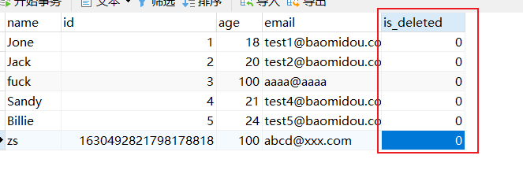
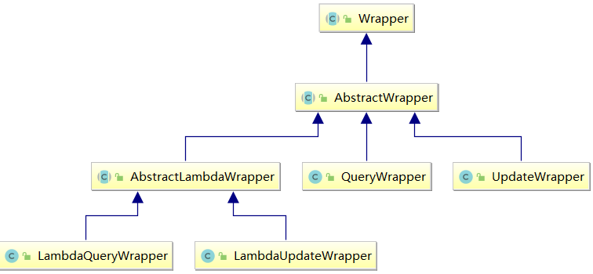
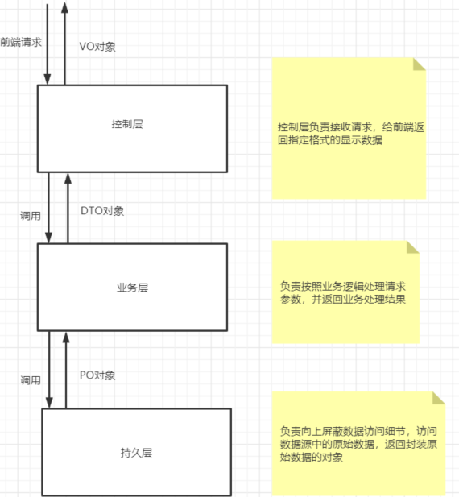
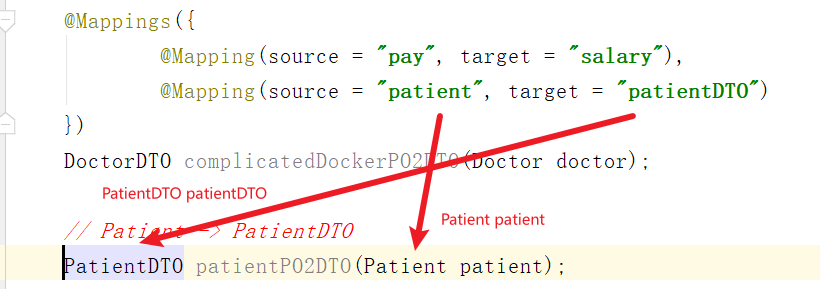
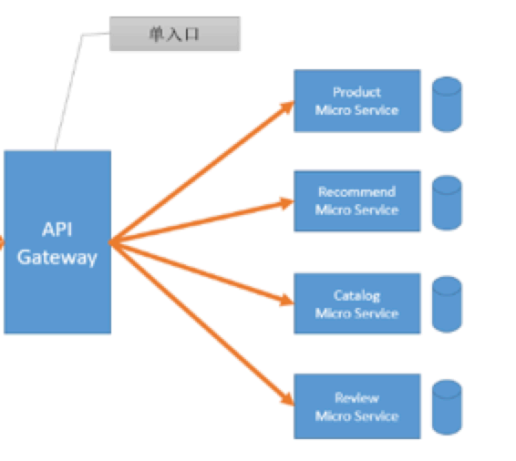
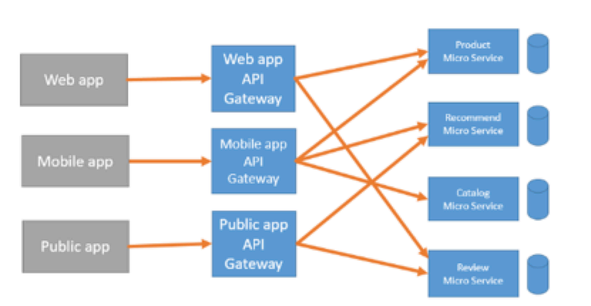

# 基础技术

## 1. MyBatis-Plus

### 1.1 简介

MyBatis-Plus（简称 MP）是一个 MyBatis的增强工具，在 MyBatis 的基础上**只做增强不做改变**，为简化开发、提高效率而生（[官方网址](http://mp.baomidou.com))，它具有如下特性：

+ 增强在单表访问。不考虑逆向工程时，使用Mybatis需要定义mapper接口，`mapper.xml`文件中写sql语句，配置数据库
+ 效率的提高指的是开发效率不是运行效率

> 愿景
>
> 我们的愿景是成为 MyBatis 最好的搭档，就像魂斗罗中的 1P、2P，基友搭配，效率翻倍。


- **无侵入**：只做增强不做改变，引入它不会对现有工程产生影响，如丝般顺滑
- **损耗小**：启动即会自动注入基本 CURD，性能基本无损耗，直接面向对象操作
- **强大的** **CRUD** **操作**：内置通用 Mapper、通用 Service，仅仅通过少量配置即可实现单表大部分，CRUD 操作，更有强大的条件构造器，满足各类使用需求
- **支持** **Lambda** **形式调用**：使用Lambda表达式指定列名，避免字符串写列名写错。通过 Lambda 表达式，方便的编写各类查询条件，无需再担心字段写错
- **支持主键自动生成**：支持多达 4 种主键策略（内含分布式唯一 ID 生成器 - Sequence），可自由配置，完美解决主键问题
- **内置分页插件**：基于 MyBatis 物理分页，开发者无需关心具体操作，配置好插件之后，写分页等同于普通 List 查询
- **分页插件支持多种数据库**：支持 MySQL、MariaDB、Oracle、DB2、H2、HSQL、SQLite、Postgre、SQLServer 等多种数据库

### 1.2. 环境准备

要是用MyBatis-Plus我们得准备好数据库中的表数据，所需的依赖，以及部分相关代码。

#### 数据准备

以一张简单的单表User表为例，其结构如下

| id   | name   | age  | email              |
| ---- | ------ | ---- | ------------------ |
| 1    | Jone   | 18   | test1@baomidou.com |
| 2    | Jack   | 20   | test2@baomidou.com |
| 3    | Tom    | 28   | test3@baomidou.com |
| 4    | Sandy  | 21   | test4@baomidou.com |
| 5    | Billie | 24   | test5@baomidou.com |

对应建表语句如下

```mysql
DROP TABLE IF EXISTS user;

CREATE TABLE user
(
    id BIGINT(20) NOT NULL COMMENT '主键ID',
    name VARCHAR(30) NULL DEFAULT NULL COMMENT '姓名',
    age INT(11) NULL DEFAULT NULL COMMENT '年龄',
    email VARCHAR(50) NULL DEFAULT NULL COMMENT '邮箱',
    PRIMARY KEY (id)
);
```

对应数据如下

```mysql
DELETE FROM user;

INSERT INTO user (id, name, age, email) VALUES
(1, 'Jone', 18, 'test1@baomidou.com'),
(2, 'Jack', 20, 'test2@baomidou.com'),
(3, 'Tom', 28, 'test3@baomidou.com'),
(4, 'Sandy', 21, 'test4@baomidou.com'),
(5, 'Billie', 24, 'test5@baomidou.com');
```

#### 工程依赖准备

创建一个SpringBoot工程(可以使用Spring Initializer)，引入如下依赖

```xml
<dependencies>
    <dependency>
        <groupId>org.springframework.boot</groupId>
        <artifactId>spring-boot-starter</artifactId>
    </dependency>
    <dependency>
        <groupId>org.springframework.boot</groupId>
        <artifactId>spring-boot-starter-test</artifactId>
        <scope>test</scope>
    </dependency>
    <dependency>
        <groupId>com.baomidou</groupId>
        <artifactId>mybatis-plus-boot-starter</artifactId>
        <version>3.5.3.1</version>
    </dependency>
     <dependency>
         <groupId>mysql</groupId>
         <artifactId>mysql-connector-java</artifactId>
         <scope>runtime</scope>
     </dependency>
      <dependency>
            <groupId>org.projectlombok</groupId>
            <artifactId>lombok</artifactId>
            <optional>true</optional>
        </dependency>
</dependencies>
```

在`application.yml`中添加如下配置

```yml
spring:
  datasource:
    url: jdbc:mysql://127.0.0.1:3306/test?characterEncoding=utf8&serverTimezone=GMT%2B8&useSSL=false
    driver-class-name: com.mysql.cj.jdbc.Driver
    username: root
    password: 1234
# 在日志中显示实际执行的sql语句
logging:
  level:
    com.cskaoyan.mybatis.plus.mapper: debug
```

#### 代码准备

步骤一： 在启动类上加`@MapperScan`注解

```java
@SpringBootApplication
@MapperScan("com.cskaoyan.mybatisplus.mapper")
public class Application {
    public static void main(String[] args) {
        SpringApplication.run(Application.class, args);
    }
}
```

因为访问的是单表，所以要有一个**单表映射的实体类**。

步骤二： 定义user表对应的映射实体类User

```java
@Data //lombok注解
public class User {
    private Long id;
    private String name;
    private Integer age;
    private String email;
}
```

步骤三： 定义Mapper继承`BaseMapper`

`BaseMapper`是MyBatis-Plus提供的模板mapper，其中包含了基本的CRUD方法，**泛型为操作的实体类型**

通过泛型就可以将Mapper和实体类关联起来，通过注解将Mapper和数据库表关联起来，从而能够实现实体类与数据库表的映射关系。

```java
public interface UserMapper extends BaseMapper<User> {
}
```

> 补充一个IDEA的BUG，报错内容是`Erro:Kotlin...`时，点击build选项下的rebuild即可。

### 1.3. 基本CRUD

定义一个用于测试的测试类，其中包含基本CRUD的代码

SpringBoot测试类不可以随便放，要保证测试类所在包目录下有启动类

测试类注解`@SpringBootTest`，为了和Spring容器整合，要加注解`@RunWith(SpringRunner.class)`。测试方法上加`@Test`

```java
@SpringBootTest
@RunWith(SpringRunner.class)
public class TestBasic {
    @Autowired
    private UserMapper userMapper;
   
}
```

#### 1.3.1 新增数据

```java
   @Test
    public void testInsert() {
        User user = new User();
        user.setName("zs");
        user.setEmail("abcd@xxx.com");
        user.setAge(100);

        int effectiveRow = userMapper.insert(user);
        // 输出受影响的行数
        System.out.println("受影响行数：" + effectiveRow);
        // 输出自动生成的id
        System.out.println(user.getId());
    }
```

MyBatis-Plus会为我们生成不依赖于自增主键的主键值。

> 之前使用Mybatis时要获得自增主键，需要在sql语句标签里添加useGeneratedKey = "true"，keyProperty = "id"。

注意： MyBatis-Plus在实现插入数据时，会默认基于**雪花算法**(SnowFlake)的策略生成id

#### 1.3.2 删除数据

##### 根据id删除

> 如果id过长，记得后面加`L`表示是长整型。

```java
    @Test
    public void testDeleteById() {
        int effectiveRow = userMapper.deleteById(1630492821798178818L);
        System.out.println("受影响行数: " + effectiveRow);
    }
```

##### 根据id批量删除

```java
    @Test
    public void testDeleteBatchByIds() {
        List<Long> ids = Arrays.asList(1L, 2L);
        int effectiveRow = userMapper.deleteBatchIds(ids);
        System.out.println("受影响行数: " + effectiveRow);
    }
```

##### 根据Map等值条件删除

注意Map中放的是where条件中包含的多个条件字段，以及条件字段对应的值(比较的关系是相等关系)

 🏷️多个条件之间的关系是并且关系。

```java
@Test
public void testDeleteByMap(){
    //根据map集合中所设置的条件删除记录
    //DELETE FROM user WHERE name = ? AND age = ?
    Map<String, Object> param = new HashMap<>();
    // age = 21
    param.put("age", 21);
    // name=sandy
    param.put("name", "Sandy");
    int effectiveRow = userMapper.deleteByMap(map);
    System.out.println("受影响行数：" + effectiveRow);
}
```

#### 1.3.3 修改数据

修改只会使用非`null`字段更新数据库。`updateById()`。

```java
@Test
public void testUpdateById(){
    User user = new User();
    user.setId(6L);
    user.setName("changfeng");
    user.setAge(20);
    //UPDATE user SET name=?, age=? WHERE id=?
    int effectiveRow = userMapper.updateById(user);
    System.out.println("受影响行数：" + effectiveRow);
}
```

#### 1.3.4 查询数据

##### 根据id查询

```java
@Test
public void testSelectById(){
    User user = userMapper.selectById(4L);
    System.out.println(user);
}
```

##### 根据id批量查询

```java
@Test
public void testSelectBatchByIds(){
    //SELECT id,name,age,email FROM user WHERE id IN ( ? , ? )
    List<Long> ids = Arrays.asList(3L, 4L， 5L);
    List<User> result = userMapper.selectBatchIds(ids);
    result.forEach(System.out::println);
}
```

##### 根据Map等值条件查询

```java
@Test
public void testSelectByMap(){
    //SELECT id,name,age,email FROM user WHERE name = ? AND age = ?
    Map<String, Object> map = new HashMap<>();
    map.put("age", 24);
    map.put("name", "Billie");
    List<User> result = userMapper.selectByMap(map);
    result.forEach(System.out::println);
}
```

##### 查询全表数据

```java
@Test
public void testSelectAll(){
    // 这里null代表没有where条件
    //SELECT id,name,age,email FROM user
    List<User> result = userMapper.selectList(null);
    result.forEach(System.out::println);
}
```

`selectList()`的参数应该是表示复杂参数的条件构造器，为`null`时表示没有`where`条件。

> Mybatis的逆向工程使用前，要生成对应的实体类和mapper，重点在于生成代码。
>
> 而MybatisPlus定义一个UserMapper可以调用增删改查所有的方法

### 1.4. 常用注解

##### `@TableName`注解

刚才我们已经，学习了MyBatis-Plus基本的CRUD，但是其实还有一个遗留问题。我们知道，在数据库中是同时存在多张表的，我们怎么控制使用Mapper，操作某一张表的呢？这其实就和`@TableName`注解有关系了。

可以使用`@TableName`注解，定义数据库表和实体类的关系。

(**默认情况下**，会根据实体类的类名访问数据库中的表，所以如果当表名和类名相同时，不加`@TableName`注解，也不会报错)

```java
@Data
@TableName(value = "user")
public class User {
    private Long id;
    private String name;
    private Integer age;
    private String email;
}
```

##### `@TableId`注解

作用：

+ 指定主键映射
+ 主键生成策略

在我们单表中，可以同时定义多个字段，在我们的映射实体类中，也可以同时定义多个属性。在单表中，我们通常都会定义主键字段，**那么主键字段是如何和实体类中的某个属性对应起来的呢？**这就和`@TableId`注解有关系了。

可以使用`@TableId`注解，定义数据库中的主键字段和实体类中的主键属性之间的映射关系。

(**默认情况下**，MyBatis-Plus会根据主键名来映射，映射到同名实体类属性)

```java
@Data
@TableName(value = "user")
public class User implements Serializable {
    @TableId(value = "id", type = IdType.ASSIGN_ID)
    private Long id;
    private String name;
    private Integer age;
    private String email;
}
```

其中，`value`属性指的是数据库主键字段的名称，`IdType`表示主键的类型。在MyBatis-Plus中主键类型有以下几种

AUTO：MybatisPlus不生成主键，**数据库生成**，MybatisPlus可以拿到生成后的主键。

ASSIGN_ID：即雪花算法，生成一个长整型值。（雪花算法和当前时间，机房数据库有关）

| 值          | 描述                                                         |
| :---------- | :----------------------------------------------------------- |
| AUTO        | 数据库 ID 自增                                               |
| NONE        | 无状态，该类型为未设置主键类型（注解里等于跟随全局，全局里约等于 INPUT） |
| INPUT       | insert 前自行 set 主键值                                     |
| ASSIGN_ID   | 分配 ID(主键类型为 Number(Long 和 Integer)或 String)(since 3.3.0),使用接口`IdentifierGenerator`的方法`nextId`(默认实现类为`DefaultIdentifierGenerator`雪花算法) |
| ASSIGN_UUID | 分配 UUID,主键类型为 String(since 3.3.0),使用接口`IdentifierGenerator`的方法`nextUUID`(默认 default 方法) |

##### `@TableField`注解

两个作用：

+ 定义映射关系
+ 让某个属性不参与映射

类似于`@TableId`注解，`@TableField`注解在实体类中用来定义实体类中的普通属性和数据库字段的映射

(**默认情况下**，MyBatis-Plus会根据字段名来映射，映射到同名实体类属性)

```java
@Data
@TableName(value = "user")
public class User implements Serializable {
    @TableId(value = "id", type = IdType.ASSIGN_ID)
    private Long id;
    @TableField(value = "name")
    private String name;
    @TableField(value = "age")
    private Integer age;
    @TableField(value = "email")
    private String email;
}
```

`@TableField(exist = false)`表示该属性不映射数据库中的字段。默认情况下，`exist`属性是`true`。

`@TableField`注解需要注意：

- 若实体类中的属性使用的是驼峰命名风格，而表中的字段使用的是下划线命名风格（例如实体类属性userName，表中字段user_name），此时MyBatis-Plus会自动将驼峰命名风格转化为下划线命名风格
- 若实体类中的属性和表中的字段不满足上述情况，例如实体类属性name，表中字段username，此时需要在实体类属性上使用`@TableField("username")`设置属性所对应的字段名

##### `@TableLogic`

为了实现**逻辑删除**，我们可以在表示删除状态的实体类属性上添加`@TableLogic`注解，从而实现逻辑删除的功能。当然，在使用之前，我们要先给数据库user表增加is_deleted属性并给该字段赋默认初值0表示未删除，以及在实体类中添加isDeleted属性。



```java
@Data
@TableName(value = "user")
public class User implements Serializable {
    @TableId(value = "id", type = IdType.ASSIGN_ID)
    private Long id;
    @TableField(value = "name")
    private String name;
    @TableField(value = "age")
    private Integer age;
    @TableField(value = "email")
    private String email;
    @TableLogic
    private Integer isDeleted;
}

```

+ 删除是更新`is_deleted`字段
+ 查询会过滤`is_deleted`字段

这样一来，**当我们执行删除语句的时候，实际执行的就是一条set语句**，比如当我们根据id删除一条记录时，实际执行的是

```sql
UPDATE user SET is_deleted=1 WHERE id=? AND is_deleted=0
```

**当我们执行查询语句的时候，会自动附带逻辑删除状态的判断**，查询结果中不会包含已经被逻辑删除的记录

```sql
SELECT id,name,age,email,is_deleted FROM user WHERE is_deleted=0
```

### 1.5.  ⭐条件构造器`Wrapper`

> 类似于逆向工程的`example`对象

在我们对数据库做增删改查操作的时候需要条件即`where`条件，这些条件就是用条件构造器`Wrapper`来构造和表示的。



`Wrapper` ： 条件构造抽象类，最顶端父类

`AbstractWrapper` ： 用于查询条件的封装，生成 sql 的 where 条件

`QueryWrapper` ： 查询条件的封装

`UpdateWrapper` ： Update 条件封装(除了包含更新条件，还可以指定更新的字段和对应的新值)

`AbstractLambdaWrapper` ： Lambda 语法使用的Wrapper，统一处理解析 lambda 获取 column

`LambdaQueryWrapper` ：用于Lambda语法使用的查询Wrapper

`LambdaUpdateWrapper` ： 用于Lambda语法使用的更新Wrapper(除了包含更新条件，还可以指定更新的字段和对应的新值)

##### `QueryWrapper`

`QueryWrapper`中提供了多个方法，每个方法都代表了一种条件。可以在`Wrapper`对象上调用多个方法，从而组装多个具体的查询条件，这些条件可以`AND`关系，也可以是`OR`关系。默认构造条件是与关系。

 🍃调用多个方法，这些方法表示的条件默认是`AND`关系

```java
	@Test
    public void testAnd(){
        //查询用户名包含a，年龄在20到30之间，邮箱不为null的用户信息，并且按照年龄的降序排序
        //SELECT id,name,age,email,is_deleted FROM user WHERE is_deleted=0 AND (name LIKE ? AND age BETWEEN ? AND ? AND email IS NOT NULL) ORDER BY age DESC
        QueryWrapper<User> queryWrapper = new QueryWrapper<>();
        queryWrapper.like("name", "a")
                .between("age", 20, 30)
                .isNotNull("email")
                .orderByDesc("age");
        List<User> result = userMapper.selectList(queryWrapper);
        result.forEach(System.out::println);
    }
```

 🍃如果要想表示条件之间的`OR`关系，必须调用`or()`方法来表示`OR`运算符

```java
    @Test
    public void testOr(){
        //查询用户名包含a 或者 年龄大于20，并且按照年龄的升序排序
        // SELECT id,name,age,email,is_deleted FROM user WHERE is_deleted=0 AND (name LIKE ? OR age > ?) ORDER BY age DESC
        QueryWrapper<User> queryWrapper = new QueryWrapper<>();
        queryWrapper.like("name", "a")
                .or()
                .gt("age", 20)
                .orderByDesc("age");
        List<User> result = userMapper.selectList(queryWrapper);
        result.forEach(System.out::println);
    }
```

🍃 我们还可以在`AND`条件中嵌套`OR`条件

```java
    @Test
    public void testInnerOr() {
        //查询用户名包含a 且 (年龄大于20 或者 id > 3)的用户
        // SELECT id,name,age,email,is_deleted FROM user WHERE is_deleted=0 AND (name LIKE ? AND (age > ? OR id > ?))
        QueryWrapper<User> queryWrapper = new QueryWrapper<>();
        queryWrapper.like("name", "a")
                .and(wrapper -> wrapper
                        .gt("age", 20)
                        .or()
                        .gt("id", 3)
                );
        List<User> list = userMapper.selectList(queryWrapper);
        list.forEach(System.out::println);
    }
```

 🍃同理，我们也可以实现`OR`条件中嵌套`AND`条件

```java
    @Test
    public void testInnerAnd() {
        //查询用户id > 3 或者 (name以j打头 且 年龄在18-30之间)的用户
        // SELECT id,name,age,email,is_deleted FROM user WHERE name LIKE ? OR (name LIKE ? AND id > ?)
        QueryWrapper<User> queryWrapper = new QueryWrapper<>();
        queryWrapper.like("name", "a")
                .or(wrapper -> wrapper
                        .likeRight("name", "J")
                        .gt("id", 3)
                );
        List<User> list = userMapper.selectList(queryWrapper);
        list.forEach(System.out::println);
    }
```

 🍃除了针对`where`中的条件，我们还可以指定`select`中查询的字段，`select(String... column)`参数是可变个数的。

```java
    @Test
    public void testSelect() {
        //查询用户id > 3 且 年龄在18-30之间的用户的名字
        // SELECT name FROM user WHERE is_deleted=0 AND (id > ? AND age BETWEEN ? AND ?)
        QueryWrapper<User> queryWrapper = new QueryWrapper<>();
        queryWrapper.gt("id", 3)
                .between("age", 18, 30)
                .select("name");
        List<User> list = userMapper.selectList(queryWrapper);
        list.forEach(System.out::println);
    }
```

 🍃当然`QueryWrapper`还可以使用在删除语句中，表示删除条件。

```java
    @Test
    public void testWrapperWithDelete() {
        // 删除age < 20的用户
        // Delete from user WHERE age < ?
        // update user set is_deleted = 1 where is_deleted = 0 and (age < ?)
        QueryWrapper<User> queryWrapper = new QueryWrapper<>();
        queryWrapper.lt("age", 20);
        int deleteRow = userMapper.delete(queryWrapper);
        System.out.println("影响行数： " + deleteRow);
    }
```

##### `UpdateWrapper`

我们可以使用`UpdateWrapper`来实现数据的修改，在使用`UpdateWrapper`修改的时候，我们可以使用User对象的**非空属性值**，表示通过`set` 语句修改的目标字段及其新值 `set` 字段1 = 新值1，...

 🍃使用方式一：更新的值是一个对象传参，条件是`UpdateWrapper`传参

```java
    @Test
    public void updateWrapperWithUserObj() {

        // 将Jone的年龄改为29，邮箱改为 Jone@cskaoyan.com
        // UPDATE user SET age=?, email=? WHERE name = ?
        UpdateWrapper<User> userUpdateWrapper = new UpdateWrapper<>();
        userUpdateWrapper.eq("name", "Jone");
        // 创建User对象，该对象的非空属性，对应着set语句修改的数据库字段，以及对应的字段值
        User user = new User();
        // 设置email属性为待修改的新值
        user.setEmail("Jone@cskaoyan.com");
        // 设置age属性为待修改的新值
        user.setAge(29);
        // update
        userMapper.update(user, userUpdateWrapper);
    }
```

 🍃使用方式二：条件和更新的值都在`UpdateWrapper`中。在使用`UpdateWrapper`的时候，我们也可以直接使用`UpdateWrapper`的`set`方法，设置`set`语句修改的目标字段及其新值。update传参时，对象传值为`null`。

```java
    @Test
    public void updateWrapperWithoutObj() {
        // 将Jone的年龄改为29，邮箱改为 Jone@cskaoyan.com
        // UPDATE user SET age=?, email=? WHERE name = ?
        UpdateWrapper<User> userUpdateWrapper = new UpdateWrapper<>();
        userUpdateWrapper.eq("name", "Jone");
        // 设置email属性为待修改的新值
        userUpdateWrapper.set("email","Jone@cskaoyan.com");
        // 设置age属性为待修改的新值
        userUpdateWrapper.set("age", 29);

        // update, 不需要传递user对象，因为使用UpdateWrapper的set方法来设置值
        userMapper.update(null, userUpdateWrapper);
        
    }
```

##### `Condition`

所有的条件参数都有一个包含`condition`的重载方法。

在实际开发中，有时需要根据条件来决定是否在SQL语句中添加条件，即需要实现动态SQL的功能，此时我们可以使用带`condition`参数的重载方法来实现。

该`condition`参数是一个`boolean`值，表示是否在SQL语句中拼接条件。只有为`true`时，条件才会出现在最终的SQL语句当中。

```java
    @Test
    public void testCondition () {
        String name = null;
        Integer minAge = null;
        Integer maxAge = 25;

        // 查询指定name，年龄在指定范围的用户
        // Preparing: SELECT id,name,age,email FROM user WHERE age <= ?
        QueryWrapper<User> userQueryWrapper = new QueryWrapper<>();
        // 每一个条件，都可以调用其有condition参数的重载方法(都是第一个参数)
        userQueryWrapper.eq(null != name && !name.isEmpty(), "name", name)
                .ge(minAge != null, "age", minAge)
                .le(maxAge != null, "age", maxAge);

        List<User> users = userMapper.selectList(userQueryWrapper);
    }
```

##### `LambdaQueryWrapper`

`LambdaQueryWrapper` 的本质和`QueryWrapper`是相同的，都主要表示`where`中的条件。

唯一不同的是，在**指定条件字段**的时候，不是直接指定字段的名称，而是通过`Lambda`表达式(实体类中对应属性的`getXxx`方法或者`isXxx`方法)来指定。

好处在于，避免写错列名。

```java
    @Test
    public void testLambdaQueryWrapper() {
        String name = null;
        Integer minAge = null;
        Integer maxAge = 25;

        // 查询name为zs，年龄在18-25岁的用户
        // Preparing: SELECT id,name,age,email FROM user WHERE age <= ? AND name=?
        LambdaQueryWrapper<User> userQueryWrapper = new LambdaQueryWrapper<>();
        // 和QueryWrapper的不同之处就在于，列名使用一个Lambda表达式来表示的(属性对应的get方法)
        userQueryWrapper.eq(null != name && !name.isEmpty(), User::getName, "zs")
                .ge(minAge != null, User::getAge, minAge)
                .le(maxAge != null, User::getAge, maxAge);

        List<User> users = userMapper.selectList(userQueryWrapper);
    }
```
##### `LambdaUpdateWrapper`

```java
    @Test
    public void testLambdaUpdateWrapper() {
        // 将Jone的年龄改为29，邮箱改为 Jone@cskaoyan.com
        // UPDATE user SET age=?, email=? WHERE name = ?
        LambdaUpdateWrapper<User> userUpdateWrapper = new LambdaUpdateWrapper<>();
        // 列名使用一个Lambda表达式来表示的(属性对应的get方法)
        userUpdateWrapper.eq(User::getName, "Jone");
        // 设置email属性为待修改的新值（列名使用一个Lambda表达式来表示的(属性对应的get方法)）
        userUpdateWrapper.set(User::getEmail,"Jone@cskaoyan.com");
        // 设置age属性为待修改的新值(列名使用一个Lambda表达式来表示的(属性对应的get方法))
        userUpdateWrapper.set(User::getAge, 29);

        // update, 不需要传递user对象，因为使用UpdateWrapper的set方法来设置值
        userMapper.update(null, userUpdateWrapper);

    }
```

### 1.6. 分页插件

MyBatis Plus自带分页插件，只要简单的配置即可实现分页功能。

添加配置类

```java
@Configuration
//@MapperScan("com.cskaoyan.mybatisplus.mapper") //可以将启动类中的注解移到此处
public class MybatisPlusConfig {
    @Bean
    public MybatisPlusInterceptor mybatisPlusInterceptor() {
        MybatisPlusInterceptor interceptor = new MybatisPlusInterceptor();
        interceptor.addInnerInterceptor(new PaginationInnerInterceptor(DbType.MYSQL));
        return interceptor;
	}
}
```

```java
@Test
public void testPage(){
    // 设置分页参数: 当前页，每页几条记录
    // 注意： MybatisPlus页数编号从1开始
    // 泛型仍然是单表映射的实体类
    Page<User> page = new Page<>(1, 2);
    userMapper.selectPage(page, null);
    //获取分页中的每一条记录
    List<User> list = page.getRecords();
    list.forEach(System.out::println);
    System.out.println("当前页：" + page.getCurrent());
    System.out.println("每页显示的条数：" + page.getSize());
    System.out.println("总记录数：" + page.getTotal());
    System.out.println("总页数：" + page.getPages());
    System.out.println("是否有上一页：" + page.hasPrevious());
    System.out.println("是否有下一页：" + page.hasNext());
}
```

## 2. Mapstruct

> BeanUtils是运行时的框架，基于反射实现，缺点是会消耗运行时的资源，而Mapstruct是在编译时执行。

### 2.1 引入

在实际开发中，一个web应用通常会被分为三层，分别为持久层，业务层，控制层，每层各有各的职责，**所以针对同一个请求，每层返回的对象应该是不同的。**

DO→DTO→VO

标准的编程规范要求每一层返回的对象都不一样。所以就有了对象类型转化的需求。

- 持久层：主要负责访问数据库中的数据，并将数据库中的数据封装为PO对象，对上层屏蔽数据访问细节。持久层不关心业务，只关心数据，因此对象属性和数据库表字段一一对应（持久层对象称PO或DO；DO：data object/PO：persistent object）
- 业务层：业务层从持久层获取封装数据，并根据具体的业务逻辑计算，得到业务层的计算结果，用DTO对象来封装。DTO对象的全称是 Data Tranfer Object。DTO只包含业务相关的属性和字段，为了尽可能让Controller层知道更少的细节。
- 控制层：控制层获取业务层的业务处理结果之后，还可能需要将其加工成前端所需要的格式，封装成VO对象返回给前端显示。



所以，在处理一个请求的时候业务层需要完成PO—>DTO对象的转化，控制层需要完成DTO—>VO对象的转化。而对象转化本身就是纯粹的“体力活”没有任何技术含量。

```java
  // 待转化的PO对象 
  XxxPO sourcePO = ...
  
  // 目标DTO对象
  XxxDTO destDTO = new XxxDTO();
  
  //通过一堆get/set方法完成转化
  destDTO.setXxx(sourcePO.getXxx());
  ...
```

对于这种没有技术含量的活，有追求的程序员是不屑做的，但是在项目中我们又必须要完成，怎么办呢？于是就有了Mapstruct来帮我们完成对象转化的工作。

> 可以调用编译器接口实现字节码的生成。Mapstruct就是利用这一点，在编译时生效，查看target/classes文件夹会发现有实现类。

### 2.2 使用

导入依赖

```xml
<dependencies> 
	<dependency> 
	<groupId>org.mapstruct</groupId> 
		<artifactId>mapstruct-jdk8</artifactId> 
		<version>1.3.0.Final</version> 
	</dependency> 
	<dependency> 
		<groupId>org.mapstruct</groupId> 
		<artifactId>mapstruct-processor</artifactId> 
		<version>1.3.0.Final</version> 
	</dependency> 
</dependencies>
```

定义转化器接口

```java
// org.mapstruct中的@Mapper注解
@Mapper(componentModel = "spring") 
public interface XxxConverter {
   // 定义转化方法将source原对象转化为目标对象
   目标类 方法名(待转化类 source);
}
```

使用定义的转化器接口

```java
@Autowired
XxxConverter xxxConverter;

@Test
public void testMapStruct() {
目标类 dest = xxxConverter.方法(users);
}
```

#### 2.2.1 简单对象的转化

```java
@Data
public class Doctor {
    private int id;
    private String name;
}
@Data
public class DoctorDTO {
    private int id;
    private String name;
}
```

在源对象(Doctor)和目标对象(DoctorDTO)的属性完全相同，我们可以简单定义转化器接口如下

```java
@Mapper(componentModel = "spring")
public interface DoctorConverter {
    DoctorDTO doctorPO2DTO(Doctor doctor);
}
```

然后再需要的地方注入Converter对象，调用转化方法即可

```java
@Autowired
DocterConverter docterConverter;

@Test
public void testSimpleObj() {
  Doctor docter = ...
  // 完成转化
  DoctorDTO destDTO = docterConverter.doctorPO2DTO(docter);
}
```

#### 2.2.2  不同属性名的映射

使用`@Mapping(source = "",target = "")`注解完成不同属性名的映射。

规范写法

```java
@Mappings({@Mapping(source="对象名.属性名",target="")})
```

假设我们给医生增加一个薪资属性，该属性在Doctor类中叫pay，在DoctorDTO中叫salary，属性名不一致，我们仍然可以完成转化

```java
@Data
public class Doctor {
    private Integer id;
    private String name;
    // 薪资
    private String pay;
}
```

```java
@Data
public class DoctorDTO {
    private Integer id;
    private String name;
    // 薪资
    private String salary;
}
```

定义转化器接口

```java
@Mapper(componentModel = "spring")
public interface DoctorConverter {
    @Mapping(source="pay", target="salary")
    DoctorDTO doctorPO2DTO(Doctor doctor);
}
```

```java
   @Autowired
   DocterConverter docterConverter;

    @Test
    public void testFieldMappingObj() {
     Doctor doctor = ...
     // 完成转化
     DoctorDTO destDTO = docterConverter.doctorPO2DTO(docter);
    }
```

#### 2.2.3 多个不同类型源对象的转化

有时候在转化一个对象的时候，涉及另外的多个对象的属性值，此时我们就可以把多个对象的属性值，赋值给目标对象

```java
@Data
public class Education {
    // 学位
    private String degreeName;
    // 学校
    private String institute;
    // 毕业年份
    private Integer yearOfPassing;
}
```

```java

@Data
public class Doctor {
    private int id;
    private String name;
    // 薪资
    private String pay;
}

@Data
public class DoctorDto {
    private int id;
    private String name;
    // 学历
    private String degree;
    private String salary;
}
```

定义转化器接口

```java
@Mapper(componentModel = "spring")
public interface DoctorConverter {
    // 多个源对象的话，在指定源对象属性时 通过对象名.属性名的方式指定
    @Mapping(source = "doctor.id", target = "id")
    @Mapping(source = "doctor.name", target = "name")
    @Mapping(source = "doctor.pay", target = "salary")
    @Mapping(source = "education.degreeName", target = "degree")
    DoctorDTO doctorPO2DTO(Doctor doctor, Education education);
}
```

```java
   @Autowired
   DocterConverter docterConverter;

    @Test
    public void testFieldMappingObj() {
     Doctor doctor = ...
     Education education = ...
     // 完成转化
     DoctorDTO destDTO = docterConverter.doctorPO2DTO(docter, education);
    }
```

#### 2.2.4 转化复杂对象

> 不仅要转化对象本身，还要转化对象本身持有的对象。这个过程需要递归下去。类似于深度拷贝。
>
> 为了实现内部对象的转化，需要指定对应的引用数据类型转化器。Mapstruct会“自动匹配”转化器，匹配两点：
>
> + 源对象类型匹配参数类型
> + 目标对象类型匹配返回值类型

如果一个对象持有了另外一个对象，或者另外一个对象的`List`，Mapstruct还可以帮我们实现类似“深度克隆”的”深度转化“。

```java
@Data
public class Patient {
    private int id;
    private String name;
}

@Data
public class PatientDTO {
    private int id;
    private String name;
}
```

```java
public class Doctor {
    private int id;
    private String name;
    private String pay;
    // 医生有患者
    private Patient patient;
}
```

```java
public class DoctorDTO {
    private int id;
    private String name;
    private String salary;
    // 医生有患者
    private PatientDTO patientDTO;
}
```

定义转化器Converter

```java
@Mapper(componentModel = "spring")
public interface DoctorConverter {
    @Mapping(source="pay", target="salary")
    DoctorDTO doctorPO2DTO(Doctor doctor);

    PatientDTO patientPO2DTO(Patient patient);
}
```

```java
   @Autowired
   DocterConverter docterConverter;

    @Test
    public void testComplicatedObj() {
     Doctor doctor = ...
     Patient patient = ...
     doctor.setPatient(patient);
     // 完成转化
     DoctorDTO destDTO = docterConverter.doctorPO2DTO(docter);
    }
```

这里要注意的是，在Doctor对象持有了一个Patient，但是当我们调用Converter转化器的doctorPO2DTO方法时，Mapstruct在转化Doctor对象的时候，也会把Patient对象转化为PatientDTO对象。原因是：

- 我们在Converter转化器中定义了如下转化方法

```java
 PatientDTO patientPO2DTO(Patient patient);
```

- 当转化器在Converter在执行complicatedDoctorPO2DTO方法转化Doctor对象的过程中，遇到Patient patient属性时，Converter会“自动发现”patientPO2DTO方法，将源对象中的Patient 对象转化为PatientDTO对象
-  🍃“自动发现”其实就是用Doctor的源对象目标属性patient的类型，**和某个Converter转化器中方法的入参做类型匹配**，同时，**用目标对象的目标属性patientDTO和该方法的返回值类型做类型匹配**
- 如果类型都匹配上了，就会自动使用这个转化器方法来完成源对象属性和目标对象属性之间的转化



其实，当Doctor对象中有属性`List<Patient> patientList` ， DoctorDTO对象中有属性`List<PatientDTO> `的时候Mapstrut也会对List中的对象类型和转化器方法的入参和返回值类型，做类型匹配，从而使用`patientPO2DTO`方法，完成将`List<Patient> patientList`转化为`List<PatientDTO>`的工作。

#### 2.2.5 转化List

```java
@Data
public class Doctor {
    private int id;
    private String name;
    // 薪资
    private String pay;
}
```

```java
public class DoctorDTO {
    private int id;
    private String name;
    private String salary;
}
```

如果我们想一次性的将多个Doctor对象转化成多个DoctorDTO对象，此时我们可以定义如下Converter转化器方法

```java
@Mapper(componentModel = "spring")
public interface DoctorConverter {
    @Mapping(source="pay", target="salary")
    DoctorDTO doctorPO2DTO(Doctor doctor);

    List<DoctorDTO> doctorPOs2DTOs(List<Doctor> doctors);
}
```

```java
   @Autowired
   DocterConverter docterConverter;

    @Test
    public void testFieldMappingObj() {
     List<Doctor> doctor = ...
     // 完成转化
     List<DoctorDTO> destDTOs = docterConverter.doctorPOs2DTOs(docter);
    }
```

## 3  Gateway

> 在微服务架构中一定有一个API网关。
>
> API网关最核心的功能，**对外接收请求，对内请求路由**。
>
> API网关成为了外部请求的唯一入口。
>
>  🏷️所以网关的功能有：
>
> 1. 对外接收请求，对内请求路由
>
> 2. 实现类似于黑白名单的软防火墙的功能
>
> 3. 记录用户的行为日志。
>
>    > 用户画像技术：给每个用户打标签。网关把用户的每次操作都记录在日志文件中，由大数据系统进行统计根据商品访问习惯打标签。
>
> 4. 登录身份的认证。
>
>    > 如果每个服务都认证的话就会有共同的代码，将身份认证代码放在网关里进行统一的登录身份认证
>
> 5. API聚合。
>
>    > 一次请求的处理需要调用多个服务马，让网关一次取调用多个服务。
>
> 6. 限流功能
>
>    > 服务器软硬件资源是有限的，而用户的请求认为是无限的。用有限的资源处理无限的请求，出现了矛盾采用折中的方式。为避免软硬件资源瞬间耗尽，可以使用限流方式。限流的本质是选择一部分处理。
>
> 7. 协议转化（基于Dubbo实现的微服务是自定义的协议，dubbo协议。将浏览器发送来的HTTP协议转为网关发给服务的dubbon协议）
>
> 以上功能和具体的业务逻辑是无关的，可以用网关实现这样的边缘功能。

>  🏷️网关的实现方式：
>
> 1. 从代理的角度，网关是一个反向代理。可以基于Nginx实现，但是Nginx只有简单功能。Tenginx,OpenResty。
> 2. 基于通用的网关框架，SpringCloud提供的一代Zuuul，二代Gateway等。（目前学习这种实现方式）
> 3. 从web应用角度，网关本质是一个web应用。可以自己基于Web应用实现API网关的功能。

### 3.1 网关介绍

如果没有网关，难道不行吗？功能上是可以的，我们直接调用提供的接口就可以了。那为什么还需要网关？

因为网关的作用不仅仅是转发请求而已。我们可以试想一下，**如果需要做一个请求认证功能**，我们可以接入到 API 服务中。但是倘若后续又有服务需要接入，我们又需要重复接入。这样我们不仅代码要重复编写，而且后期也不利于维护。

**由于接入网关后，网关将转发请求。**所以在这一层做请求认证，天然合适。这样这需要编写一次代码，在这一层过滤完毕，再转发给下面的 API。

所以 API 网关的通常作用是完成一些通用的功能，如请求认证，请求记录，请求限流，黑白名单判断等。

API网关是一个服务器，是**系统的唯一入口**。
API网关方式的核心要点是，所有的客户端和消费端都通过统一的网关接入微服务，在网关层处理所有的非业务功能。通常，网关提供REST/HTTP的访问API。


**单网关**：



**多入口**：



> 访问相同的服务为什么需要多个网关？
>
> 为了适配不同的客户端：移动端，网页端。
>
> 不同客户端数据粘性不一样，手机端因为有通知功能，粘性更大。
>
> Public app是大公司的开放平台。

### 3.2 网关使用

 🏷️核心是通过定义`route`使用Spring Cloud Gateway。

Spring Cloud Gateway是一个基于Spring生态的API网关，基于WebFlux（类似于SpringMVC）框架实现。它旨在以简单高效的方式实现，请求路由，以及一些其他的边缘功能，比如，安全，监控等功能。

> WebFlux框架是一个**响应式编程的框架**。基于异步非阻塞实现，性能好。完全等价于SpringMVC。但是引入依赖时两者互斥，不能同时引入。
>
> > 响应式编程（Reactive Programming）是一种编程范式，主要用于处理异步数据流和变化。它强调数据流和变化传播的机制，使得程序能够在数据变化时自动响应。以下是响应式编程的关键概念和特点：
> >
> > ### 关键概念
> >
> > 1. **数据流**：
> >    - 响应式编程将数据视作流，可以是时间序列、事件流或其他变化的值。
> >
> > 2. **观察者模式**：
> >    - 采用观察者模式，允许对象（观察者）订阅数据流的变化，一旦数据改变，所有订阅者都会收到通知。
> >
> > 3. **异步编程**：
> >    - 支持非阻塞操作，使得程序在等待某些事件发生时不会被阻塞，能够继续执行其他任务。
> >
> > 4. **背压**：
> >    - 在处理数据流时，可以控制数据的流动速度，以防止消费者被淹没（例如，处理能力不足时不再发送数据）。
> >

通用的网关框架除了Gateway之外，还有Zuul，Zuul2等框架。其中，Zuul是由Netflix公司开发出的最早的通用网关框架，功能丰富，但是基于同步阻塞式Servlet API实现，性能不佳。Zuul2可以理解为Zuul的升级版，它基于异步非阻塞模式实现，但是由于zuul2在开发过程中一直延期，所以Spring Coud官方并未采用Zuul2最为自己的通用网关，而是自己推出了自己的基于异步非阻塞实现的第二代服务网关Gateway。

#### 3.2.1 核心概念

- **`Predicate`**：表示路由规则的匹配条件

- **`Filter`**：过滤器，在请求处理之前(Pre)实现队请求的拦截处理，在请求处理之后(Post)实现对响应的拦截处理

  >  和tomcat的Filter没有关系，只是名字相同，功能相似。

- **Route**：定义请求和路由目标之间的映射，它由一个**唯一ID**(自定义)，一个**目标地址URI**，表示**路由条件**`Predicate`集合，以及**一个Filter集合**组成。对于一个请求而言，如果它满足一个路由的全部路由条件(Predicate)，那么该请求就会按照该路由(Route)规则，向目标地址URI转发。

  >  🏷️一个Route由四部分组成：
  >
  > + 唯一ID
  > + 目标地址
  > + 路由条件集合
  > + 过滤器集合

  `Path`：代表路径匹配条件。

```yaml
spring:
  cloud:
    gateway:
     #定义多个路由
      routes:
      # 一个路由route的id
      - id:  test_route
        # 该路由转发的目标URI
        uri: https://example.org
        # 路由条件集合
        predicates:
        - Path=/red/**
        # 过滤器集合
        filters:
        - AddRequestParameter=color, red
```

我们再来看一看Gateway是如何工作的

只要能发送HTTP请求就可以当作Gateway Client。

GatewayHandlerMapping会拿着请求与所有路由规则进行匹配。匹配成功后请求并不是直接转发到目标URI，而是可能设置了拦截器到达Gateway Web Handler，之后经过Filter到达目标。


- 客户端向Gateway发起请求
- Gateway的Handler Mapping组件，会对请求做路由匹配，如果请求和某个路由规则匹配，则把该请求交给Web Handler处理
- 在将请求转发给目标之前，Web Handler会将请求，交给满足请求过滤条件的一系列过滤器，即一个过滤器链对该请求进行过滤处理
- 过滤器链，被虚线分隔，是因为过滤器既可以在转发请求前拦截请求，也可以在请求处理之后对响应进行拦截处理。

#### 3.2.2  网关路由配置

SpringCloud Gateway的网关配置有两种方式，**配置文件配置**和**代码配置**两种方式。

在使用Gateway之前，我们得单独创建一个Maven工程，引入Gateway依赖，之后将其独立启动。需要的依赖如下

```xml
<dependencies>
        <!--gateway-->
        <dependency>
            <groupId>org.springframework.cloud</groupId>
            <artifactId>spring-cloud-starter-gateway</artifactId>
        </dependency>
        <!--单元测试依赖-->
        <dependency>
            <groupId>org.springframework.boot</groupId>
            <artifactId>spring-boot-starter-test</artifactId>
        </dependency>
</dependencies>
```

##### 3.2.2.1 配置文件配置

假设现在我们在基于Gateway的网关中，添加路由配置，实现如下功能：

- 将URI匹配`/routeconfig/rest/**`的请求，转发给某一个服务或应用(将请求路由到服务或应用)
- 将URI匹配`/guonei/**`的请求，转发给另一个服务或应用(将请求路由到服务或应用)

> 先拿到目标URI，拼接原来请求路径，生成新的请求。

```yaml
spring:
  application:
    name: cloud-gateway
  cloud:
    gateway:
      routes:
         #路由的ID，没有固定规则但要求唯一，建议配合服务名
        - id: config_route 
          #匹配后提供服务的路由地址
          uri: http://localhost:8002
           # 断言，路径相匹配的条件
          predicates:
            - Path=/routeconfig/rest/**      
		#路由的ID，没有固定规则但要求唯一，建议配合服务名
        - id: config_news 
          #匹配后提供服务的路由地址
          uri: http://news.baidu.com
          # 断言，路径相匹配的进行路由
          predicates:
            - Path=/guonei/**      
```

##### 3.2.2.2 代码配置

调用一个routes的`route()`方法就是定义一个路由规则。

> 路由匹配条件中最常用的是路径匹配条件。(`Predicate`中的`Path`)

```java
@Configuration
public class GateWayConfig
{
    @Bean
    public RouteLocator customRouteLocator(RouteLocatorBuilder routeLocatorBuilder)
    {
        RouteLocatorBuilder.Builder routes = routeLocatorBuilder.routes();
		
        // route方法的第一个参数表示新建的routeID
        // 第二个参数表示Route对象对应的的Builder对象
        routes.route("code_route_config",
                r -> r.path("/guonei")
                        .uri("http://news.baidu.com")).build();

        return routes.build();
    }
}
```

配置类方式可读性不好，使用较少，不要求记住代码，因为没有深究WebFlux。

转发是网关做的，这里将转发的目标地址写定了，如果有多个服务器可以处理，不想要写定某一个地址，该如何做呢？类似于服务调用的注册中心。引入动态路由。动态路由的实现要依赖注册中心，所以要引入注册中心的依赖。

#### 3.2.3  动态路由

网关接收外部请求，按照一定的规则，将请求转发给其他服务或者应用。如果站在服务调用的角度，网关就扮演着服务消费者的角色，此时，如果我们再来看看服务调用的目标URI配置，就会很自然的发现一个问题，服务提供者调用的地址是写死的，即网关没有动态的发现服务，这就有涉及到了我们之前解决过的服务的自动发现问题，以及发现服务后，所涉及到的服务调用的负载均衡的问题。

回忆一下，我们之前是如何解决这些问题的？通过Nacos或者Eureka注册中心动态发现服务，通过Ribbon进行服务调用的负载均衡。同样，Gateway也可以整合Nacos或者Eureka，Ribbon从而实现，动态路由的功能。

想要使用动态路由的功能，首先我们要整合注册中心，这里我们以Nacos为例

```xml
<!--SpringCloud ailibaba nacos -->
<dependency>
    <groupId>com.alibaba.cloud</groupId>
    <artifactId>spring-cloud-starter-alibaba-nacos-discovery</artifactId>
</dependency>
```

然后在配置文件中，添加注册中心的配置

```yaml
spring:
  cloud:
    nacos:
      discovery:
        server-addr: localhost:8848
```

还要修改路由配置，使用动态路由

```yaml
spring:
  application:
    name: cloud-gateway
  cloud:
    nacos:
      discovery:
        server-addr: localhost:8848
    gateway:
      routes:
         #路由的ID，没有固定规则但要求唯一，建议配合服务名
        - id: config_route 
          #匹配后提供服务的路由地址, 这里lb之后，跟的是要调用的服务名称
          uri: lb://nacos-provider-8002
           # 断言，路径相匹配的条件
          predicates:
            - Path=/routeconfig/rest/**      
```

> 如何实现动态路由？
>
> 不再使用HTTP协议，使用lb协议。根据lb协议将服务转发给匹配的目标服务。这里涉及到负载均衡，底层仍是整合了Ribbon，默认的策略还是Zone
>
> `loadbalance`

此时，当id为config_route的路由规则匹配某个请求后，在调用该请求对应的服务时，就会从nacos注册中心自动发现服务，并在服务调用的时候实现负载均衡。

#### 3.2.4  `Predicate`

在Gateway中，有一些的内置Predicate Factory，有了这些Pridicate Factory，在运行时，Gateway会自动根据需要创建其对应的`Pridicate`对象测试路由条件。具体的有兴趣的话大家可以去查看官网: https://spring.io/projects/spring-cloud-gateway

- `Path` 路由断言 Factory:  根据请求路径匹配的路由条件工厂

```yaml
spring:
  cloud:
    gateway:
      routes:
      - id: path_route
        uri: https://example.org
        predicates:
        # 如果可以匹配的PathPattern有多个，则每个路径模式以，分开
        - Path=/red/{segment},/blue/{segment}
```

> `{segment}`是一个占位符，匹配内容任意

- `After` 路由断言 Factory：在指定日期时间之后发生的请求都将被匹配

  > 匹配的是时间点，在这个时间之后才可以匹配。
  >
  > 时间格式：带时区的时间，JDK8提供的类`ZoneDateTime`
  >
  > ```java
  > ZoneDateTime current = ZoneDateTime.now();
  > ```

```yaml
spring:
  cloud:
    gateway:
      routes:
      - id: after_route
        uri: http://example.org
        predicates:
        - After=2017-01-20T17:42:47.789-07:00[America/Denver]
```

- `Cookie` 路由断言 Factory

  Cookie 路由断言 Factory有两个参数，cookie名称和正则表达式。请求包含次cookie名称且正则表达式为真的将会被匹配。

  > 等号右边是匹配的`cookie的名字，cookie的值`

  > 关于cookie的知识
  >
  > 所有的cookie都属于某个domain。

  ```yaml
  spring:
    cloud:
      gateway:
        routes:
        - id: cookie_route
          uri: http://example.org
          predicates:
          - Cookie=chocolate, ch.p
  ```

- `Header`  路由断言 Factory

  Header 路由断言 Factory有两个参数，header名称和正则表达式。请求包含次header名称且正则表达式为真的将会被匹配。

  > 正则表达式`\d+`表示是数字值。

  ```yaml
  spring:
   cloud:
     gateway:
       routes:
       - id: header_route
         uri: http://example.org
         predicates:
         - Header=X-Request-Id, \d+
  ```

- `Host` 路由断言 Factory

  Host 路由断言 Factory包括一个参数：host name列表。使用Ant路径匹配规则，`.`作为分隔符。

  > Ant路径匹配规则

  ```javascript
  spring:
    cloud:
      gateway:
        routes:
        - id: host_route
          uri: http://example.org
          predicates:
          - Host=**.somehost.org,**.anotherhost.org
  ```

- `Method` 路由断言 Factory

  Method 路由断言 Factory只包含一个参数: 需要匹配的HTTP请求方式

  ```yaml
  spring:
    cloud:
      gateway:
        routes:
        - id: method_route
          uri: http://example.org
          predicates:
          - Method=GET
  ```

  所有GET请求都将被路由

#### 3.2.5  Filter

Gateway内置了很多的Filter这里就不再一一列举了。我们重点来学习下自定义Filter。

> 检验该请求中是否携带了特定cookie（名为`access_token`），有两种情况：
>
> 1. 有，放行
>
>    1. 通过返回`chain.filter(exchange)`
>
>       ```java
>               return chain.filter(exchange)
>       ```
>
> 2. 没有，拦截（不转发）
>
>    1. 抛出一个自定义异常
>
> WebFlux把请求和响应对象封装在了 `ServerWebExchange exchange`里。
>
> `Mono<Void>`在响应式编程中代表零个或一个对象。

> 拦截器在拦截链中的位置，由拦截器优先级决定，返回值越小表示优先级越高，越处在拦截链中的前面。

> 拦截器会拦截全部请求吗？
>
> `GloablFilter`只会拦截符合路由匹配规则的请求。

```java
@Component
public class MyGatewayFilter implements GlobalFilter, Ordered {
 
  
    @Override
    public Mono<Void> filter(ServerWebExchange exchange, GatewayFilterChain chain) {
        ServerHttpRequest request = exchange.getRequest();
        MultiValueMap<String, HttpCookie> cookies = request.getCookies();
        List<HttpCookie> tokens = cookies.get("access_token");
        if (tokens == null || tokens.size() == 0) {
            throw new RuntimeException("少了cookie！");
        }

        return chain.filter(exchange);
    }

    @Override
    public int getOrder() {
       return 0;
    }
}
```

## MinIO

### MinIO介绍

MinIO 是一个基于Apache License v2.0开源协议的对象存储服务器。它兼容亚马逊S3云存储服务接口，非常适合于存储大容量非结构化的数据，例如图片、视频、日志文件等，而一个对象文件可以是任意大小，从几kb到最大`5T`[不等]。[详情参见官方文档地址](https://docs.min.io/)

MinIO作为一个优秀的开源对象存储服务器具有如下特征：

- 高性能：作为高性能对象存储，在标准硬件条件下它能达到55GB/s的读、35GB/s的写速率
- 可扩容：不同MinIO集群可以组成联邦，并形成一个全局的命名空间，并跨越多个数据中心
- SDK支持: 它有类似Java、Python或Go等语言的sdk支持
- 支持纠删码: MinIO使用纠删码、Checksum来防止硬件错误和静默数据污染。在最高冗余度配置下，即使丢失1/2的磁盘也能恢复数据。
- 有控制台界面
- 功能简单: 这一设计原则让MinIO不容易出错、更快启动

MinIo的使用

> 一下介绍是在Windows环境下，项目中是在Ubuntu中的docker安装，详情见环境配置。
>
> ### minio
>
> ```shell
> # 拉取镜像
> docker pull minio/minio
> 
> # 创建文件夹 注意这里是两个文件夹，中间有空格
> sudo mkdir -p /home/data /home/config 
> # 运行容器
> docker run \
>   -p 9000:9000 \
>   -p 9001:9001 \
>   --name minio \
>   -d --restart=always \
>   -e "MINIO_ROOT_USER=admin" \
>   -e "MINIO_ROOT_PASSWORD=admin123456" \
>   -v /home/data:/data \
>   -v /home/config:/root/.minio \
>   minio/minio server /data --console-address ":9001"
> ```
>
> ```bash
> # 测试验证，访问http://ip:9001
> ```
>

- 访问以下url，下载MinIO可执行文件

```
https://dl.min.io/server/minio/release/windows-amd64/minio.exe
```

- 进入minio.exe所在的目录，执行以下命令在c:\minio目录下启动MinIO Server，我们可以将c:\minio替换成任意存在的目录

```
.\minio.exe server C:\minio --console-address :9090
```

- 如果成功启动，minio会在控制台界面打印出如下信息


MinIO Server启动启动后，我们可以通过浏览器访问控制台界面，但是需要登录，登录时默认的用户名是minioadmin，密码也是minioadmin


要是用MinIo我们还必须了解两个基本概念：

- 对象:  在MinIO中对象指的是二进制数据，甚至有时指的是Blob(Binary Large OBject)，二进制数据可以是图片，音视频文件，可执行文件等等
- 桶(bucket):  MinIO用桶来组织对象，一个桶类似于操作系统中的一个目录，一个桶中可以存储任意多个对象

所以，要是用MinIO必须首先创建桶，向桶中存取对象，同时还要注意，如果要想访问到桶中的数据，我们得把桶的权限设置为public


### MinIO的Java客户端

我们还可以使用MinIO提供的Java语言客户端，通过Java语言操作MinIO实现文件上传。

在工程中导入MinIO客户端依赖如下

```xml
<dependency>
    <groupId>io.minio</groupId>
    <artifactId>minio</artifactId>
    <version>8.2.0</version>
</dependency>
```

基于客户端依赖，即可以实现文件上传功能，我们定义FilepuloadController代码如下：

```java
@RestController
@RequestMapping("admin/product")
public class FileUploadController {

    //  获取文件上传对应的地址
    @Value("${minio.endpointUrl}")
    public String endpointUrl;

    @Value("${minio.accessKey}")
    public String accessKey;

    @Value("${minio.secreKey}")
    public String secreKey;

    @Value("${minio.bucketName}")
    public String bucketName;

    //  文件上传控制器
    @PostMapping("fileUpload")
    public Result fileUpload(MultipartFile file) throws Exception{
        //  准备获取到上传的文件路径！
        String url = "";

        // 使用MinIO服务的URL，端口，Access key和Secret key创建一个MinioClient对象
        MinioClient minioClient =
                MinioClient.builder()
                        .endpoint(endpointUrl)
                        .credentials(accessKey, secreKey)
                        .build();
        // 检查存储桶是否已经存在
        boolean isExist = minioClient.bucketExists(BucketExistsArgs.builder().bucket(bucketName).build());
        if(isExist) {
            System.out.println("Bucket already exists.");
        } else {
            // 创建一个名为asiatrip的存储桶，用于存储照片的zip文件。
            minioClient.makeBucket(MakeBucketArgs.builder()
                    .bucket(bucketName)
                    .build());
        }
        //  定义一个文件的名称 : 文件上传的时候，名称不能重复！
        String fileName = System.currentTimeMillis()+ UUID.randomUUID().toString();
        // 使用putObject上传一个文件到存储桶中。
        minioClient.putObject(
                PutObjectArgs.builder().bucket(bucketName).object(fileName).stream(
                        file.getInputStream(), file.getSize(), -1)
                        .contentType(file.getContentType())
                        .build());
        url = endpointUrl+"/"+bucketName+"/"+fileName;

        System.out.println("url:\t"+url);
        //  将文件上传之后的路径返回给页面！
        return Result.ok(url);
    }
}

```

最后图片的路径就是`endpointUrl/bucketName/fileName`
