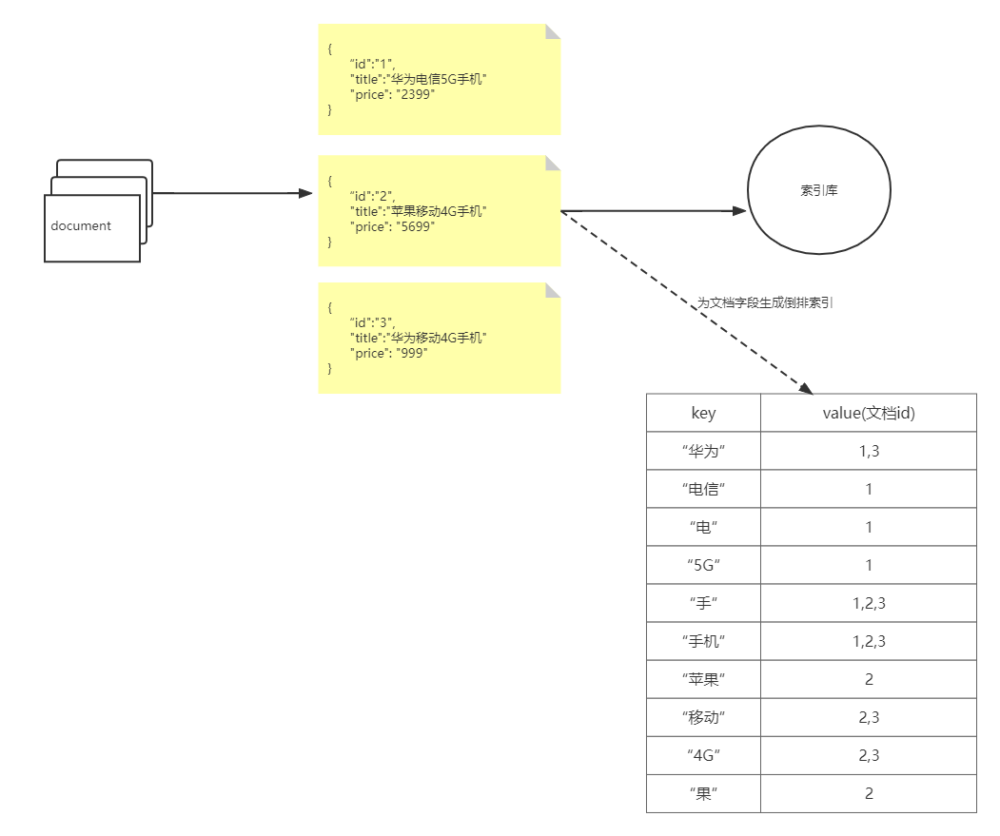
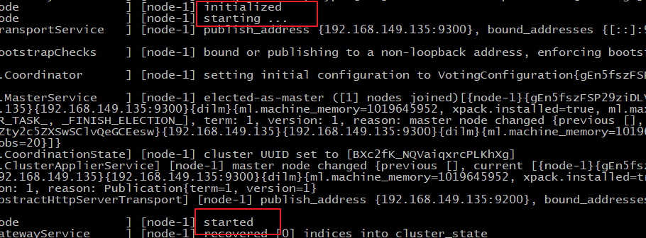
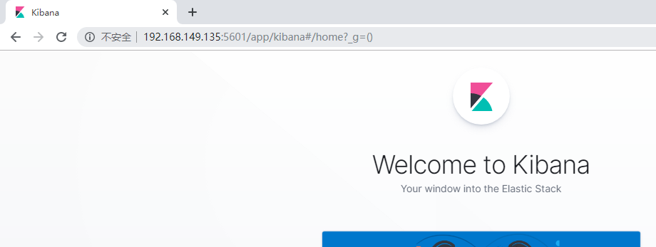
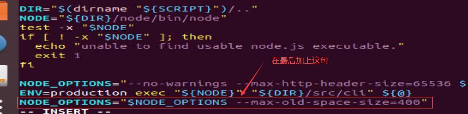

# Elastic Search

## 1 引例

现在假设我们有如下的一张数据库表


现在假设我们有一个需求是从这张表中搜索“手机”或者“华为手机”的相关信息，我们会怎么做？

```sql
select * from product where name like "%手机%";
select * from product where name like "%华为手机%";
```

但是针对这张表，我们如果直接通过以上SQL语句来查询，会存在两个问题:

- 针对单表的全表扫描效率低
- 关系数据库中提供的查询功能弱

思考一下，我们的一个电商网站中，有上百万商品数据，如果我们采用`like`的方式，去实现商品搜索的功能，其效率是非常低下的，同时由于用户输入的商品关键字是比较随意的，使用`like`的方式往往也很难真正查询到用户想要的商品。

> 搜索时，模糊匹配做了运算，**会使索引失效**，导致查询效率降低。

## 2 ES介绍及基本概念

在很多场景下，比如电商网站的商品搜索，我们都需要使用**全文检索**的功能查询所需的内容，那么如何高效的实现全文检索的功能呢？解决之道就在于Elastic Search。

ElasticSearch**是一个**基于Lucene的分布式、高扩展、高实时的基于RESTful 风格API的**搜索与数据分析引擎**。

> Lucene是一个按内容搜索的框架，但是不流行，因为需要设置许多参数，这些参数需要一些门槛，并且不支持分布式。一个英国程序员对Lucene做了封装，就是ElasticSearch。ElasticSearch诞生的浪漫故事。

> 基于RESTful风格API意味着,通过发送HTTP请求就可以使用,因为所有语言都可以实现HTTP协议,所以也就是说支持各种语言实现.

为什么Elastic Search能够实现大规模数据场景下的高效全文检索呢？主要是因为在ES中，**数据的存储和组织方式与关系数据库不同**。

我们首先需要了解ES中的基本概念：

- 字段(`Field`):  一个字段表示一个属性，类比于数据库表中的属性，数据库中的一行数据通常是多个属性值组成

- 文档(`document`)：在ES中数据的存储和关系数据库不同，**所有的数据**都是以文档的`JSON document`的形式存在，`document`是ES中**索引**和**搜索**的最小的数据单位，类比于**数据库中的一行数据**，通常有多个字段值组成
- 映射(`mapping`)： `mapping` 定义了`document` 中每个字段的类型、字段所使用的分词器等。相当于关系型数据库中的**表结构**。
- 索引（`index`)：ElasticSearch存储数据的地方，可以理解成关系型数据库中的**数据库概念**，存放一类相同或者类似的`document`，比如一个员工索引，商品索引。
- 类型(`Type`)：逻辑上的数据分类，一种`type`就像一张表。如用户表、角色表等。在Elasticsearch6.X默认type为_doc，es 7.x中删除了type的概念

在了解了ES的基本概念之后，接下来，我们可以大致解释下，为何ES可以实现高效的全文检索功能，其中一个很重要的原因是ES使用了倒排索引(**这里要注意的一点是，倒排索引和文档的存储本身没有关系，只是为了快速的全文检索，针对`document`的一个或者多个字段，所创建的索引)**

> 特殊的数据结构：倒排索引。
>
> MySql里使用B+树增加查询速度。
>
> 倒排索引也就是反向索引，相对的有正排索引，也就是正向索引。
>
> 正排索引，实现分词的查询
>
> 1. 存储时，对文档处理存储
> 2. 查询时，先对查询关键词处理
> 3. 全表扫描匹配
>
> 解决了功能弱的问题但是没有解决全表扫描的低效率问题。
>
> 正向索引和倒向索引的本质都是建立映射关系。

那么什么是倒排索引呢？为了理解什么是倒排索引，我们先来理解正排索引。针对以下3条document文档数据所创建的正排索引如下：


- 凡是索引其本质都是在建立一种映射关系
  - 正向：文档到文档分词的映射
  - 反向：文档分词到文档的映射

- 无论是正排索引还是倒排索引，在创建索引时都是要对目标字段的值进行分词的。
- 正排索引，建立的是文档的唯一标识Id(内容所在位置) → 文档目标字段内容的映射

如果我们是基于正向索引来查找和“华为手机”相关的商品信息(根据商品的title字段的值来匹配)，首先对搜索的关键字也会做分词处理，比如分解为"华为"和"手机"两个关键词，然后遍历每一个文档，将关键词和文档中的分词内容进行匹配，如此我们可以查找到所需要的华为手机的相关商品信息。

但是，使用正向索引仍然无法避免全部遍历每一个商品对应的文档("类似全表扫描")，这种匹配方式，效率比较低下。接下来，我们换种方式，基于倒排索引，来实现搜索。


- 反向索引是以文段目标字段所有可能的分词结果为`key`，其`value`表达的是，包含该词的文档Id(即文档位置)
- 通过对比可知，反向索引表达的是文档字段内容 → 包含该内容的文档位置(文档Id)的映射

如果基于倒排索引，来查找和关键字“华为手机”相关的商品，那么我们很容易就可以查询出想要的结果，并且还不需要遍历每一个商品信息。同理，ES在搜索时就是基于倒排索引，所以它的搜索性能很好。



## 3 ES及可视化客户端安装

> 详细安装见项目配置文档

### 3.1 ElasticSearch安装

- 利用winscp上传ElasticSearch安装包


- 执行解压操作 ，如下图


```shell
 # 将elasticsearch-7.4.0-linux-x86_64.tar.gz解压到opt文件夹下. -C 大写
 tar -zxvf elasticsearch-7.4.0-linux-x86_64.tar.gz  -C /opt/es
```

- 修改elasticsearch.yml文件


```shell
vim /opt/es/elasticsearch-7.4.0/config/elasticsearch.yml 
```

```shell
# ======================== Elasticsearch Configuration =========================
cluster.name: my-application
node.name: node-1
network.host: 0.0.0.0
http.port: 9200
cluster.initial_master_nodes: ["node-1"]
```

cluster.name：配置elasticsearch的集群名称，默认是elasticsearch。建议修改成一个有意义的名称

node.name：节点名，elasticsearch会默认随机指定一个名字，建议指定一个有意义的名称，方便管理

network.host：设置为0.0.0.0允许外网访问

http.port：Elasticsearch的http访问端口

cluster.initial_master_nodes：初始化新的集群时需要此配置来选举master

- 修改配置文件


系统默认用户最大可创建文件数太小，最大虚拟内存太小，要让es正常运行，需要修改操作系统配置如下：

```shell

#1. ===最大可创建文件数太小=======
sudo vim /etc/systemd/system.conf
# 在文件末尾添加如下内容
DefaultLimitNOFILE=65536
sudo vim /etc/systemd/user.conf
# 在文件末尾添加如下内容
DefaultLimitNOFILE=65536

#2. ===最大虚拟内存太小=======
vim /etc/sysctl.conf
# 在文件中增加下面内容
vm.max_map_count=655360
# 重新加载，输入下面命令：
sysctl -p

# 输入如下命令重启系统
sudo reboot ubuntu
```

**8、启动elasticsearch**

```shell
cd /opt/elasticsearch-7.4.0/bin
./elasticsearch #启动
```



通过上图我们可以看到elasticsearch已经成功启动

浏览器输入http://192.168.149.135:9200/，如下图


此时elasticsearch已成功启动：

```
重点几个关注下即可:
number" : "7.4.0"   表示elasticsearch版本
lucene_version" : "8.2.0"  表示lucene版本
name ： 默认启动的时候指定了 ES 实例名称
cluster_name ： 默认名为 elasticsearch
```

这里需要注意一点，有的同学虚拟机或者云服务器的内存较小，测试我们需要限制下es的内存大小。打开config目录下的jvm.options文件


### 3.2 Kibana安装

Kibana是一个针对Elasticsearch的开源分析及可视化平台，用来搜索、查看交互存储在Elasticsearch索引中的数据。使用Kibana，可以通过各种图表进行高级数据分析及展示。

- 通过winscp上传Kibana安装包
- 执行解压操作

```bash
tar -xzf kibana-7.4.0-linux-x86_64.tar.gz -C /opt/es
```

- 打开kibana配置文件

```bash
vim /opt/kibana-7.4.0-linux-x86_64/config/kibana.yml
```

- 添加如下配置

```
server.port: 5601
server.host: "0.0.0.0"
server.name: "kibana"
elasticsearch.hosts: ["http://127.0.0.1:9200"]
elasticsearch.requestTimeout: 99999
```

server.port：http访问端口

server.host：ip地址，0.0.0.0表示可远程访问

server.name：kibana服务名

elasticsearch.hosts：elasticsearch地址

elasticsearch.requestTimeout：请求elasticsearch超时时间，默认为30000，此处可根据情况设置

- 启动kibana

```shell
# 切换到kibana的bin目录
cd /opt/kibana-7.4.0-linux-x86_64/bin
# 启动
./kibana
```


- 访问kibana

  浏览器输入http://服务器IP:5601/，如下图：



在启动kibana之前，我们也设置下kibana的内存：



```node
NODE_OPTIONS="$NODE_OPTIONS --max-old-space-size=200"
```

## 4 Restful API操作ES

ES虽然是基于Java语言开发的，但它的使用却不仅仅局限于Java语言，因为ES对外提供了Restful风格的API，我们可以通过这些Restful风格的API向ES发送请求，从而操作ES。

### 4.1  操作索引

- 创建索引

```
PUT http://ip:端口/索引名称
```

- 查询索引


```
GET http://ip:端口/索引名称  # 查询单个索引信息
GET http://ip:端口/索引名称1,索引名称2...  # 查询多个索引信息
GET http://ip:端口/_all  # 查询所有索引信息
```

- 删除索引


```
DELETE http://ip:端口/索引名称
```

+ 关闭、打开索引

```
POST http://ip:端口/索引名称/_close  
POST http://ip:端口/索引名称/_open 
```

使用Postman发请求验证。

### 4.2 数据类型

数据类型有两类：简单数据类型和复杂数据类型。

#### 4.2.1 简单数据类型

我们先来看一个简单的映射定义：

```json
PUT teacher/_mapping
{
    "properties": {
      "id": {
        "type": "integer"  
      },
      "name": {
        "type": "text"
      },
      "isMale": {
        "type": "boolean"
      }
    }
}
```

在定义映射的时候，类比于定义数据库中的表结构，我们需要指明每一个字段的名称，数据类型等等信息，所以我们先得了解映射中包含的数据类型。

- 字符串
  - `text`：会分词，不支持聚合
  - `keyword`：不会分词，将全部内容作为一个词条，支持聚合


- 数值：`long`, `integer`, `short`, `byte`, `double`, `float`, `half_float`, `scaled_float`

  > + IEEE754标准,`double`类型是8个字节,`half_float`类型是2个字节
  >
  > + `scaled_float`类型还需要另一个参数"scaling_factor",真实值是一个整型数据,需要乘以"scaling_factor"之后四舍五入得到
- 布尔：`boolean`

- 二进制：`binary`
- 范围类型：`integer_range`, `float_range`, `long_range`, `double_range`, `date_range` 

- 日期：`date`

#### 4.2.2 复杂数据类型

+ 数组：`[]`  没有专门的数组类型，ES会自动处理数组类型数据

+ 对象：`{}` Object: object(for single JSON objects 单个JSON对象)

### 4.3 操作映射

- 添加映射

```
 #添加映射
 PUT student/_mapping
 {
   "properties":{
     "name":{
       "type":"text"
     },
     "age":{
       "type":"integer"
     }
   }
 }
 
#查询映射
 GET studnt/_mapping
```

- 创建索引并添加映射

```json
 #创建索引并添加映射
 PUT teacher
{
  "mappings": {
    "properties": {
      "name": {
        "type": "text"
      },
      "age": {
        "type": "integer"
      }
    }
  }
}

# 查询映射
GET teacher/_mapping
```

- 添加字段

```json
#添加字段
PUT teacher/_mapping
{
  "properties": {
      "name": {
        "type": "text"
      },
      "age": {
        "type": "integer"
      }
    }
}

# 查询映射
GET teacher/_mapping
```

### 4.4 操作文档

文档的唯一标识是`_id`而不是写在json中的`"id"`字段。唯一标识可以在创建时指定，也可以默认生成。

+ 添加文档，指定id

```json
POST teacher/_doc/2
{
  "name":"张三",
  "age":18,
  "address":"北京"
}

GET /teacher/_doc/2
```

+ 添加文档，不指定id

```json
#添加文档，不指定id，自动生成
POST teacher/_doc/
{
  "name":"张三",
  "age":18,
  "address":"北京"
}

#查询所有文档
GET /teacher/_search
```

- 修改文档(可以只修改部分)

  ```json
  POST teacher/_update/2
  {
    "doc": {
      "name": "李四"
    }
  }
  ```

- 删除文档


```json
#删除指定id文档
DELETE teacher/_doc/1
```

## 5 分词器

分词操作，发生在哪里？

+ 保存文档数据。创建倒排索引项时
+ 搜索关键字，关键字被分词

对于Elastic Search而言，在生成倒排索引时，需要对文档字段分词，在搜索时，还需要对搜索关键字进行分词，分词的工作是由分词器来完成的。但是很遗憾，ES中默认使用的分词器，对中文支持的并不好，会对中文逐字拆分。所以对于中文内容的分词，我们通常会采用对中文支持比较好的IK分词器。

IKAnalyzer是一个开源的，基于java语言开发的轻量级的中文分词工具包，基于Maven构建，具有60万字/秒的高速处理能力，并且支持用户词典扩展定义。

### 5.1 IK分词器的安装

- 安装JDK
- 下载IK分词器的压缩包，并解压：https://github.com/medcl/elasticsearch-analysis-ik
- 进入IK分词器的解压目录，利用mvn命令编译打包

```shell
# 切换到 elasticsearch-analysis-ik-7.4.0目录
#打包
mvn package
```

- 将arget/releases的elasticsearch-analysis-ik-7.4.0.zip，移动到es安装目录的指定目录下

```shell
#进入es安装目录
cd /opt/es/elasticsearch-7.4.0/plugins/
#新建目录(ik分词器jar包就放在这个目录)
mkdir analysis-ik
# 将jar包上传到analysis-ik目录并解压(可能要先安装unzip命令)
unzip  /opt/es/elasticsearch-7.4.0/plugins/analysis-ik/elasticsearch-analysis-ik-7.4.0.zip
```

- 将elasticsearch-analysis-ik-7.4.0目录下的config目录中的所有文件 拷贝到elasticsearch的config目录

```shell
cp -R /opt/elasticsearch-analysis-ik-7.4.0/config/*   /opt/elasticsearch-7.4.0/config
```

- 重启es

### 5.2  IK分词器的使用

IK分词器有两种分词模式：`ik_max_word`和`ik_smart`模式。在映射中指定使用哪个分词器，有两个含义：

+ 存储数据时使用该分词器分词
+ 查询时对关键字使用该分词器分词

> 细粒度分词和粗粒分词，粒度越细分词越多。

1. **`ik_max_word`**

会将文本做最细粒度的拆分，比如会将“好好学习, 天天向上”拆分为“好好学习，好好学、好好、好学、学习、天天向上、天天，向上。

```json
#方式一ik_max_word
GET _analyze
{
  "analyzer": "ik_max_word",
  "text": "好好学习, 天天向上"
}
```

`ik_max_word`分词器执行如下：

```json
{
  "tokens" : [
    {
      "token" : "好好学习",
      "start_offset" : 0,
      "end_offset" : 4,
      "type" : "CN_WORD",
      "position" : 0
    },
    {
      "token" : "好好学",
      "start_offset" : 0,
      "end_offset" : 3,
      "type" : "CN_WORD",
      "position" : 1
    },
    {
      "token" : "好好",
      "start_offset" : 0,
      "end_offset" : 2,
      "type" : "CN_WORD",
      "position" : 2
    },
    {
      "token" : "好学",
      "start_offset" : 1,
      "end_offset" : 3,
      "type" : "CN_WORD",
      "position" : 3
    },
    {
      "token" : "学习",
      "start_offset" : 2,
      "end_offset" : 4,
      "type" : "CN_WORD",
      "position" : 4
    },
    {
      "token" : "天天向上",
      "start_offset" : 6,
      "end_offset" : 10,
      "type" : "CN_WORD",
      "position" : 5
    },
    {
      "token" : "天天",
      "start_offset" : 6,
      "end_offset" : 8,
      "type" : "CN_WORD",
      "position" : 6
    },
    {
      "token" : "向上",
      "start_offset" : 8,
      "end_offset" : 10,
      "type" : "CN_WORD",
      "position" : 7
    }
  ]
}


```

2. **`ik_smart`**
   会做最粗粒度的拆分，比如会将“好好学习, 天天向上”拆分为好好学习、天天向上。

```json
# 方式二 ik_smart
GET _analyze
{
  "analyzer": "ik_smart",
  "text": "好好学习, 天天向上"
}
```

`ik_smart`分词器执行如下：

```json
{
  "tokens" : [
    {
      "token" : "好好学习",
      "start_offset" : 0,
      "end_offset" : 4,
      "type" : "CN_WORD",
      "position" : 0
    },
    {
      "token" : "天天向上",
      "start_offset" : 5,
      "end_offset" : 9,
      "type" : "CN_WORD",
      "position" : 1
    }
  ]
}
```

开发中大多使用细粒度分词器。

### 5.3 指定分词器查询文档

文档的查询可以分为两种查询方式

+ 词条查询（`term`）：词条查询**不会分析查询条件**，只有当词条和查询字符串完全匹配时才匹配搜索

+ 全文查询（`match`）：全文查询**会分析查询条件**，先将查询条件进行分词，然后查询，求并集

两种查询方式的区别在于是否会对查询的关键字分词。

准备工作如下：

- 创建索引，添加映射，并指定分词器为ik分词器

```json
PUT member
{
  "mappings": {
    "properties": {
      "name": {
        "type": "keyword"
      },
      "address": {
        "type": "text",
        "analyzer": "ik_max_word"
      }
    }
  }
}
```

- 添加文档

```
POST member/_doc/1
{
  "name":"zs",
  "age":18,
  "address":"武汉市洪山区"
}

POST member/_doc/2
{
  "name":"lisi",
  "age":18,
  "address":"武汉市"
}

POST /member/_doc/3
{
  "name":"ww",
  "age":18,
  "address":"武汉黄陂"
}

```

- 查询映射

```
GET member/_search
```

4.查看分词效果

```json
GET _analyze
{
  "analyzer": "ik_max_word",
  "text": "武汉市洪山区"
}

```

下面分别采用两种方式查询，分词都是用IK分词器：

- 词条查询：`term`

查询member中匹配到"武汉"两字的词条

```json
GET member/_search
{
  "query": {
    "term": {
      "address": {
        "value": "武汉"
      }
    }
  }
}
```

- 全文查询：`match`


   全文查询会分析查询条件，先将查询条件进行分词，然后查询，求并集

```json
GET member/_search
{
  "query": {
    "match": {
      "address":"武汉黄陂"
    }
  }
}
```

## 6 Java 操作ES

> 这里的API代码知道功能，用的时候来查就可以。时间花在刀刃上。

我们仍然基于SpringBoot工程，首先引入依赖

```xml
<!--引入es的坐标-->
<dependency>
    <groupId>org.elasticsearch.client</groupId>
    <artifactId>elasticsearch-rest-high-level-client</artifactId>
    <version>7.8.0</version>
</dependency>
<dependency>
    <groupId>org.elasticsearch.client</groupId>
    <artifactId>elasticsearch-rest-client</artifactId>
    <version>7.8.0</version>
</dependency>
<dependency>
    <groupId>org.elasticsearch</groupId>
    <artifactId>elasticsearch</artifactId>
    <version>7.8.0</version>
</dependency>
```

定义ES配置类

```java
@Configuration
@ConfigurationProperties(prefix="elasticsearch")
public class ElasticSearchConfig {

    private String host;

    private int port;

    public String getHost() {
        return host;
    }

    public void setHost(String host) {
        this.host = host;
    }

    public int getPort() {
        return port;
    }

    public void setPort(int port) {
        this.port = port;
    }
    @Bean
    public RestHighLevelClient client(){
        return new RestHighLevelClient(RestClient.builder(
                new HttpHost(host,port,"http")
        ));
    }
}
```

准备好测试类

```java
@SpringBootTest
@RunWith(SpringRunner.class)
class ElasticsearchDay01ApplicationTests {
@Autowired
RestHighLevelClient client;

    @Test
    public void test() {
        System.out.println(client);
    }
}
```


### 6.1 创建索引

1. 添加索引

 ```java
/**
     * 添加索引
     * @throws IOException
     */
    @Test
    public void addIndex() throws IOException {
       //1.使用client获取操作索引对象
        IndicesClient indices = client.indices();
        //2.具体操作获取返回值
        //2.1 设置索引名称
        CreateIndexRequest createIndexRequest=new CreateIndexRequest("member");

        CreateIndexResponse createIndexResponse = indices.create(createIndexRequest, RequestOptions.DEFAULT);
        //3.根据返回值判断结果
        System.out.println(createIndexResponse.isAcknowledged());
    }
 ```

2. 添加索引，并添加映射

```java
/**
   * 添加索引，并添加映射
   */
  @Test
  public void addIndexAndMapping() throws IOException {
     //1.使用client获取操作索引对象
      IndicesClient indices = client.indices();
      //2.具体操作获取返回值
      //2.具体操作，获取返回值
      CreateIndexRequest createIndexRequest = new CreateIndexRequest("member");
      //2.1 设置mappings
      String mapping = "{\n" +
              "      \"properties\" : {\n" +
              "        \"address\" : {\n" +
              "          \"type\" : \"text\",\n" +
              "          \"analyzer\" : \"ik_max_word\"\n" +
              "        },\n" +
              "        \"age\" : {\n" +
              "          \"type\" : \"long\"\n" +
              "        },\n" +
              "        \"name\" : {\n" +
              "          \"type\" : \"keyword\"\n" +
              "        }\n" +
              "      }\n" +
              "    }";
      createIndexRequest.mapping(mapping,XContentType.JSON);

      CreateIndexResponse createIndexResponse = indices.create(createIndexRequest, RequestOptions.DEFAULT);
      //3.根据返回值判断结果
      System.out.println(createIndexResponse.isAcknowledged());
  }

```

### 6.2 查询、删除、判断索引

查询索引

```java
// 查询索引

@Test
public void queryIndex() throws IOException {
    IndicesClient indices = client.indices();
    GetIndexRequest getRequest=new GetIndexRequest("member");
    GetIndexResponse response = indices.get(getRequest, RequestOptions.DEFAULT);
    Map<String, MappingMetaData> mappings = response.getMappings();
    for (String key : mappings.keySet()) {
        System.out.println(key+":"+mappings.get(key).getSourceAsMap());
    }
}
```

删除索引

```java
// 删除索引

@Test
public void deleteIndex() throws IOException {
     IndicesClient indices = client.indices();
    DeleteIndexRequest deleteRequest=new DeleteIndexRequest("member");
    AcknowledgedResponse delete = indices.delete(deleteRequest, RequestOptions.DEFAULT);
    System.out.println(delete.isAcknowledged());

}
```

索引是否存在

```java
// 索引是否存在

@Test
public void existIndex() throws IOException {
    IndicesClient indices = client.indices();

    GetIndexRequest getIndexRequest=new GetIndexRequest("member");
    boolean exists = indices.exists(getIndexRequest, RequestOptions.DEFAULT);
    System.out.println(exists);

}   
```

### 6.3 添加文档

1. 添加文档，使用map作为数据

```java
@Test
public void addDoc1() throws IOException {
    Map<String, Object> map=new HashMap<>();
    map.put("name","zs");
    map.put("age","18");
    map.put("address","武汉市洪山区");
  // 指定索引的名字是"member"
    IndexRequest request=new IndexRequest("member").id("1").source(map);
    IndexResponse response = client.index(request, RequestOptions.DEFAULT);
    System.out.println(response.getId());
}
```

2. 添加文档，使用对象作为数据

```java
@Test
public void addDoc2() throws IOException {
    Person person=new Person();
    person.setId("2");
    person.setName("lisi");
    person.setAge(18);
    person.setAddress("武汉");
    String data = JSON.toJSONString(person);
    IndexRequest request=new IndexRequest("member").id(person.getId()).source(data,XContentType.JSON);
    IndexResponse response = client.index(request, RequestOptions.DEFAULT);
    System.out.println(response.getId());
}
```

### 6.4 修改、查询、删除文档

1. 修改文档：添加文档时，如果id存在则修改(全量修改)，或者做增量修改

> 全量修改：直接覆盖原内容
>
> 增量修改：只修改文档的一部分

```java
// 修改文档：添加文档时，如果id存在则修改，id不存在则添加

    @Test
    public void UpdateDoc() throws IOException {
        Person person=new Person();
        person.setId("2");
        person.setName("ww");
        person.setAge(20);
        person.setAddress("长城");

        String data = JSON.toJSONString(person);

        IndexRequest request=new IndexRequest("member").id(person.getId()).source(data,XContentType.JSON);
        IndexResponse response = client.index(request, RequestOptions.DEFAULT);
        System.out.println(response.getId());
    }
```

```java
// 增量修改，只修改文档的一部分

@Test
public void update() throws IOException {
    // 构造修改请求，修改member索引中，_id值为1的文档
    UpdateRequest updateRequest = new UpdateRequest("member", "100023501");

    // 准备修改的字段以及字段值
    HashMap<String, Object>  fieldMap = new HashMap<>();
    // 假设只修改age字段的值
    fieldMap.put("age", 100);
    updateRequest.doc(fieldMap);
    UpdateResponse update = client.update(updateRequest, RequestOptions.DEFAULT);
    System.out.println(update.status());
}
```

3. 根据id查询文档

```java
// 根据id查询文档

@Test
public void getDoc() throws IOException {

    //设置查询的索引、文档
    GetRequest indexRequest=new GetRequest("member","1");

    GetResponse response = client.get(indexRequest, RequestOptions.DEFAULT);
    System.out.println(response.getSourceAsString());
}
```

4. 根据id删除文档

```java
// 根据id删除文档

@Test
public void delDoc() throws IOException {

    //设置要删除的索引、文档
    DeleteRequest deleteRequest=new DeleteRequest("member","1");

    DeleteResponse response = client.delete(deleteRequest, RequestOptions.DEFAULT);
    System.out.println(response.getId());
}
```

# 高级操作

发一个请求，执行多个操作。

## 批量操作

批量操作只包含增删改。建立一次连接可以发送多条操作请求，这样操作可以节省带宽。

增改用两行描述，一行描述操作，一行描述参数。删只用一行就可以。

### 基本语法

先描述操作再传递参数。

```
POST _bulk
{"create": {"_index": "teacher","_id": "cs001"}}
{"id":1, "name":"changfeng","age":18}
...
```

## 高级查询

### `match_all`查询

### `term`查询

数据类型的分词与否决定保存文档时是否对文档进行分词。

字符串数据类型有两种：

- `text`：会分词，不支持聚合
- `keyword`：不会分词，将全部内容作为一个词条，支持聚合

而`term`，`match`是查询时是否对关键词进行分词。`term`不会对关键字进行分词。

### `match`查询

会对查询关键字进行分词。默认使用`or`运算符。

可以实现效果：同时匹配几个关键字分词。

#### 使用运算符`operator`

`or`运算符：查询关键字只有一个词和文档目标字段分词匹配即可。

`and`运算符：文档目标分词必须包含查询关键字中的所有分词

### `queryString`查询

多条件查询

1. 会对查询条件进行分词
2. 然后将分词后的查询条件和词条进行等值匹配

> DSL Domain Specific Language

### 范围&排序查询

### 复合查询`bool`

条件是一个数组，想怎么查就怎么查。

+ must：必须满足的条件，多个条件之间是`and`关系
+ must_not：必须不满足
+ should：可以满足的条件，多个条件之间是`or`关系
+ filter：条件必须成立，不会计算`_score`，性能比must高。

> `_score`：近似度得分，分数越低代表越不近似。must和should都会计算近似度得分。

注意事项：

+ filter和must区别在有无近似度得分
+ 先用filter过滤掉一部分，最后用must计算得分
+ should条件可能会失效，失效的条件是should和must或者filter共存。到那时如果满足should条件，近似度得分会更高。

### 聚合查询

+ 指标聚合：得到的是一个值，类似MySQL聚合函数
+ 桶聚合：得到的是分组，类似group by


# 集群相关知识
