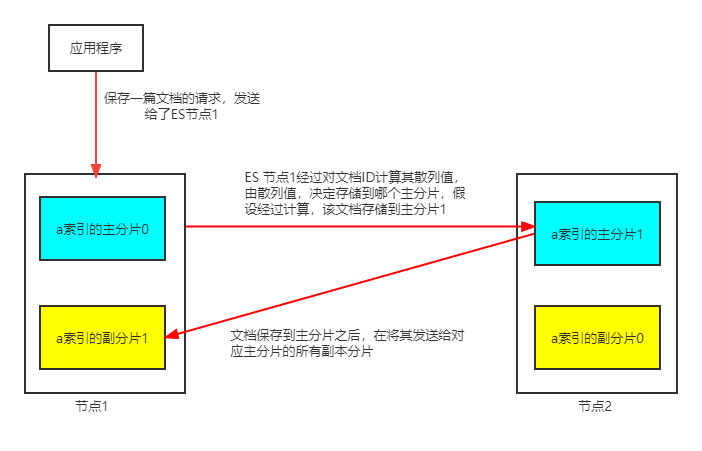
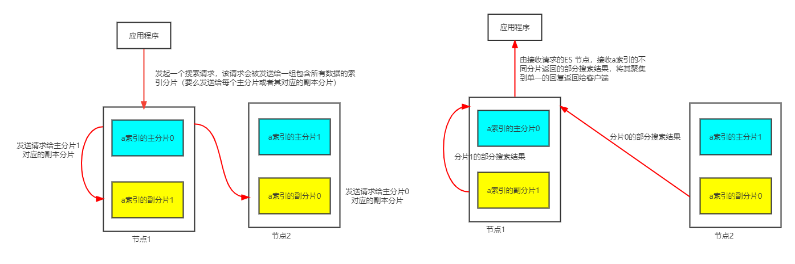

# 1  Elastic Search 高级操作

昨天我们学习了，对于Elastic Search基本的索引，映射，文档相关的增删改查操作。但是对于Elastic Search还有一些更为复杂的高级操作。

## 1.1 批量操作

通过批量操作，我们可以一次向Elastic Search发送多条增删改操作。从而达到一定程度上节省带宽的操作。

批量操作只包含增删改。建立一次连接可以发送多条操作请求，这样操作可以节省带宽。

增改用两行描述，一行描述操作，一行描述参数。删只用一行就可以。

### 1.1.1 基本语法

- 先来看通过脚本的方式执行批量操作：

```json
# 准备工作
# 定义索引，及其映射
PUT teacher
{
  "mappings": {
    "properties": {
    "id": {"type": "long"},
    "name": {"type": "text"},
    "age": {"type": "integer"}
   }
  }
}
```

批量操作脚本

```json
#批量操作
#删除1号
#新增2号
#更新2号 
POST _bulk
{"create": {"_index": "teacher", "_id": "2"}}
{"name": "南风", "age": 18}
{"update": {"_index": "teacher", "_id": 2}}
{"doc": {"name":"景天", "age": 19}}
{"delete": {"_index":"teacher", "_id": "1"}}
```

- 接着我们使用JAVA API执行批量操作

```java
/**
 *  Bulk 批量操作
 */
@Test
public void test2() throws IOException {

    //创建bulkrequest对象，整合所有操作
    BulkRequest bulkRequest =new BulkRequest();

       /*
    # 1. 删除1号记录
    # 2. 添加2号记录
    # 3. 修改2号记录 名称为 “景天”
     */
    //添加对应操作
    //1. 删除1号记录
    DeleteRequest deleteRequest=new DeleteRequest("teacher","1");
    bulkRequest.add(deleteRequest);

    //2. 添加2号记录
    Map<String, Object> map=new HashMap<>();
    map.put("name","南风");
    IndexRequest indexRequest=new IndexRequest("teacher").id("2").source(map);
    bulkRequest.add(indexRequest);
    //3. 修改3号记录 名称为 “景天”，年龄为19
    Map<String, Object> mapUpdate=new HashMap<>();
    mapUpdate.put("name","景天");
    UpdateRequest updateRequest=new UpdateRequest("teacher","2").doc(mapUpdate);

    bulkRequest.add(updateRequest);
    //执行批量操作
    BulkResponse response = client.bulk(bulkRequest, RequestOptions.DEFAULT);
    System.out.println(response.status());

}
```

### 1.1.2 批量从数据库导入数据

- 创建索引和映射

```json
PUT product
{
  "mappings": {
    "properties": {
      "id":{"type": "long"},
      "image": {"type":  "keyword"},
      "status": {"type": "integer"},
      "sellPoint": {
        "type": "text",
        "analyzer": "ik_max_word"
      },
      "title": {
        "type": "text",
        "analyzer": "ik_max_word"
      },
      "num":{"type": "integer"},
      "tmName": {"type": "keyword"},
      "cid": {"type": "long"},
      "price": {"type": "double"},
      "limitNum": {"type": "integer"},
      "created": {"type": "date"},
      "updated": {"type": "date"}
    }
  }
}
```

- 代码实现从数据库批量将数据导入Elastic Search

```java
/**
 * 从Mysql 批量导入 elasticSearch
 */
@Test
public void test3() throws IOException {
    //1.查询所有数据，mysql
    List<Item> products = productMapper.findAll();

    //2.bulk导入
    BulkRequest bulkRequest=new BulkRequest();

    //2.1 循环goodsList，创建IndexRequest添加数据
    for (Item item : items) {

        //将product对象转换为json字符串
        String data = JSON.toJSONString(item);
        IndexRequest indexRequest=new IndexRequest("product").source(data,XContentType.JSON);
        bulkRequest.add(indexRequest);

    }


    BulkResponse response = client.bulk(bulkRequest, RequestOptions.DEFAULT);
    System.out.println(response.status());

}
```

## 1.2 高级查询

### 1.2.1 `match all` 查询

`match all`查询，相当于**不加查询条件**的查询索引中所有的文档

```json
GET product/_search
{
  "query": {
    "match_all": {}
  },
  "from": 0,
  "size": 100
}
```

```java
/**
 * 查询所有
 *  1. matchAll
 *  2. 将查询结果封装为Goods对象，装载到List中
 *  3. 分页。默认显示10条
 */
@Test
public void matchAll() throws IOException {

    //2. 构建查询请求对象，指定查询的索引名称
    SearchRequest searchRequest=new SearchRequest("product");

    //4. 创建查询条件构建器SearchSourceBuilder
    SearchSourceBuilder sourceBuilder=new SearchSourceBuilder();

    //6. 查询条件
    QueryBuilder queryBuilder= QueryBuilders.matchAllQuery();
    //5. 指定查询条件
    sourceBuilder.query(queryBuilder);

    //3. 添加查询条件构建器 SearchSourceBuilder
    searchRequest.source(sourceBuilder);
    // 8 . 添加分页信息  不设置时分页默认10条
//        sourceBuilder.from(0);
//        sourceBuilder.size(100);
    //1. 查询,获取查询结果
    SearchResponse searchResponse = client.search(searchRequest, RequestOptions.DEFAULT);

    //7. 获取命中对象 SearchHits
    SearchHits hits = searchResponse.getHits();

    //7.1 获取总记录数
  Long total= hits.getTotalHits().value;
    System.out.println("总数："+total);
    //7.2 获取Hits数据  数组
    SearchHit[] result = hits.getHits();
        //获取json字符串格式的数据
    List<Product> products = new ArrayList<>();
    for (SearchHit searchHit : result) {
        String sourceAsString = searchHit.getSourceAsString();
        //转为java对象
        Product product = JSON.parseObject(sourceAsString, Product.class);
        products.add(product);
    }

     System.out.println(items);

}
```


### 1.2.2 `term` 查询

`term`查询和字段类型有关系，首先回顾一下ElasticSearch两个数据类型

 ElasticSearch两个数据类型：

- `text`：会分词，不支持聚合
- `keyword`：不会分词，将全部内容作为一个词条，支持聚合

`term`查询：不会对查询条件进行分词。但是注意，`term`查询，查询`text`类型字段时，文档中类型为`text`类型的字段本身仍然会分词

```
GET product/_search
{
  "query": {
    "term": {
      "title": {
        "value": "手机充电器"
      }
    }
  }
}
```

Java API

```java
@Test
public void testTerm() throws IOException {

    //2. 构建查询请求对象，指定查询的索引名称
    SearchRequest searchRequest = new SearchRequest("product");

     //4. 创建查询条件构建器SearchSourceBuilder
    SearchSourceBuilder searchSourceBuilder = new SearchSourceBuilder();
    //6. 查询条件
    TermQueryBuilder termQueryBuilder = QueryBuilders.termQuery("title", "手机充电器");

    //5. 指定查询条件
    searchSourceBuilder.query(termQueryBuilder);

    //3. 添加查询条件构建器 SearchSourceBuilder
    searchRequest.source(searchSourceBuilder);

    //1. 查询,获取查询结果
    SearchResponse search = client.search(searchRequest, RequestOptions.DEFAULT);
    //7. 获取命中对象 SearchHits
    SearchHits hits = search.getHits();

    //7.1 获取总记录数
    long value = hits.getTotalHits().value;

    ArrayList<Product> items = new ArrayList<>();

    SearchHit[] h = hits.getHits();
    for (int i = 0; i < value; i++) {
        Product product = JSON.parseObject(h[i].getSourceAsString(), Item.class);
        items.add(product);
    }

    System.out.println(items);

}
```

### 1.2.3 `match`查询

`match` 查询的特征：

+ 会对查询条件进行分词。

+ 然后将分词后的查询条件和目标字段分词后的词条进行等值匹配

+ 默认取并集（OR），即只要查询条件中的一个分词和目标字段值的一个分词(词条)匹配，即认为匹配查询条件

```json
# match查询
GET product/_search
{
  "query": {
    "match": {
      "title": "手机充电器"
    }
  },
  "size": 500
}
```

`match` 的默认搜索（or 并集）例如：华为手机，会分词为 “华为”，“手机” 只要出现其中一个词条都会认为词条匹配。

`match`的 and（交集） 搜索，例如：例如：华为手机，会分词为 “华为”，“手机”  但要求“华为”，和“手机”同时出现在词条中，才算词条匹配。

```json
GET product/_search
{
  "query": {
    "match": {
      "title": {
        "query": "华为手机",
        "operator": "and"
      }
    }
  },
  "size": 500
}
```

Java API

```java
@Test
public void testMatch() throws IOException {

    //2. 构建查询请求对象，指定查询的索引名称
    SearchRequest searchRequest = new SearchRequest("product");

     //4. 创建查询条件构建器SearchSourceBuilder
    SearchSourceBuilder searchSourceBuilder = new SearchSourceBuilder();
    //6. 查询条件
    MatchQueryBuilder matchQueryBuilder = QueryBuilders.matchQuery("title", "手机充电器");
    // 设置关键字查询的运算符
    //matchQueryBuilder.operator(Operator.AND);
    //5. 指定查询条件
    searchSourceBuilder.query(matchQueryBuilder);

    //3. 添加查询条件构建器 SearchSourceBuilder
    searchRequest.source(searchSourceBuilder);

    //1. 查询,获取查询结果
    SearchResponse search = client.search(searchRequest, RequestOptions.DEFAULT);
    //7. 获取命中对象 SearchHits
    SearchHits hits = search.getHits();

    //7.1 获取总记录数
    long value = hits.getTotalHits().value;

    ArrayList<Product> items = new ArrayList<>();

    SearchHit[] h = hits.getHits();
    for (int i = 0; i < value; i++) {
        Product product = JSON.parseObject(h[i].getSourceAsString(), Product.class);
        items.add(product);
    }
    System.out.println(items);

}
```

### 1.2.4  `querystring`

 `query_string` 多条件查询

1. 会对查询条件进行分词。
2. 然后将分词后的查询条件和词条进行等值匹配
3. 默认取并集（`OR`）
4. 可以指定多个查询字段

`query_string`：可以识别`query`中的连接符（`or` 、`and`）

```json
# queryString

GET product/_search
{
  "query": {
    "query_string": {
      "fields": ["title","sellPoint"], 
      "query": "耳机 AND 充电器"
    }
  }
}
```

java代码

```java
QueryStringQueryBuilder query = QueryBuilders.queryStringQuery("耳机充电器").field("title").field("sellPoint");
```

### 1.2.5 范围 & 排序查询

```json
GET product/_search
{
  "query": {
    "range": {
      "price": {
        "gte": 100,
        "lte": 1000
      }
    }
  },
  "sort": [
    {
      "price": {
        "order": "desc"
      }
    }
  ]
}
```

```java
 //范围查询 以price 价格为条件
RangeQueryBuilder query = QueryBuilders.rangeQuery("price");

//指定下限
query.gte(100);
//指定上限
query.lte(1000);

sourceBuilder.query(query);

//排序  价格 降序排列
sourceBuilder.sort("price",SortOrder.DESC);
```

### 1.2.6 复合查询 `bool`

 `boolQuery`：对多个查询条件连接。其组成主要分为如下四个部分：

1. `must`（and）：条件必须成立
2. `must_not`（not）：条件必须不成立
3. `should`（or）：条件可以成立
4. `filter`：条件必须成立，性能比must高。不会计算得分

```json
# must
GET product/_search
{
  "query": {
    "bool": {
      "must": [
        {
           "term": {
             "title": {
               "value": "充电器"
             }
           }
        },
        {
          "match": {
            "sellPoint": "快充"
          }
        }
      ]
    }
  }
}
```

```json
# must_not
GET product/_search
{
  "query": {
    "bool": {
      "must_not": [
        {
           "match": {
             "title": "充电器"
           }
        }
      ]
    }
  }
}
```

```json
# should 中的多个条件是or关系
GET product/_search
{
  "query": {
    "bool": {
      "should": [
          {
           "term": {
             "title": {
               "value": "充电器"
             }
           }
        },
        {
          "term": {
             "sellPoint": {
               "value": "小菜鸡"
             }
           }
        }
      ]
    }
  }
}
```

```json
# filter
GET product/_search
{
  "query": {
    "bool": {
      "filter": [
          {
           "term": {
             "title": {
               "value": "充电器"
             }
           }
        },
        {
          "match": {
            "sellPoint": "快充"
          }
        }
      ]
    }
  }
}
```

这里有几点需要注意：

- 一个复合查询中，可以同时包含`must`，`must not`，`should`，`filter`中的一个或多个部分
- 每一部分，都可以包含多个查询条件(`should`中的多个查询条件是or关系)
- 当存在`must`，或者`filter`的时候，`should`中的条件默认不生效
- `must`和`filter`都可以表示同时满足多个条件的查询，但是不同的地方在于must会计算文档的近似度得分，`filter`不会(`must_not`也不会)。所以`filter`写在`must`之前。

```json
# boolquery 包含多个部分
GET product/_search
{
  "query": {
    "bool": {
      "must": [
        {
          "term": {
            "title": {
              "value": "充电器"
            }
          }
        }
      ],
      "filter":[ 
        {
        "term": {
          "title": "原装"
        }
       },
       {
         "range":{
          "price": {
            "gte": 40,
            "lte": 100
         }
         }
       }
      
      ]
    }
  }
}

```

JAVA API:

布尔查询：`boolQuery` 

1. 查询商品为(`title`)：充电器 
2. 查询过滤条件：原装
3. 查询价格在：40-100 

```java
//1.构建boolQuery
BoolQueryBuilder boolQuery = QueryBuilders.boolQuery();
//2.构建各个查询条件
//2.1 查询品牌名称为:华为
TermQueryBuilder termQueryBuilder = QueryBuilders.termQuery("title", "耳机");
boolQuery.must(termQueryBuilder);
//2.2. 查询标题包含：手机
MatchQueryBuilder matchQuery = QueryBuilders.matchQuery("title", "原装");
boolQuery.filter(matchQuery);

//2.3 查询价格在：40-100
RangeQueryBuilder rangeQuery = QueryBuilders.rangeQuery("price");
rangeQuery.gte(40);
rangeQuery.lte(100);
boolQuery.filter(rangeQuery);

sourceBuilder.query(boolQuery);
```

### 1.2.7 聚合查询

聚合和查询是两个不同的操作，聚合的目标是查询之后的结果。

聚合：`aggregate`

聚合查询分为两种类型:

- 指标聚合：相当于MySQL的聚合函数。`max`、`min`、`avg`、`sum`等
- 桶聚合：相当于MySQL的 `group by` 操作。不要对`text`类型的数据进行分组，会失败。

```json
# 聚合查询

# 指标聚合 聚合函数

GET product/_search
{
  "query": {
    "match": {
      "title": "耳机"
    }
  },
  "aggs": {
    "max_price": {
      "max": {
        "field": "price"
      }
    }
  }
}

# 桶聚合  分组
GET product/_search
{
  "query": {
    "match": {
      "title": "充电器"
    }
  },
  "aggs": {
    "price_bucket": {
      "terms": {
        "field": "price",
        "size": 100
      }
    }
  }
}
```

JAVA API

```java
/**
     * 聚合查询：桶聚合，分组查询
     * 1. 查询title包含充电器的数据
     * 2. 查询充电器的价格列表
     */
@Test
public void testAggQuery() throws IOException {

    SearchRequest searchRequest=new SearchRequest("product");

    SearchSourceBuilder sourceBuilder=new SearchSourceBuilder();
    MatchQueryBuilder queryBuilder = QueryBuilders.matchQuery("title", "充电器");

    sourceBuilder.query(queryBuilder);
    // 查询价格列表  只展示前100条
    AggregationBuilder aggregation=AggregationBuilders.terms("price_bucket").field("price").size(100);
    sourceBuilder.aggregation(aggregation);


    searchRequest.source(sourceBuilder);

    SearchResponse searchResponse = client.search(searchRequest, RequestOptions.DEFAULT);

    //7 获取命中对象 SearchHits
    SearchHits hits = searchResponse.getHits();

    //7.1 获取总记录数
    Long total= hits.getTotalHits().value;
    System.out.println("总数："+total);

    // aggregations 对象
    Aggregations aggregations = searchResponse.getAggregations();
    //将aggregations 转化为map
    Map<String, Aggregation> aggregationMap = aggregations.asMap();


    //通过key获取price_bucket 对象 使用Aggregation的子类接收  buckets属性在Terms接口中体现

    // Aggregation price_bucket = aggregationMap.get("price_bucket");
    Terms price_bucket =(Terms) aggregationMap.get("price_bucket");

    //获取buckets 数组集合
    List<? extends Terms.Bucket> buckets = goods_brands.getBuckets();

    Map<String,Object>map=new HashMap<>();
    //遍历buckets   key 属性名，doc_count 统计聚合数
    for (Terms.Bucket bucket : buckets) {

        System.out.println(bucket.getKey());
        map.put(bucket.getKeyAsString(),bucket.getDocCount());
    }

    System.out.println(map);

}
```

有时，为了获取更多的信息，针对桶聚合，我们还会做嵌套聚合，嵌套的子聚合可以针对父聚合的**每个分桶中**文档数据，在分桶中再做聚合。

接下来我们可以实现这样一个需求，针对指定价格区间中，统计实际售卖的商品有多少种不同的价格，并统计每种不同价格的商品名称。

```json
GET  product/_search
{
  
  "query": {
    "match_all": {}
  },
  
  "aggs": {
    "price_bucket": {
      "terms": {
        "field": "price"
        , "size": 20
      },
      "aggs": {
        "tm_bucket": {
          "terms": {
            "field": "tmName"
          }
        }
      }
    }
  }
}
```

```java
@Test
public void testSubAggregation() throws IOException {
SearchRequest searchRequest=new SearchRequest("product");

SearchSourceBuilder sourceBuilder=new SearchSourceBuilder();
//1. 查询title包含手机的数据

MatchAllQueryBuilder matchAllQueryBuilder = QueryBuilders.matchAllQuery();

sourceBuilder.query(matchAllQueryBuilder);
//2. 构造价格聚合
AggregationBuilder priceAgg= AggregationBuilders
                                    .terms("price_bucket").field("price");

// 构造品牌聚合(价格聚合的子聚合)
TermsAggregationBuilder subAggregation = AggregationBuilders.terms("tm_bucket").field("tmName");
// 给价格聚合设置子聚合
priceAgg.subAggregation(subAggregation);

// 设置结合参数
sourceBuilder.aggregation(priceAgg);


searchRequest.source(sourceBuilder);

SearchResponse searchResponse = client.search(searchRequest, RequestOptions.DEFAULT);

//7. 获取命中对象 SearchHits
SearchHits hits = searchResponse.getHits();

//7.1 获取总记录数
Long total= hits.getTotalHits().value;
System.out.println("总数："+total);

// aggregations 对象
Aggregations aggregations = searchResponse.getAggregations();

//通过key获取price_bucket 对象 使用Aggregation的子类接收  buckets属性在Terms接口中体现
Terms price_bucket = aggregations.get("price_bucket");

//获取buckets 数组集合
List<? extends Terms.Bucket> buckets = price_bucket.getBuckets();

// 存放封装价格聚合信息的集合
List<PriceAggregationInfo> priceTrademarkInfos = new ArrayList<>();

//遍历buckets   key 属性名，doc_count 统计聚合数
for (Terms.Bucket bucket : buckets) {
    // 一个价格桶(父聚合的桶)的信息，包括价格，以及该价格商品对应的品牌(子聚合的桶)
    PriceAggregationInfo priceAggregationInfo = new PriceAggregationInfo();
    // 针对每一个父聚合的桶(价格桶)，每一个桶的key是商品的价格
    Double price = Double.parseDouble(bucket.getKeyAsString());
    priceAggregationInfo.setPrice(price);

    // 获取价格桶中的，品牌聚合(子聚合)的结果
    Terms tmBuckets = bucket.getAggregations().get("tm_bucket");
    // 存放同一价格的品牌集合
    ArrayList<String> names = new ArrayList<>();
    for ( Terms.Bucket tmBucket: tmBuckets.getBuckets()) {
        String tmName  = tmBucket.getKeyAsString();
        names.add(tmName);
    }

    // 设置品牌集合
    priceAggregationInfo.setTrademarkNames(names);

    priceTrademarkInfos.add(priceAggregationInfo);
}

System.out.println(priceTrademarkInfos);
}
```

### 1.2.8 高亮查询

为了使前端HTML显示高亮，我们直接返回一个带高亮标签的查询结果。

高亮查询的实质就是在目标字符串前后加上标签。比如"`<font color='red'></font>`"

高亮三要素：

1. 高亮字段
2. 前缀
3. 后缀

默认前后缀 ：`em`

```html
<em>手机</em>
```

```json
GET product/_search
{
  "query": {
    "match": {
      "title": "充电器"
    }
  },
  "highlight": {
    "fields": {
      "title": {
        "pre_tags": "<font color='red'>",
        "post_tags": "</font>"
      }
    }
  }
}
```

```java
@Test
public void testHighLight() throws IOException {
    // 构建针对索引"product"的查询请求
    SearchRequest searchRequest = new SearchRequest("prouct");

    // 创建SearchSourceBuilder
    SearchSourceBuilder searchSourceBuilder = new SearchSourceBuilder();
    MatchQueryBuilder matchQueryBuilder = QueryBuilders.matchQuery("title", "充电器");
    searchSourceBuilder.query(matchQueryBuilder);

    // 构造高亮查询条件
    HighlightBuilder highlighter = new HighlightBuilder();
    highlighter.field("title").preTags("<font color='red'>").postTags("</font>");
    searchSourceBuilder.highlighter(highlighter);

    searchRequest.source(searchSourceBuilder);

    SearchResponse search = client.search(searchRequest, RequestOptions.DEFAULT);
    SearchHits hits = search.getHits();

    long value = hits.getTotalHits().value;

    ArrayList<Product> items = new ArrayList<>();

    SearchHit[] h = hits.getHits();
    for (int i = 0; i < value; i++) {
        Product item = JSON.parseObject(h[i].getSourceAsString(), Product.class);
        // 显示生成的高亮字符串
        Map<String, HighlightField> highlightFields = h[i].getHighlightFields();
        //System.out.println(highlightFields);
        HighlightField HighlightField = highlightFields.get("title");
        Text[] fragments = HighlightField.fragments();
        //替换
        item.setTitle(fragments[0].toString());
        items.add(item);
    }

    System.out.println(items);

}
```

# 2 集群相关知识

我们启动的一个Elasticsearch进程，我们称之为为一个Elasticsearch节点(Node)，多个Elasticsearch节点，可以组成一个Elasticsearch集群。接下来，我们就来了解下Elasticsearch集群相关的知识

## 2.1 索引在集群中的分布

1. 在ElasticSearch集群中，文档以什么形式存储？**以分片的形式存储**。
2. 为什么要分片？
   1. 从数据存储角度，便于**横向扩容**，存储更多的文档数据。如果不进行分片都存储在一个ElasticSearch Server服务器上，有存储上限。为了实现海量数据存储，只需要横向扩容创建新的分片就可以。
   2. 从查询角度。因为所有分片合起来才是一个完整的索引，所以想要查询一条数据时需要查询所有分片，但是可以将查询请求同时发给含有分片的不同服务器，从而实现了**并行查询**。

> 分片理解为索引的一部分，分片合起来是一个索引。

分片分为两类：**主分片和副本分片**。

为了防止某一个服务器进程宕机，引入副本分片的概念，通过将主分片和其副本分片存储在不同的服务器上即可。

一个分片的主分片和其副本分片不允许存储在一台服务器上。

+ 所以集群只有一个服务器时，不可能存在副本分片。
+ 当主分片消失时，副本分片自动升级为主分片。


无论是单机还是集群模式，ES中的**索引数据**都是以**分片**的形式存在的，一个索引的一个分片中只存储该索引中的一部分数据，即一个索引中的文档数据，被存储在其所属的若干个分片中，每个分片只存储索引部分数据。

对于一个索引所包含的所有分片，又被分成了两种：

- 主分片：一个索引中的文档到底被分成几部分来存储，主要看索引到底包含多少个主分片，**有多少个主分片，索引数据就被分成几部分**。用户插入ES的文档数据都是首先存储到主分片的。
- 副本分片：而副本分片主要是作为主分片的数据副本而存在，每个主分片都可以有对应的副本分片。

所以，在ES集群中，一个索引的多个分片数据，就保存在不同的ES服务器实例或者说不同的ES Node上，一个单机版的ES服务器，也可以看做是只包含一个ES Node的ES集群，所以一个ES Node可以包含索引的多个分片数据。

这里还有三点细节需要注意：

- ES 不允许将一个主分片和它对应的副本分片存储在同一个ES Node中。这主要是为了防止，一个ES Node 宕机导致，某分片数据全部丢失(主分片和该主分片对应的副本分片的数据全部丢失)。这是因为如果每个主分片至少有一个副本分片，那么即使该主分片所在的ES Node宕机也没关系，ES会自动将其副本分片变为主分片，保证数据的正常访问。
- 一个ES的索引由**一个或多个**主分片以及**零个或多个**副本分片构成，即ES不强制要求主分片一定有对应的副本分片
- 在创建索引的时候就可以定义，索引的主分片数量，以及每个主分片对应的副本分片的数量，但是对于一个索引而言，一旦索引创建完毕，其主分片数量就不能在变了，只能修改其副本分片的数量

## 2.2 文档数据在ES集群中的存储和搜索

 🏷️ **如何存储？**

我们先来看看文档数据的存储：

- 当存储一篇文档的时候，ES首先根据文档ID的散列值，选择一个主分片，并将该文档发送到该主分片保存。
- 然后，该文档被发送到主分片对应的所有的副本分片进行保存，这使得副本分片和主分片之间保持数据同步
- 数据同步使得副本分片可以服务与搜索请求，并在原有主分片无法访问时自动升级为主分片



在保存一篇文档的时候，我们讲解了**如何决定一篇文档所在的分片的**，这一过程我们称为**文档路由**。当ES散列文档ID时就会发生文档的路由，来决定文档应该索引到哪个分片中。

 🏷️**如何搜索？**

再来看看在集群中搜索文档数据的过程，当在索引中搜索的时候，Elastic Search会在索引的所有分片中进行查找，这些分片可以是主分片，也可以是副本分片，原因是主分片和副本分片通常包含一样的文档。**ES在索引的主分片和副本分片中进行搜索请求的负载均衡**，使得副本分片对于搜索的性能和容错都有帮助。下面看看具体的搜索过程:

- 搜索请求首先被一个ES Node接收，并将请求转发到一组包含所有数据的索引分片
- 在选择转发请求的分片时，使用轮询算法选择可用分片(这里轮训的是某主分片和其对应的副本分片，并且对于索引中的每一个主分片与其对应的副本分片都会有这样的轮训选择过程)，并将搜索请求转发到所有选中的分片
- 然后，ES将从这些接收到请求的分片收集搜索的结果，将其聚集到单一的回复，然后将回复返回给客户端



## 2.3 脑裂问题

“脑裂”问题即有多个`Master Node`共存。

> 引入另一个概念“角色”

在一个ES集群中，包含多个ES Node，这多个ES Node又可以扮演不同的**角色**，实现不同的功能，主要有以下几种角色：

- `Matster Node`：负责创建，删除索引，以及给节点分配分片等**集群管理**的工作
- `Data Node`: 负责存储文档数据，以及对文档**数据的CRUD**操作
- `Coordinating Node`: 负责接收客户端的请求，并将请求分发到各个相关节点，并最终收集各节点返回的结果，整合为一个统一的结果，返回给客户端， 其实**每个ES Node都隐式的扮演者协调节点的角色**（接收请求，分发请求并整合响应）。

在这其中，`Data Node`和`Coordinating Node`都可以有多个，但是`Matster Node`作为管理集群的"大脑"。正常情况下，当主节点无法工作时，会从备选主节点中**选举**一个出来变成新主节点，原主节点回归后变成备选主节点。

> 选举算法：选举一个新的`Master Node`

但有时因为网络抖动等原因，主节点没能及时响应，集群误以为主节点挂了，选举了一个新主节点，此时一个ES集群中**有了两个主节点**，其他节点不知道该听谁的调度，结果将是灾难性的！这种类似一个人得了精神分裂症，就被称之为“脑裂”现象。

之所以产生脑裂问题的原因是主节点因为各种原因，在收到请求后未能及时响应。导致主节点未能及时响应的原因，一般主要有以下几点:

- 网络抖动

  内网一般不会出现ES集群的脑裂问题，可以监控内网流量状态。外网的网络出现问题的可能性大些

- 节点负载

  如果主节点同时承担数据节点的工作，可能会因为工作负载大而导致对应的 ES 实例停止响。

- 内存回收 

  由于数据节点上ES进程占用的内存较大，较大规模的内存回收操作也能造成ES进程失去响应。

如何解决脑裂问题呢？

- 不要把主节点同时设为数据节点（`node.master`和`node.data`不要同时设为`true`），node.master=true意味着该节点有竞选Master Node的资格，node.date=true，意味着该节点扮演数据节点的角色

- 将节点响应超时（discovery.zen.ping_timeout）稍稍设置长一些（默认是3秒），避免误判。
- 设置选举规则：设置需要超过半数的备选节点同意，才能发生主节点重选，类似需要参议院半数以上通过，才能弹劾现任总统。（discovery.zen.minimum_master_nodes = 半数以上的投票节点数）。
  - 注意如果共6个节点时，至少要设置4而不是3，因为3个时会出现3对3的矛盾。