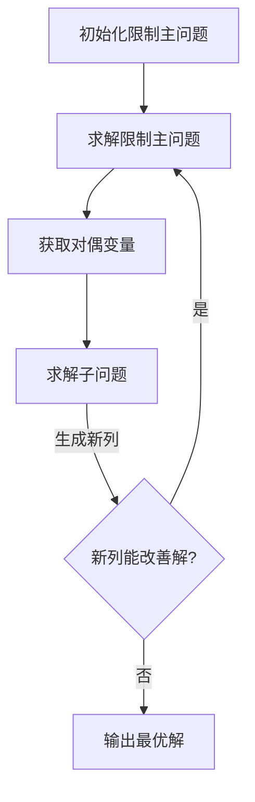
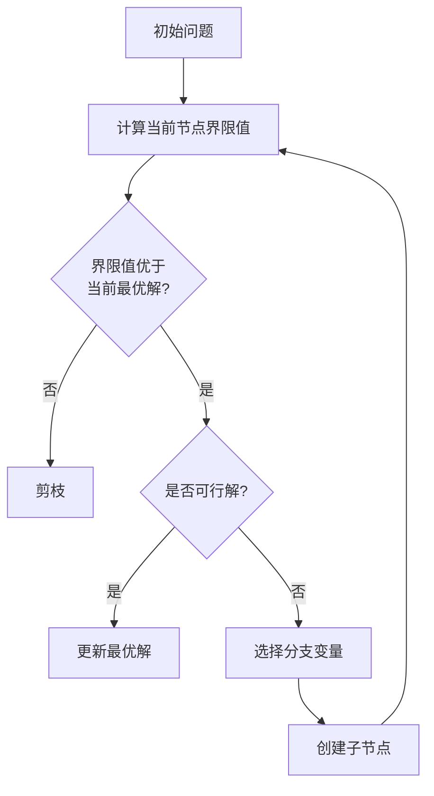
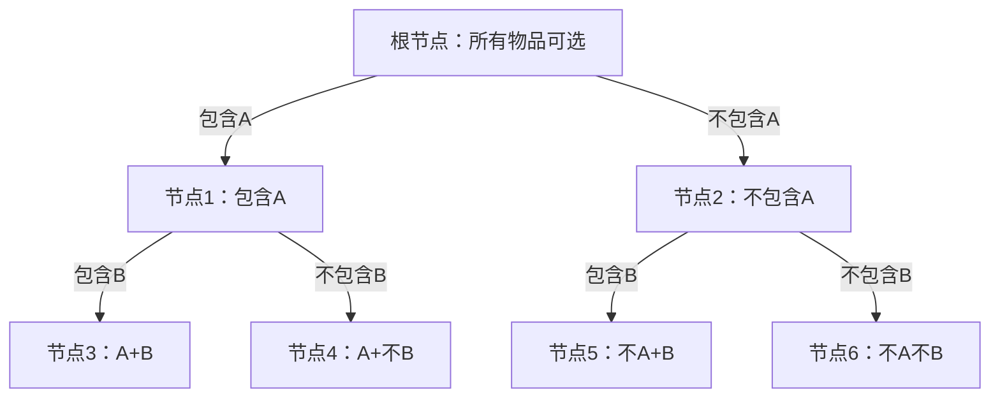
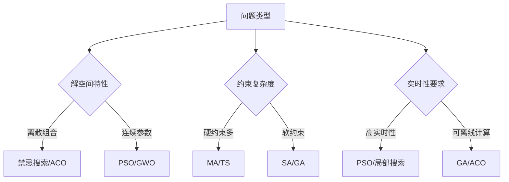
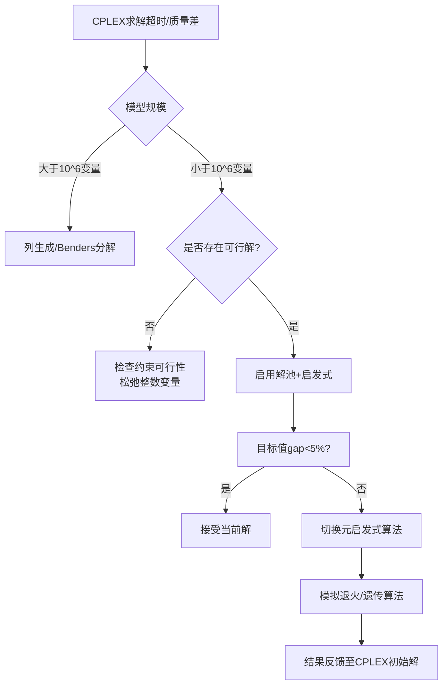

# 运筹优化知识点

##  ⭐问答

###  ⛳单纯形法是什么？具体讲解一下单纯形法的步骤

> 学习参考《运筹学》教材和[单纯形法 - 维基百科，自由的百科全书](https://zh.wikipedia.org/wiki/单纯形法)
>
> 1. 单纯形法的原理：落脚点在线性规划模型的解的特点
>    1. 线性规划模型的定义
>    2. 线性规划模型的标准形式
>    3. 线性规划问题的解的特点
>
> 2. 单纯形法是一种迭代算法，具体例子说明解法步骤
>    1. 化为标准形式
>    2. 初始单纯形表
>    3. 结束条件：检验数满足最优性条件
> 3. 引申，除了单纯形法常用的还有内点法，介绍一下内点法并和单纯形法做对比

单纯形法的一般解题步骤可归纳如下：

1. 把线性规划问题的约束方程组表达成标准形式，找出基本可行解作为初始基本可行解。
2. 若基本可行解不存在，即约束条件有矛盾，则问题无解。
3. 若基本可行解存在，从初始基本可行解作为起点，根据**最优性条件和可行性条件**，引入**非基变量**取代某一基变量，找出目标函数值更优的另一基本可行解。
4. 按步骤3进行迭代，直到对应**检验数满足最优性条件**（这时目标函数值不能再改善），即得到问题的最优解。
5. 若迭代过程中发现问题的目标函数值无界，则终止迭代。

###  ⛳列生成算法？当变量数目大于约束条件数时，需要使用列生成算法，讲解一下生成算法。列生成算法除了主问题还有子问题，子问题的作用是什么？

#### 列生成算法详解

列生成算法（Column Generation）是一种用于解决大规模线性规划问题的高效方法，特别适用于**变量数量远大于约束条件数量**的情况。这种方法的核心思想是：不需要在内存中存储所有变量，而是通过动态生成"有潜力"的列（即变量）来逐步逼近最优解。

#### 算法基本框架

列生成算法包含两个主要部分：
1. **主问题（Master Problem）**：原始问题的一个限制版本
2. **子问题（Subproblem）**：用于生成新列的问题



#### 主问题（Master Problem）

主问题是原始问题的一个限制版本，只包含一部分变量（列）：
- 开始时只包含少量列（通常是一个可行基）

- 随着迭代进行，逐步添加新列

- 形式为：

  $\min \mathbf{c}_R^T \mathbf{x}_R$ 
  $\text{s.t. } \mathbf{A}_R \mathbf{x}_R = \mathbf{b}$
  $\mathbf{x}_R \geq 0$

其中$\mathbf{A}_R$是原始约束矩阵$\mathbf{A}$的子集。

#### 子问题（Subproblem）

子问题（也称为定价问题）是列生成算法的核心创新点，它的作用包括：

1. **识别有价值的列**：根据主问题的对偶变量，计算未包含列的**缩减成本**
   - 缩减成本 = $c_j - \mathbf{\pi}^T \mathbf{a}_j$
   - 其中$\mathbf{\pi}$是主问题的对偶解
   - $\mathbf{a}_j$是潜在列在约束中的系数

2. **生成新列**：
   - 寻找缩减成本为负的列（对于最小化问题）
   - 这些列有可能改善主问题的目标值
   - 子问题通常建模为：$\min \{c_j - \mathbf{\pi}^T \mathbf{a}_j | j \in \text{未考虑的列}\}$

3. **检查最优性**：
   - 如果所有未包含列的缩减成本都非负，则当前解是最优解
   - 否则，将缩减成本最小的列加入主问题

#### 子问题的重要性

子问题在列生成算法中扮演着关键角色：

1. **避免全变量枚举**：
   - 当变量数量极大时（如10⁶以上），无法在内存中存储所有变量
   - 子问题允许我们按需生成有价值的列

2. **利用问题结构**：
   - 子问题通常有特殊结构（如最短路径、背包问题等）
   - 可以设计高效算法求解子问题
   - 例如在切割问题中，子问题是一个背包问题

3. **动态探索解空间**：
   - 只生成可能改善解的列
   - 避免考虑大量无效列

#### 算法流程

1. **初始化**：构造一个可行的限制主问题
2. **求解主问题**：得到原始解和对偶解
3. **求解子问题**：寻找缩减成本最小的列
4. **判断终止**：
   - 如果缩减成本 ≥ 0：当前解最优
   - 否则：将新列加入主问题
5. **迭代**：重复步骤2-4

#### 典型应用场景

1. **切割问题（Cutting Stock Problem）**
   - 主问题：满足客户需求
   - 子问题：生成新的切割方案（一维背包问题）

2. **机组调度（Crew Scheduling）**
   - 主问题：覆盖所有航班
   - 子问题：生成可行的机组轮班（最短路径问题）

3. **车辆路径问题（Vehicle Routing）**
   - 主问题：服务所有客户
   - 子问题：生成可行路径（带资源约束的最短路径）

#### 算法特点

1. **优点**：
   - 处理大规模问题
   - 内存效率高
   - 利用问题特殊结构

2. **挑战**：
   - 初始可行解可能难以获得
   - 子问题必须高效可解
   - 收敛速度可能变慢（尾端效应）

#### 实例演示：切割问题

考虑一个纸卷切割问题：
- 原料卷长度：20米
- 客户需求：
  - 3米：15卷
  - 5米：20卷
  - 7米：15卷

**主问题**：
- 决策变量：使用切割方案k的次数$x_k$
- 目标：最小化原料使用量 $\min \sum x_k$
- 约束：$\sum a_{ik}x_k \geq d_i$（$d_i$为第i种卷的需求）

**子问题**（定价问题）：
- 给定对偶变量$\pi_i$（每种卷的"价值"）
- 求解：

  $\max \sum \pi_i y_i$
  $\text{s.t. } \sum l_i y_i \leq L$
  $y_i \geq 0$（整数）
- 其中$y_i$是方案中切割第i种卷的数量

子问题是一个整数背包问题，可以高效求解。新生成的切割方案（列）将加入主问题进行下一轮优化。

列生成算法通过这种主-子问题交互，能够高效解决包含大量可能切割方案的优化问题，而无需显式枚举所有方案。

###  ⛳branch and bound，讲解一下，举个例子，bound是怎么求的

#### Branch and Bound（分支定界）算法详解

#### 基本思想
Branch and Bound 是一种用于求解离散优化问题的算法框架，通过系统地枚举候选解空间（分支），并利用**界限值**（bound）来剪除不可能包含最优解的子集（剪枝），从而减少搜索空间。



#### 核心概念

1. **分支（Branching）**：
   - 将问题分解为更小的子问题
   - 例如：在0-1背包问题中，分为"包含某物品"和"不包含某物品"两个分支

2. **定界（Bounding）**：
   - 为每个子问题计算界限值
   - 最大化问题：计算上界（最优解可能的最大值）
   - 最小化问题：计算下界（最优解可能的最小值）

3. **剪枝（Pruning）**：
   - 当子问题的界限值**不优于**当前已知最优解时，放弃该分支
   - 最大化问题：上界 ≤ 当前最优解 → 剪枝
   - 最小化问题：下界 ≥ 当前最优解 → 剪枝

#### 界限值计算方法

界限值的计算依赖于具体问题，以下是常见方法：

##### 1. 松弛法（Relaxation）
- 整数规划 → 线性规划
- 背包问题 → 分数背包
- TSP问题 → 最小生成树

**例子：0-1背包问题**

- 真实问题：物品必须整件选择
- 松弛问题：允许选择物品的一部分（分数背包）
- 界限值 = 分数背包的解（上界）

##### 2. 启发式方法
- 使用贪心算法快速获得可行解
- 界限值 = 贪心解的值

##### 3. 拉格朗日松弛
- 将困难约束放入目标函数
- 通过调整乘子获得紧致的界限

#### 实例：0-1背包问题

**问题描述**：

- 背包容量：W=10
- 物品：A(重量6, 价值8), B(重量4, 价值4), C(重量3, 价值3), D(重量2, 价值2)



#### 界限计算过程

**1. 根节点界限（松弛法）**：

- 按价值密度排序：A(8/6≈1.33), C(3/3=1), B(4/4=1), D(2/2=1)
- 分数背包解：选A(6/6) + C(3/3) + D(1/2)
- 界限值 = 8 + 3 + 1 = 12（上界）

**2. 节点1（包含A）**：
- 已用容量：6，剩余容量：4
- 可选物品：B,C,D
- 分数背包解：选B(4/4) + C(0) + D(0)
- 界限值 = 8 + 4 = 12

**3. 节点2（不包含A）**：
- 已用容量：0，剩余容量：10
- 分数背包解：选B(4/4) + C(3/3) + D(2/2) + A(不可选)
- 界限值 = 4 + 3 + 2 = 9

**4. 节点3（包含A和B）**：
- 已用容量：10，剩余容量：0
- 可行解：价值=8+4=12
- 更新最优解：12

**5. 剪枝决策**：
- 节点4（A+不B）：界限值=8+3+1=12（但12≤当前最优解12，剪枝）
- 节点5（不A+B）：界限值=9<12，继续探索
- 节点6（不A不B）：界限值=3+2=5<12，继续探索

最终最优解：选择A和B，总价值12

#### 关键实现步骤

```python
def branch_and_bound(problem):
    best_solution = None
    best_value = -float('inf')  # 最大化问题初始化
    
    # 初始化优先队列（按界限值排序）
    queue = PriorityQueue()
    root_node = Node(problem)
    queue.put((-root_node.bound, root_node))  # 负号实现最大优先队列
    
    while not queue.empty():
        _, node = queue.get()
        
        # 剪枝：界限值不优于当前最优解
        if node.bound <= best_value:
            continue
            
        # 如果是可行解且更优
        if node.is_feasible() and node.value > best_value:
            best_value = node.value
            best_solution = node.solution
            
        # 分支创建子节点
        for child in node.branch():
            if child.bound > best_value:  # 有希望的子节点
                queue.put((-child.bound, child))
    
    return best_solution, best_value
```

#### 算法特点

1. **优点**：
   - 避免穷举所有解
   - 适用于大规模离散优化问题
   - 可以随时返回当前最优解（anytime algorithm）

2. **挑战**：
   - 界限值质量影响效率
   - 最坏情况仍需指数时间
   - 分支策略影响搜索效率

#### 典型应用

1. 整数线性规划
2. 旅行商问题（TSP）
3. 车间调度问题
4. 背包问题
5. 图划分问题

分支定界算法的效率高度依赖于界限值的紧致程度（tightness）和分支策略的质量。紧致的界限值可以显著减少搜索空间，而智能的分支策略可以更快地找到高质量解。

###  ⛳解释一下影子价格

###  ⛳拉格朗日松弛？

###  ⛳PSO和GA的优缺点？

粒子群算法和遗传算法的比较

注意在谷斗的项目中，作业排程有遗传算法的使用，也有ALNS的使用，成量项目还使用了VNS算法。当有多个算法时，往往涉及到算法决策环节，有一种项目的技术架构选型乐趣，像究竟使用RocketMQ还是RabbitMQ。




###  ⛳tabu-search的具体步骤

###  ⛳路径规划问题，TSP/VRP等（启发式算法和精确算法的对比）

###  ⛳选址问题（工程在那里运输成本最小？）

###  ⛳如何看待运筹优化和机器学习之间的关系？

###  ⛳整数规划、B&B，simplex、拉格朗日

###  ⛳启发式和元启发式的区别

算法如果只分两种，就是精确算法和启发算法。所有启发、元启发算法都不是精确算法 (不保证能得到最优解）。

启发算法和元启发算法最大的区别是，启发算法更多求局部最优，元启发算法设计有克服陷入局部优化的机构，更适合寻求全局最优，比如遗传算法GA有突变Mutation机制。

其次，启发算法的设计更多是取决于问题Problem-dependent，元启发算法是独立于问题Problem-independent (可以作为一个black box操作，适用性广，但还是要根据问题调算法各种参数）。元启发算法范围内大部分应用了随机优化机构，多目标优化用的蛮多。但是多目标优化中，目标太多时一般会先降维（比如PCA），多于3-5个目标的优化效率低，也没有太多实际的可读性。

接近实际的案例里面一般都会涉及多种算法，先用元启发算法求得一个小范围的满意解，再用启发或者精确算法找最优解，这样即提高了计算效率又能有高质量结果。（算法种类和术语名字太多，看到各种名字很容易晕，其实很多都有相关性（差不多），弄清楚他们之间的关系还是有点重要的）。

> [【学界】整数规划精确算法/近似算法/(元)启发算法/神经网络反向传播等算法的区别与关联 - 知乎](https://zhuanlan.zhihu.com/p/30140008)

###  ⛳混合整数规划

###  ⛳P问题，NP问题，NPC问题，NP-hard问题

什么是P问题、NP问题和NPC问题 | Matrix67: The Aha Moments

http://www.matrix67.com/blog/archives/105

###  ⛳对于各类求解器的看法？

国内目前运筹学求解器和国外求解器差距有多大？

https://www.zhihu.com/question/315353554/answer/1713105618

视频教程 | 用Python玩转运筹优化求解器IBM Cp

https://zhuanlan.zhihu.com/p/58851943

###  ⛳找零问题，贪心和动态规划

找零问题----贪婪算法、动态规划、回溯法

https://blog.csdn.net/weixin_43956732/article/details/107393751

动态规划和贪心算法的区别

https://zhuanlan.zhihu.com/p/26392222

###  ⛳one hot encoding是什么？

独热编码（One-Hot Encoding）

https://zhuanlan.zhihu.com/p/134495345

###  ⛳手推KKT，Lagrangian dual

拉格朗日乘子与KTT条件

https://zhuanlan.zhihu.com/p/55798676

###  ⛳SVM中的KKT条件和拉格朗日对偶

https://blog.csdn.net/kepengs/article/details/89314932

###   ⛳元启发式算法，启发式算法，超启发式算法的区别

启发式算法，元启发式算法与超启发式算法的区别

**启发式算法（heuristics）**
启发式算法是依赖于问题的技术。因此，他们通常适应当前的问题，并试图充分利用这一问题的特殊性。然而，由于它们往往过于贪婪，它们通常陷入局部最优状态，因而通常无法获得全局最优解。
**元启发式算法（metaheuristics）**
元启发式是独立于问题的技术。因此，它们没有利用问题的任何特殊性，因此可用作黑匣子。一般来说，他们并不贪婪。事实上，他们甚至可能接受某个具体问题中解的暂时恶化(例如，模拟退火技术)，这使他们能够更彻底地探索解的空间，从而得到一个有希望的更好的解(有时会与全局最优相吻合)。请注意，尽管元启发式算法是一种独立于问题的技术，但仍有必要对其内在参数进行一些微调，以便使该技术适应手头的问题。
**超启发式算法（Hyper-heuristics）**
事实上它不同于以上两者算法的对象，上两者的对象其实都是针对问题找解，只是启发式算法针对特殊问题找出较优解，而元启发式对普遍问题，不加入任何特殊条件找出通解空间。**超启发算法的特殊性在于它找出的空间不是解的空间，而是启发式或元启发式的空间**。事实上，超启发式可以被看作是“启发式搜索启发式”。还有一个稍微不同的叫法，定义为“启发式生成启发式”。
**总结**
三者之间对象不同，搜索得出的空间也不同，启发式算法（heuristics）搜索得出的是特殊解空间，元启发式算法（metaheuristics）搜索得出的是普遍问题的解空间，而超启发式算法（Hyper-heuristics）搜索得出的是启发式的空间。

###  ⛳CPLEX解不出来，ts满足不了求解质量怎么办？

cplex一直在运行不出结果，这是无解吗？

####  一、诊断问题根源（关键第一步）

| **问题类型**     | **典型症状**                   | **诊断工具**                         |
| :--------------- | :----------------------------- | :----------------------------------- |
| **模型规模过大** | 内存溢出、节点增长缓慢         | CPLEX日志：`Node count`停滞          |
| **约束过紧**     | 可行解极少、LP松弛值远低于最优 | `IloCplex.getBestObjValue()`         |
| **对称性/退化**  | 相同目标值解大量存在           | 日志中`Symmetry`警告                 |
| **数值不稳定**   | 解振荡、约束违反               | `IloCplex.Param.NumericalEmphasis=1` |

> 执行以下操作快速定位瓶颈：
>
> ```java
> cplex.setParam(IloCplex.Param.MIP.Strategy.Search, CPX_MIPSEARCH_TRADITIONAL); // 关闭动态搜索
> cplex.setParam(IloCplex.Param.MIP.Interval, 1); // 每节点输出日志
> cplex.setParam(IloCplex.Param.MIP.Limits.TreeMemory, 32768); // 限制内存32GB
> ```

#### ⚡ 二、求解策略优化（CPLEX高级功能）

##### 1. **加速可行解获取**

- **启发式策略强化**：

  ```java
  cplex.setParam(IloCplex.Param.MIP.Strategy.HeuristicFreq, 100); // 每100节点启发式
  cplex.setParam(IloCplex.Param.MIP.Strategy.RINSHeur, 50);       // 每50节点RINS
  ```

- **初始解注入**（若已知可行解）：

  ```java
  IloNumVar[] vars = ...;
  double[] initVal = {x1, x2, x3}; 
  cplex.addMIPStart(vars, initVal); // 注入初始解
  ```

##### 2. **解池管理（多解探索）**

- 获取多个近优解，避免局部最优：

  ```java
  cplex.setParam(IloCplex.Param.MIP.Pool.AbsGap, 5.0);  // 允许目标值偏离5%
  cplex.setParam(IloCplex.Param.MIP.Pool.Intensity, 3); // 高强度解池（0-4）
  cplex.populate(); // 生成解池
  IloSolutionPool pool = cplex.getSolutionPool();
  ```

##### 3. **并行与分布式计算**

- 利用多核/集群资源：

  ```java
  cplex.setParam(IloCplex.Param.Threads, 16);         // 16线程并行
  cplex.setParam(IloCplex.Param.DistMIP.RampupPeriod, 60); // 分布式求解超时60s
  ```

#### 🧩 三、模型重构技巧

##### 1. **问题分解**

| **技术**        | **适用场景**                    | **Java实现**                                               |
| :-------------- | :------------------------------ | :--------------------------------------------------------- |
| **Benders分解** | 固定成本+连续决策（如选址问题） | 主问题用CPLEX，子问题回调`IloCplex.LazyConstraintCallback` |
| **列生成**      | 大规模组合问题（路径规划/排产） | 主问题迭代调用`cplex.getDual()`                            |
| **问题切割**    | 地理分散系统（供应链）          | 按区域划分子模型，边界协调                                 |

##### 2. **约束松弛与简化**

- **移除冗余约束**：用CPLEX预求解器识别：

  ```
  cplex.setParam(IloCplex.Param.Preprocessing.Reduce, 3); // 最高强度简化
  ```

- **整数变量松弛**：对非关键变量暂缓整数约束

  ```
  IloNumVarType[] types = new IloNumVarType[vars.length];
  Arrays.fill(types, IloNumVarType.Float); // 暂时松弛为连续变量
  ```

##### 3. **目标函数变换**

- **分段线性化**：将非线性项转化为MIP

- **加权和法处理多目标**：优先保证关键目标

  ```
  IloNumExpr totalCost = cplex.scalProd(costVars, weights);
  IloNumExpr serviceLevel = cplex.scalProd(slaVars, slaWeights);
  cplex.addMaximize(cplex.sum(cplex.prod(0.7, totalCost), cplex.prod(0.3, serviceLevel)));
  ```

------

#### 🔄 四、替代求解方案（当CPLEX仍失效时）

##### 1. **启发式/元启发式**

| **算法**     | 适用问题      | Java库推荐                                   |
| :----------- | :------------ | :------------------------------------------- |
| **模拟退火** | 排产/路径优化 | [jMetal](https://jmetal.github.io/)          |
| **遗传算法** | 多目标优化    | [MOEA Framework](https://moeaframework.org/) |
| **禁忌搜索** | 组合优化      | [OptaPlanner](https://www.optaplanner.org/)  |

##### 2. **近似算法保障**

- **PTAS/FPTAS**：对特定问题（如背包）提供理论保证：

  ```
  // 背包问题FPTAS伪代码
  double epsilon = 0.05; // 5%误差
  double K = (epsilon * maxValue) / n;
  for (Item item : items) {
      int scaledValue = (int) Math.floor(item.value / K); // 缩放价值
      // 用DP求解缩放后问题
  }
  ```

##### 3. **开源求解器切换**

- **SCIP**：学术免费，MIP求解能力强

  ```
  // 通过JNI调用SCIP
  SCIP scip = new SCIP();
  scip.createInstance("problem");
  scip.loadProblem(vars, constraints, obj);
  scip.solve();
  ```

- **OR-Tools**：Google优化库，支持SAT/MIP混合求解

------

#### 📊 五、决策流程图解




###  ⛳机器学习各种优化器optimizer的总结和比较

## ⭐ 建模

### 基站

#### 问题

---

现有一家移动运营商（例如中国移动、中国电信）需要为一座城市建造基站，已知该城市终端用户的所在位置和所需的移动流量，可选的基站建造位置，以及不同类型基站的覆盖范围和最大流量。请帮助基站规划员决策需要布置的基站数量，所选的基站位置以及每小时的基站运行状态（无流量需求时基站可关闭，假设基站可随意开关且没有额外成本），使得这家公司的支出总成本最小，包括基站建造成本以及基站运营成本。

1) 假设每个时间段内的终端需求都需要被满足，建立数学规划模型，设计最优的基站建设及运营方案。可根据需要添加合理的前提假设。
2) 假设每个时间段内的终端需求不需要都被满足，但是未被满足的流量需求会产生额外成本，请修改模型并简述和模型1的差异
3) 如果没有可选的基站位置，城市里的任何位置都可建造基站，请简述如何修改你的方案和模型？
4) 如果可选的基站点过多，请简述如何修改模型，使得在可接受的时间范围内求解模型？
5) 如果每个终端用户的流量需求不确定，请简述如何求解这个问题？

---

#### 解答


### 选课

#### 问题

---

某学生必须在4个不同系中选修10门课程，每个系至少选1门。这个学生将每个系选修课程数目与获得知识量按照100分衡量如下。要争取获得的知识量达到最大。

(1) 针对以上场景：

- 请使用动态规划求解该问题。（编程）
- 请使用混合整数规划求解该问题。（调用任意求解器编程）

(2) 若C的选修课数量不得多于D：

- 请使用动态规划求解该问题。（编程）
- 请使用混合整数规划求解该问题。（调用任意求解器编程）

备注：

- A/B/C/D表示不同的系
- 1到7表示选课数量
- 优先使用python

|      | 1    | 2    | 3    | 4    | 5    | 6    | 7    |
| ---- | ---- | ---- | ---- | ---- | ---- | ---- | ---- |
| A    | 25   | 50   | 60   | 80   | 100  | 100  | 100  |
| B    | 20   | 70   | 90   | 100  | 100  | 100  | 100  |
| C    | 40   | 60   | 80   | 100  | 100  | 100  | 100  |
| D    | 10   | 20   | 30   | 40   | 50   | 60   | 70   |

---

#### 解答

